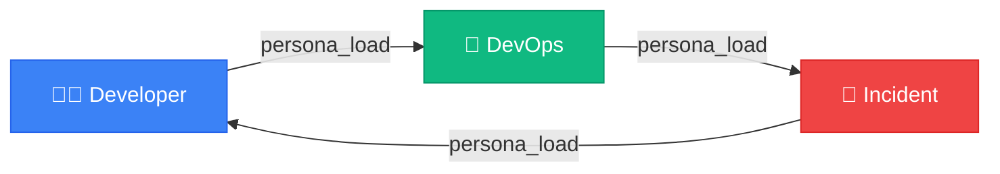

<picture>
  <source media="(prefers-color-scheme: dark)" srcset="https://capsule-render.vercel.app/api?type=waving&color=0:667eea,100:764ba2&height=200&section=header&text=AI%20Workflow&fontSize=80&fontColor=fff&animation=twinkling&fontAlignY=35&desc=Your%20AI-Powered%20Development%20Command%20Center&descSize=20&descAlignY=55">
  
</picture>

<div align="center">

[](https://modelcontextprotocol.io/)
[](https://www.python.org/)
[](https://cursor.sh/)
[](#-tool-modules)
[](#-skills)
[](LICENSE)

**Transform Claude into your personal DevOps engineer, developer assistant, and incident responder.**

[Getting Started](#-quick-start) •
[Commands](docs/commands/README.md) •
[Skills](docs/skills/README.md) •
[Personas](docs/personas/README.md) •
[Tool Modules](docs/tool-modules/README.md) •
[Architecture](docs/architecture/README.md)

</div>

---

## ✨ What is This?

AI Workflow is a **comprehensive MCP (Model Context Protocol) server** that gives Claude AI superpowers for software development:

| Capability | Description |
|------------|-------------|
| 🔧 **Execute Actions** | Create branches, update Jira, deploy code |
| 🧠 **Remember Context** | Track your work across sessions |
| 🎭 **Adopt Personas** | DevOps, Developer, Incident modes |
| ⚡ **Run Workflows** | Multi-step skills that chain tools |
| 🔄 **Auto-Heal** | Detect failures, fix auth/VPN, retry automatically |
| 🔍 **Self-Debug** | Analyze and fix its own tools |

---

## 🚀 Quick Start

### 1️⃣ Clone & Install

```bash
git clone https://github.com/yourusername/ai-workflow.git ~/src/ai-workflow
cd ~/src/ai-workflow

# Option 1: Using UV (recommended - fast!)
uv venv
uv pip install -e .

# Option 2: Traditional pip
python3 -m venv .venv
source .venv/bin/activate
pip install -e .
```

> **Don't have UV?** Install it: `curl -LsSf https://astral.sh/uv/install.sh | sh`

### 2️⃣ Add to Your Project

Create `.cursor/mcp.json` in your project:

```json
{
  "mcpServers": {
    "aa-workflow": {
      "command": "bash",
      "args": [
        "-c",
        "cd ~/src/ai-workflow && source .venv/bin/activate && python3 -m server"
      ]
    }
  }
}
```

### 3️⃣ Restart Cursor & Go!

```
You: Load the developer persona

Claude: 👨‍💻 Developer Persona Loaded
        Tools: git, gitlab, jira, calendar, gmail (~86 tools)

You: Start working on AAP-12345

Claude: [Runs start_work skill]
        ✅ Created branch: aap-12345-implement-api
        ✅ Updated Jira: In Progress
        Ready to code!
```

---

## 💬 Slack Bot Setup

The Slack bot requires authentication tokens from your browser session.

### Getting Slack Credentials

```bash
# Install dependency
pip install pycookiecheat

# Extract both credentials automatically
python scripts/get_slack_creds.py
```

The script extracts directly from Chrome's storage:
- `d_cookie` from Chrome's encrypted Cookies database
- `xoxc_token` from Chrome's Local Storage

No browser debugging or manual steps required!

### Add to config.json

```json
{
  "slack": {
    "xoxc_token": "xoxc-...",
    "d_cookie": "xoxd-...",
    "channels": {
      "team": {
        "id": "C01234567",
        "name": "my-team-channel"
      }
    }
  }
}
```

### Run the Slack Bot

```bash
make slack-daemon-llm
```

---

## 🎭 Personas (Tool Profiles)

> **Note:** "Agents" in this project are **tool configuration profiles** (personas), not separate AI instances. When you "load an agent," you're configuring which tools Claude has access to.

Switch personas to get different tool sets. See [full persona reference](docs/personas/README.md).

| Persona | Command | Tools | Focus |
|---------|---------|-------|-------|
| [👨‍💻 developer](docs/personas/developer.md) | `Load developer persona` | ~86 | Daily coding, PRs |
| [🔧 devops](docs/personas/devops.md) | `Load devops persona` | ~90 | Deployments, K8s |
| [🚨 incident](docs/personas/incident.md) | `Load incident persona` | ~78 | Production debugging |
| [📦 release](docs/personas/release.md) | `Load release persona` | ~69 | Shipping releases |
| [💬 slack](docs/personas/slack.md) | `Load slack persona` | ~52 | Slack bot daemon |



---

## ⚡ Skills

Skills are reusable multi-step workflows with **built-in auto-healing**. See [full skills reference](docs/skills/README.md).

### Daily Workflow

| Time | Command | What It Does |
|------|---------|--------------|
| ☕ Morning | `/coffee` | Email, PRs, calendar, Jira summary |
| 💻 Work | `/start-work AAP-12345` | Create branch, update Jira |
| 🚀 Submit | `/create-mr` | Validate, lint, create MR |
| 🍺 Evening | `/beer` | Wrap-up, standup prep |

### Popular Skills

| Skill | Description | Auto-Heal |
|-------|-------------|-----------|
| [☕ coffee](docs/skills/coffee.md) | Morning briefing | ✅ |
| [🍺 beer](docs/skills/beer.md) | End-of-day wrap-up | ✅ |
| [⚡ start_work](docs/skills/start_work.md) | Begin Jira issue | ✅ VPN + Auth |
| [🚀 create_mr](docs/skills/create_mr.md) | Create MR + Slack notify | ✅ VPN + Auth |
| [✅ mark_mr_ready](docs/skills/mark_mr_ready.md) | Mark draft as ready | ✅ |
| [👀 review_pr](docs/skills/review_pr.md) | Review MR | ✅ VPN + Auth |
| [🔄 sync_branch](docs/skills/sync_branch.md) | Rebase onto main | ✅ VPN |
| [📋 standup_summary](docs/skills/standup_summary.md) | Generate standup | ✅ |
| [🧪 test_mr_ephemeral](docs/skills/test_mr_ephemeral.md) | Deploy to ephemeral | ✅ VPN + Auth |
| [🚨 investigate_alert](docs/skills/investigate_alert.md) | Triage alerts | ✅ VPN + Auth |
| [🎫 create_jira_issue](docs/skills/create_jira_issue.md) | Create Jira issue | ✅ |
| [✅ close_issue](docs/skills/close_issue.md) | Close issue with summary | ✅ VPN |

### 🔄 Auto-Heal via Python Decorators

MCP tools include **auto-healing** via Python decorators (`server/auto_heal_decorator.py`). When a tool fails due to VPN or auth issues:

1. **Detects** the failure pattern (network timeout, unauthorized, forbidden)
2. **Fixes** by calling `vpn_connect()` or `kube_login()`
3. **Retries** the operation automatically
4. **Logs** the failure to memory for analysis

```python
from server.auto_heal_decorator import auto_heal_k8s

@registry.tool()
@auto_heal_k8s()
async def kubectl_get_pods(namespace: str, environment: str = "stage") -> str:
    """Get pods - auto-heals VPN/auth failures."""
    ...
```

| Decorator | Use Case |
|-----------|----------|
| `@auto_heal_ephemeral()` | Bonfire namespace tools |
| `@auto_heal_konflux()` | Tekton pipeline tools |
| `@auto_heal_k8s()` | Kubectl tools |
| `@auto_heal_jira()` | Jira tools |
| `@auto_heal_git()` | Git/GitLab tools |

---

## 🎯 Cursor Commands

63 slash commands for quick access. See [full commands reference](docs/commands/README.md).

| Category | Commands |
|----------|----------|
| ☀️ **Daily** | `/coffee` `/beer` `/standup` `/weekly-summary` |
| 🔧 **Development** | `/start-work` `/create-mr` `/mark-ready` `/close-issue` `/sync-branch` `/rebase-pr` `/hotfix` |
| 👀 **Review** | `/review-mr` `/review-all-open` `/check-feedback` `/check-prs` `/close-mr` |
| 🧪 **Testing** | `/deploy-ephemeral` `/test-ephemeral` `/check-namespaces` `/extend-ephemeral` `/run-local-tests` |
| 🚨 **Operations** | `/investigate-alert` `/debug-prod` `/release-prod` `/env-overview` `/rollout-restart` `/scale-deployment` `/silence-alert` |
| 📋 **Jira** | `/jira-hygiene` `/create-issue` `/clone-issue` `/sprint-planning` |
| 🔍 **Discovery** | `/tools` `/personas` `/list-skills` `/smoke-tools` `/smoke-skills` `/memory` |
| 📅 **Calendar** | `/my-calendar` `/schedule-meeting` `/setup-gmail` `/google-reauth` |
| 🔐 **Infrastructure** | `/vpn` `/konflux-status` `/appinterface-check` `/ci-health` `/cancel-pipeline` `/check-secrets` `/scan-vulns` |

### Example Workflow

```bash
/coffee                    # Morning briefing
/start-work AAP-12345      # Begin work on issue
# ... code ...
/create-mr                 # Create merge request
/deploy-ephemeral          # Test in ephemeral
/mark-ready                # Remove draft, notify team
# ... review cycle ...
/close-issue AAP-12345     # Wrap up
/beer                      # End of day summary
```

---

## 🔧 Tool Modules

260+ tools across 16 modules. See [full MCP server reference](docs/tool-modules/README.md).

| Module | Tools | Description |
|--------|-------|-------------|
| [workflow](docs/tool-modules/workflow.md) | 30 | Core workflow, agents, skills, memory |
| [git](docs/tool-modules/git.md) | 19 | Git operations |
| [gitlab](docs/tool-modules/gitlab.md) | 35 | MRs, pipelines, code review |
| [jira](docs/tool-modules/jira.md) | 28 | Issue tracking |
| [k8s](docs/tool-modules/k8s.md) | 26 | Kubernetes operations |
| [bonfire](docs/tool-modules/bonfire.md) | 21 | Ephemeral environments |
| [quay](docs/tool-modules/quay.md) | 8 | Container registry |
| [prometheus](docs/tool-modules/prometheus.md) | 13 | Metrics queries |
| [alertmanager](docs/tool-modules/alertmanager.md) | 7 | Alert management |
| [kibana](docs/tool-modules/kibana.md) | 9 | Log search |
| [google-calendar](docs/tool-modules/google-calendar.md) | 6 | Calendar & meetings |
| [gmail](docs/tool-modules/gmail.md) | 6 | Email processing |
| [slack](docs/tool-modules/slack.md) | 16 | Slack integration |
| [konflux](docs/tool-modules/konflux.md) | 40 | Build pipelines |
| [appinterface](docs/tool-modules/appinterface.md) | 8 | GitOps config |

> Plus **45 shared parsers** in `scripts/common/parsers.py` for reusable output parsing

See [MCP Server Architecture](docs/architecture/README.md) for implementation details.

---

## 🛠️ Auto-Debug & Learning Loop

When tools fail, Claude can fix them **and remember the fix forever**:

```
Tool: ❌ Failed to release namespace
      💡 Known Issues Found!
         Previous fix for `bonfire_release`: Add --force flag

      💡 Auto-fix: debug_tool('bonfire_namespace_release')
```

### The Learning Loop

```
┌────────────────────────────────────────────────────────────────┐
│  Tool fails → Check memory → Apply known fix → ✓              │
│       ↓                                                        │
│  Unknown? → debug_tool() → Fix code → learn_tool_fix() → ✓    │
│                                              ↓                 │
│                                    Saved to memory forever     │
└────────────────────────────────────────────────────────────────┘
```

### Key Tools

| Tool | Purpose |
|------|---------|
| `check_known_issues(tool, error)` | Check if we've seen this before |
| `debug_tool(tool, error)` | Analyze source and propose fix |
| `learn_tool_fix(tool, pattern, cause, fix)` | Save fix to memory |

### Memory Files

| File | Purpose |
|------|---------|
| `memory/learned/tool_fixes.yaml` | Tool-specific fixes from auto-remediation |
| `memory/learned/patterns.yaml` | General error patterns and solutions |
| `memory/learned/runbooks.yaml` | Operational procedures that worked |
| `memory/learned/tool_failures.yaml` | Skill auto-heal failure tracking |

---

## 📁 Project Structure

```
ai-workflow/
├── server/              # MCP server infrastructure
│   ├── main.py          # Server entry point
│   ├── persona_loader.py # Dynamic persona loading
│   ├── debuggable.py    # Self-healing tool decorator
│   └── utils.py         # Shared utilities
├── tool_modules/        # Tool plugins (aa-git/, aa-jira/, etc.)
├── personas/            # Persona configs (developer.yaml, devops.yaml)
├── skills/              # 50 workflow definitions (start_work.yaml, etc.)
├── memory/              # Persistent context
│   ├── state/           # Active issues, MRs, environments
│   └── learned/         # Patterns, tool fixes, runbooks
├── extensions/          # IDE integrations
│   └── aa-workflow-vscode/  # VSCode/Cursor extension
├── docs/                # Documentation
├── scripts/             # Python utilities
│   └── common/
│       ├── auto_heal.py # Skill auto-healing utilities
│       └── parsers.py   # 44 shared parser functions
├── config.json          # Configuration
└── .cursor/commands/    # 63 Cursor slash commands
```

---

## 📚 Documentation

| Document | Description |
|----------|-------------|
| [Commands Reference](docs/commands/README.md) | 63 Cursor slash commands |
| [Skills Reference](docs/skills/README.md) | All 50 available skills |
| [Personas Reference](docs/personas/README.md) | 5 tool configuration profiles |
| [Tool Modules Reference](docs/tool-modules/README.md) | 16 tool plugins with 260+ tools |
| [Learning Loop](docs/learning-loop.md) | Auto-remediation + memory |
| [Skill Auto-Heal](docs/plans/skill-auto-heal.md) | Auto-healing implementation |
| [IDE Extension](docs/ide-extension.md) | VSCode/Cursor extension |
| [Architecture Overview](docs/architecture/README.md) | High-level design |
| [MCP Server Implementation](docs/architecture/mcp-implementation.md) | Server code details |
| [Development Guide](docs/DEVELOPMENT.md) | Contributing and development setup |

---

## 🤝 Contributing

1. Fork the repository
2. Create a feature branch
3. Add tests for new functionality
4. Submit a merge request

---

## 📄 License

MIT License - See [LICENSE](LICENSE) for details.

---

<picture>
  <source media="(prefers-color-scheme: dark)" srcset="https://capsule-render.vercel.app/api?type=waving&color=0:667eea,100:764ba2&height=100&section=footer">
  
</picture>

<div align="center">
  <sub>Built with ❤️ for developers who want AI that actually does things</sub>
</div>
