<picture>
  <source media="(prefers-color-scheme: dark)" srcset="https://capsule-render.vercel.app/api?type=waving&color=0:667eea,100:764ba2&height=200&section=header&text=AI%20Workflow&fontSize=80&fontColor=fff&animation=twinkling&fontAlignY=35&desc=Your%20AI-Powered%20Development%20Command%20Center&descSize=20&descAlignY=55">
  
</picture>

<div align="center">

[](https://modelcontextprotocol.io/)
[](https://www.python.org/)
[](https://cursor.sh/)
[](#-tool-modules)
[](LICENSE)

**Transform Claude into your personal DevOps engineer, developer assistant, and incident responder.**

[Getting Started](#-quick-start) •
[Features](#-features) •
[Architecture](#-architecture) •
[Agents](#-agents) •
[Skills](#-skills) •
[Examples](#-usage-scenarios)

</div>

---

## ✨ What is This?

AI Workflow is a **comprehensive MCP (Model Context Protocol) server** that gives Claude AI superpowers for software development. Instead of just answering questions, Claude can now:

```
┌─────────────────────────────────────────────────────────────────────┐
│  🔧 Execute Real Actions     Create branches, update Jira, deploy  │
│  🧠 Remember Context         Track your work across sessions       │
│  🎭 Adopt Personas           DevOps, Developer, Incident modes     │
│  📋 Run Workflows            Multi-step skills that chain tools    │
│  🔍 Debug Everything         See exactly what's happening          │
└─────────────────────────────────────────────────────────────────────┘
```

<details>
<summary><b>🎬 See it in action</b></summary>

```
You: Start working on AAP-12345 in the backend repo

Claude: 🚀 Executing Skill: start_work
        
        🔧 Step 1: get_issue ✅
           Issue: "Implement new REST API endpoint"
        
        🔧 Step 2: checkout_main ✅
           Switched to 'main'
        
        🔧 Step 3: pull_latest ✅
           Already up to date
        
        🔧 Step 4: create_branch ✅
           Created: aap-12345-implement-new-rest-api-endpoint
        
        🔧 Step 5: update_jira ✅
           Status → In Progress
        
        ─────────────────────────────────
        ⏱️ Completed in 2.3s | ✅ 5/5 steps
        
        Ready to code! Your branch is set up.
```

</details>

---

## 🚀 Quick Start

Get up and running in 3 minutes:

### 1️⃣ Clone & Install

```bash
git clone https://github.com/yourusername/ai-workflow.git ~/src/ai-workflow
cd ~/src/ai-workflow
pip install fastmcp pyyaml httpx jinja2
```

### 2️⃣ Add to Your Project

Create `.cursor/mcp.json` in your project:

```json
{
  "mcpServers": {
    "aa-developer": {
      "command": "bash",
      "args": ["-c", "cd ~/src/ai-workflow/mcp-servers/aa-common && python3 -m src.server --agent developer"]
    }
  }
}
```

### 3️⃣ Restart Cursor & Go!

```
You: Start working on AAP-12345

Claude: 🚀 Executing Skill: start_work
        ✅ Fetched issue details
        ✅ Created branch: AAP-12345-implement-feature
        ✅ Updated Jira status → In Progress
        
        Ready to code!
```

<details>
<summary><b>📁 More agent configurations</b></summary>

| Agent | Command | Tools |
|-------|---------|-------|
| developer | `--agent developer` | git, gitlab, jira (74 tools) |
| devops | `--agent devops` | k8s, prometheus, alertmanager (75 tools) |
| incident | `--agent incident` | k8s, prometheus, jira (78 tools) |
| release | `--agent release` | konflux, quay, appinterface (69 tools) |
| all | `--all` | All 150+ tools |

</details>

---

## 🏗️ Architecture

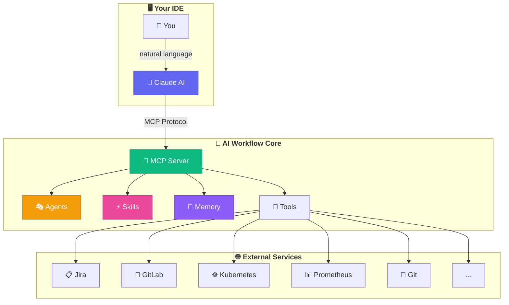

### The Four Pillars

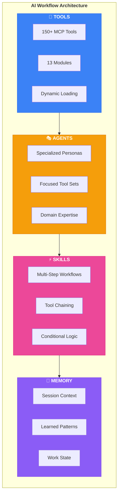

---

## 🎭 Agents

Agents are **specialized personas** that focus Claude on specific domains with curated tool sets.

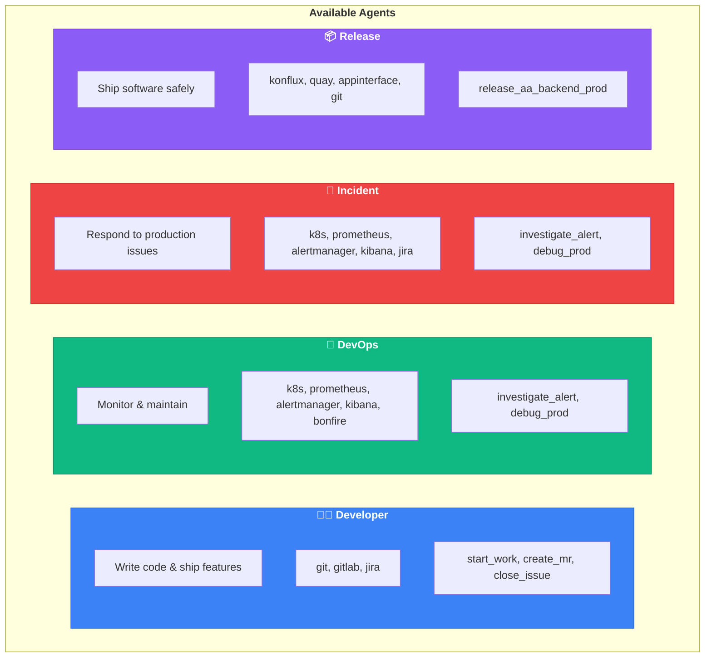

### Agent Comparison

| Agent | Focus | Tools Loaded | Best For |
|-------|-------|--------------|----------|
| 👨‍💻 **developer** | Code & MRs | 74 tools | Daily development work |
| 🔧 **devops** | Infrastructure | 75 tools | Monitoring, deployments |
| 🚨 **incident** | Production issues | 78 tools | Alert triage, debugging |
| 📦 **release** | Shipping | 69 tools | Releases, promotions |

> **Note:** Each agent is limited to <80 tools to stay within Cursor's limits. For tools not in your agent, use `tool_exec()`:
> ```python
> tool_exec("konflux_list_builds", '{"namespace": "aap-aa-tenant"}')
> ```

### Agent Tool Modules

| Agent | Modules Loaded |
|-------|----------------|
| developer | git, gitlab, jira |
| devops | k8s, prometheus, alertmanager, kibana, bonfire |
| incident | k8s, prometheus, alertmanager, kibana, jira |
| release | konflux, quay, appinterface, git |

### Loading an Agent

```
You: Load the devops agent

Claude: ## 🔧 DevOps Agent Loaded
        
        I'm now focused on infrastructure and monitoring.
        
        **My capabilities:**
        • Kubernetes operations (pods, deployments, logs)
        • Prometheus metrics and alerts
        • Alertmanager silence management
        • Kibana log analysis
        • Bonfire ephemeral namespaces
        
        **Available skills:**
        • investigate_alert - Systematic alert triage
        • debug_prod - Debug production issues
        
        What infrastructure task can I help with?
```

---

## ⚡ Skills

Skills are **reusable multi-step workflows** that chain tools together with logic, conditions, and templating.

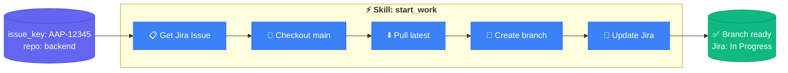

### 🎯 Available Skills

| Skill | Description | Agent |
|-------|-------------|-------|
| ⚡ [`start_work`](#start_work) | Begin working on a Jira issue | developer |
| 🚀 [`create_mr`](#create_mr) | Create MR with Jira link | developer |
| ✅ [`close_issue`](#close_issue) | Close issue with commit summary | developer |
| 👀 [`review_pr`](#review_pr) | Review PR with auto-approve/feedback | developer |
| 📋 [`review_all_prs`](#review_all_prs) | Batch review open PRs | developer |
| 🧪 [`test_mr_ephemeral`](#test_mr_ephemeral) | Test in ephemeral namespace | developer |
| 📋 [`jira_hygiene`](#jira_hygiene) | Validate/fix Jira quality | developer |
| 🔍 [`investigate_alert`](#investigate_alert) | Systematic alert triage | devops, incident |
| 🐛 [`debug_prod`](#debug_prod) | Debug production issues | devops, incident |
| 📦 [`release_aa_backend_prod`](#release_aa_backend_prod) | Release to production | release |

---

### ⚡ start_work

Begin work on a Jira issue - creates branch, sets up context, or resumes existing work.

```
skill_run("start_work", '{"issue_key": "AAP-12345"}')
```

**Inputs:**
| Input | Required | Default | Description |
|-------|----------|---------|-------------|
| `issue_key` | Yes | - | Jira issue key (e.g., AAP-12345) |
| `repo` | No | `.` | Repository path |

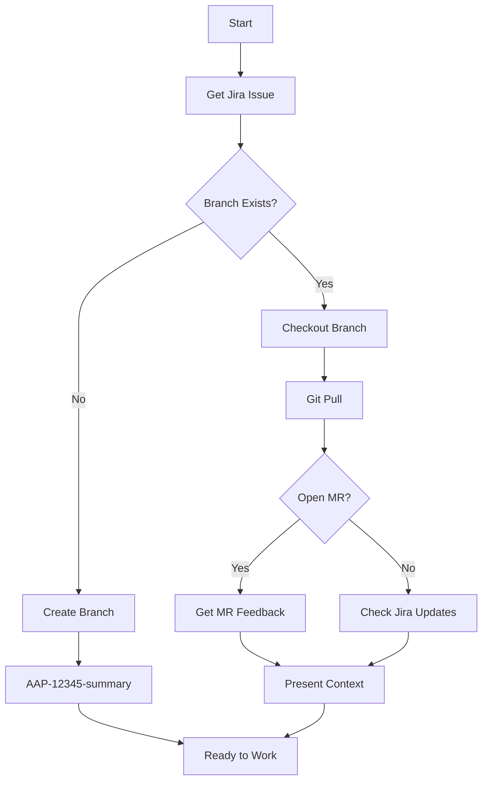

---

### 🚀 create_mr

Create a Merge Request with proper formatting, linked to Jira.

```
skill_run("create_mr", '{"issue_key": "AAP-12345"}')
```

**Inputs:**
| Input | Required | Default | Description |
|-------|----------|---------|-------------|
| `issue_key` | Yes | - | Jira issue key |
| `repo` | No | `.` | Repository path |
| `draft` | No | `false` | Create as draft MR |

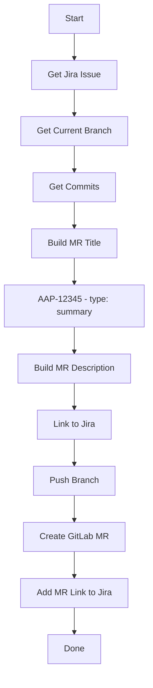

---

### ✅ close_issue

Close a Jira issue with a summary of completed work from commits.

```
skill_run("close_issue", '{"issue_key": "AAP-12345"}')
```

**Inputs:**
| Input | Required | Default | Description |
|-------|----------|---------|-------------|
| `issue_key` | Yes | - | Jira issue key |
| `repo` | No | `.` | Repository path |
| `add_comment` | No | `true` | Add closing comment |

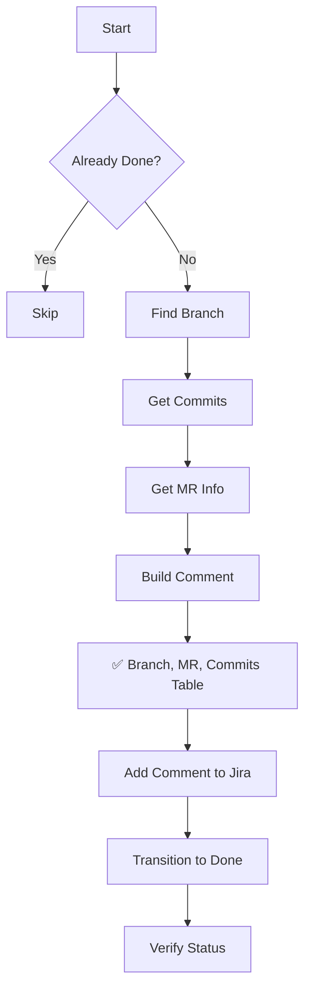

---

### 👀 review_pr

Review a colleague's PR with static analysis and local testing. **Automatically approves or posts feedback.**

```
skill_run("review_pr", '{"mr_id": 123}')
skill_run("review_pr", '{"mr_id": 123, "skip_tests": true}')
```

**Inputs:**
| Input | Required | Default | Description |
|-------|----------|---------|-------------|
| `mr_id` | Yes | - | GitLab MR ID |
| `skip_tests` | No | `false` | Skip local tests |

**Auto-Actions:**
- ✅ **Approve** if no blocking issues found
- 📝 **Post feedback** if security issues, test failures, or format problems
- 📋 **Update Jira** with review status

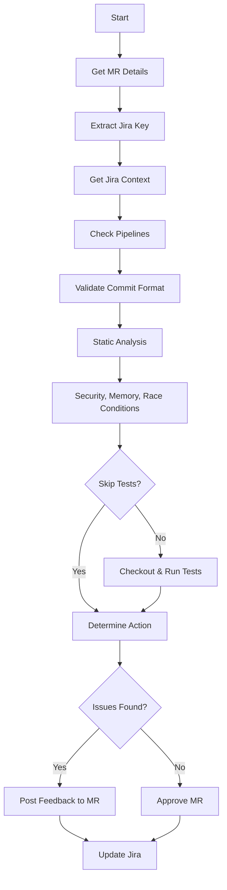

---

### 📋 review_all_prs

Batch review all open PRs with intelligent follow-up.

```
skill_run("review_all_prs", '{}')
skill_run("review_all_prs", '{"dry_run": true}')
```

**Inputs:**
| Input | Required | Default | Description |
|-------|----------|---------|-------------|
| `project` | No | automation-analytics/automation-analytics-backend | GitLab project |
| `reviewer` | No | - | Filter by reviewer |
| `limit` | No | `10` | Max MRs to process |
| `dry_run` | No | `false` | Preview without taking action |

**Decision Logic:**
| Scenario | Action |
|----------|--------|
| No previous review from me | Run full review |
| I gave feedback, author didn't respond | Skip (waiting) |
| I gave feedback, author addressed it | Approve |
| I gave feedback, unresolved issues remain | Post follow-up |

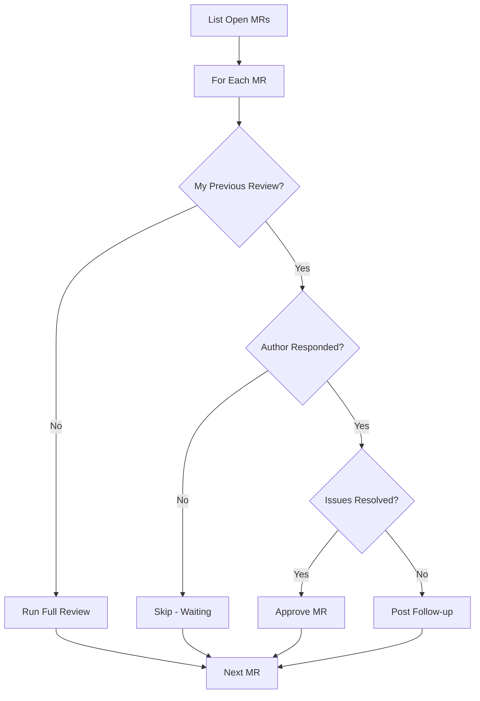

---

### 🧪 test_mr_ephemeral

Test an MR image in an ephemeral Kubernetes namespace.

```
skill_run("test_mr_ephemeral", '{"mr_id": 123}')
skill_run("test_mr_ephemeral", '{"commit_sha": "abc123"}')
```

**Inputs:**
| Input | Required | Default | Description |
|-------|----------|---------|-------------|
| `mr_id` | No* | - | GitLab MR ID |
| `commit_sha` | No* | - | Commit SHA to test |
| `duration` | No | `2h` | Namespace duration |
| `billing` | No | `false` | Include billing component |

*One of `mr_id` or `commit_sha` required

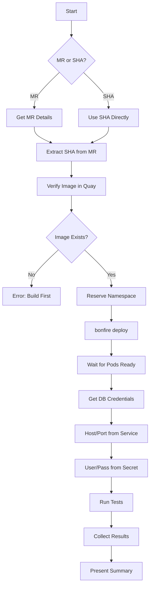

---

### 📋 jira_hygiene

Validate and fix Jira issue quality - descriptions, acceptance criteria, links.

```
skill_run("jira_hygiene", '{"issue_key": "AAP-12345"}')
skill_run("jira_hygiene", '{"issue_key": "AAP-12345", "auto_fix": true}')
```

**Inputs:**
| Input | Required | Default | Description |
|-------|----------|---------|-------------|
| `issue_key` | Yes | - | Jira issue key |
| `auto_fix` | No | `false` | Auto-fix issues |
| `auto_transition` | No | `false` | Auto-transition New→Refinement |

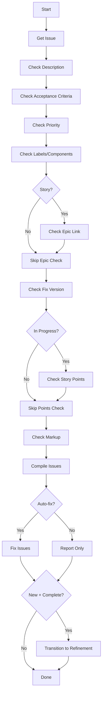

**Checks Performed:**
- ✅ Has description (not empty)
- ✅ Has acceptance criteria
- ✅ Priority is set
- ✅ Has labels/components
- ✅ Linked to epic (stories only)
- ✅ Has fix version
- ✅ Story points (if In Progress)
- ✅ Proper Jira markup

---

### 🔍 investigate_alert

Investigate a firing Prometheus alert.

```
skill_run("investigate_alert", '{"environment": "production"}')
skill_run("investigate_alert", '{"environment": "stage", "alert_name": "HighErrorRate"}')
```

**Inputs:**
| Input | Required | Default | Description |
|-------|----------|---------|-------------|
| `environment` | Yes | - | `production` or `stage` |
| `alert_name` | No | - | Specific alert to investigate |

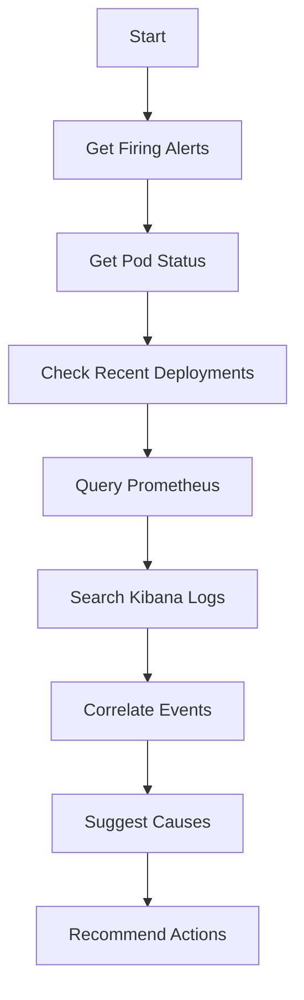

---

### 🐛 debug_prod

Comprehensive production debugging with memory-backed pattern matching.

```
skill_run("debug_prod", '{"namespace": "main"}')
skill_run("debug_prod", '{"namespace": "billing", "alert_name": "HighLatency"}')
```

**Inputs:**
| Input | Required | Default | Description |
|-------|----------|---------|-------------|
| `namespace` | No | asks | `main` or `billing` |
| `alert_name` | No | - | Prometheus alert name |
| `pod_filter` | No | - | Filter pods by name |
| `time_range` | No | `1h` | How far back (15m, 1h, 6h, 24h) |

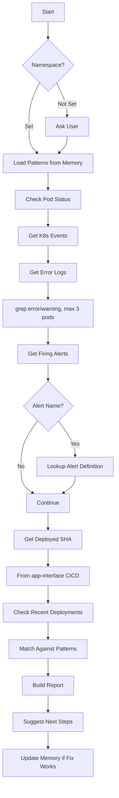

**Locations Checked:**
- Pod status: CrashLoopBackOff, OOMKilled, restarts
- Events: warnings, errors
- Logs: filtered for errors (truncated)
- Alert definitions: `app-interface/resources/insights-prod/`
- CICD config: `app-interface/data/services/insights/tower-analytics/cicd/`
- Namespace config: `app-interface/data/services/insights/tower-analytics/namespaces/`

---

### 📦 release_aa_backend_prod

Release Automation Analytics backend to production via app-interface.

```
skill_run("release_aa_backend_prod", '{"commit_sha": "abc123def456"}')
```

**Inputs:**
| Input | Required | Default | Description |
|-------|----------|---------|-------------|
| `commit_sha` | Yes | - | Commit SHA to release |
| `release_date` | No | today | Release date for Jira |
| `include_billing` | No | `false` | Also update billing namespace |

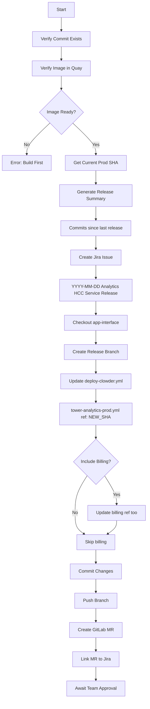

**Files Modified:**
```
app-interface/data/services/insights/tower-analytics/cicd/deploy-clowder.yml
```

---

### 📝 Skill Format

```yaml
name: skill_name
description: What this skill does
version: "1.0"

inputs:
  - name: input_name
    type: string
    required: true
    description: "What this input is for"

constants:
  some_value: "constant data"

steps:
  - name: step_one
    tool: tool_name
    args:
      param: "{{ inputs.input_name }}"
    output: step1_result

  - name: step_two
    condition: "{{ step1_result.success }}"
    compute: |
      # Python code here
      result = {"processed": step1_result.data}
    output: step2_result

  - name: step_three
    condition: "{{ not step2_result.processed }}"
    tool: fallback_tool
    on_error: continue

outputs:
  - name: summary
    value: |
      ## Results
      {{ step2_result | json }}
```

### ▶️ Running Skills

**In chat:**
```
Run skill: start_work with issue AAP-12345
```

**Via tool:**
```
skill_run("start_work", '{"issue_key": "AAP-12345"}')
```

**From agent:**
```
Use the investigate_alert skill to check what's happening in production
```

---

## 🔧 Tool Modules

The system provides **150+ tools** organized into 13 modules:

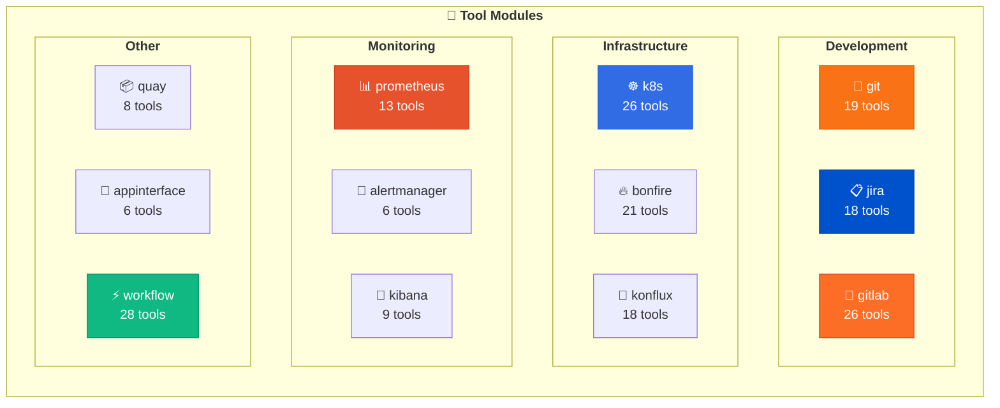

### Tool Categories

<details>
<summary><b>📂 Git Tools (19)</b></summary>

| Tool | Description |
|------|-------------|
| `git_status` | Show working tree status |
| `git_branch` | List/create branches |
| `git_checkout` | Switch branches |
| `git_commit` | Commit changes |
| `git_push` | Push to remote |
| `git_pull` | Pull from remote |
| `git_log` | Show commit history |
| `git_diff` | Show changes |
| `git_stash` | Stash changes |
| `git_merge` | Merge branches |
| `git_rebase` | Rebase branch |
| `git_cherry_pick` | Cherry-pick commits |
| `git_reset` | Reset changes |
| `git_tag` | Manage tags |
| `git_remote` | Manage remotes |
| ... | and more |

</details>

<details>
<summary><b>📋 Jira Tools (23)</b></summary>

**Read Operations:**
| Tool | Description |
|------|-------------|
| `jira_view_issue` | View issue details |
| `jira_view_issue_json` | Get issue as JSON |
| `jira_search` | Search with JQL |
| `jira_list_issues` | List project issues |
| `jira_my_issues` | List your assigned issues |
| `jira_list_blocked` | List blocked issues |
| `jira_lint` | Check issue quality |

**Write Operations:**
| Tool | Description |
|------|-------------|
| `jira_set_status` | Transition issue status |
| `jira_assign` | Assign to user |
| `jira_unassign` | Remove assignee |
| `jira_add_comment` | Add comment |
| `jira_block` | Mark as blocked |
| `jira_unblock` | Remove block |
| `jira_add_to_sprint` | Add to sprint |
| `jira_remove_sprint` | Remove from sprint |
| `jira_create_issue` | Create new issue |
| `jira_clone_issue` | Clone existing issue |
| `jira_add_link` | Link issues |
| `jira_add_flag` | Add impediment flag |
| `jira_remove_flag` | Remove flag |
| `jira_open_browser` | Open in browser |

*Requires: `rh-issue` CLI and `JIRA_JPAT` environment variable*

</details>

<details>
<summary><b>🦊 GitLab Tools (26)</b></summary>

| Tool | Description |
|------|-------------|
| `gitlab_mr_list` | List MRs |
| `gitlab_mr_create` | Create MR |
| `gitlab_mr_view` | View MR details |
| `gitlab_mr_approve` | Approve MR |
| `gitlab_mr_merge` | Merge MR |
| `gitlab_pipeline_list` | List pipelines |
| `gitlab_pipeline_view` | Pipeline details |
| `gitlab_pipeline_retry` | Retry pipeline |
| `gitlab_job_logs` | Job logs |
| `gitlab_project_info` | Project info |
| ... | and more |

</details>

<details>
<summary><b>☸️ Kubernetes Tools (22)</b></summary>

**Pods:**
| Tool | Description |
|------|-------------|
| `kubectl_get_pods` | List pods |
| `kubectl_describe_pod` | Describe pod |
| `kubectl_logs` | Get pod logs |
| `kubectl_delete_pod` | Delete pod |

**Deployments:**
| Tool | Description |
|------|-------------|
| `kubectl_get_deployments` | List deployments |
| `kubectl_describe_deployment` | Describe deployment |
| `kubectl_rollout_status` | Check rollout status |
| `kubectl_rollout_restart` | Rolling restart |
| `kubectl_scale` | Scale replicas |

**Networking:**
| Tool | Description |
|------|-------------|
| `kubectl_get_services` | List services |
| `kubectl_get_ingress` | List ingress |

**Config:**
| Tool | Description |
|------|-------------|
| `kubectl_get_configmaps` | List configmaps |
| `kubectl_get_secrets` | List secrets |

**Debugging:**
| Tool | Description |
|------|-------------|
| `kubectl_get_events` | Get events |
| `kubectl_top_pods` | Resource usage |
| `kubectl_get` | Get any resource |
| `kubectl_exec` | Exec command |

**SaaS/App-SRE:**
| Tool | Description |
|------|-------------|
| `kubectl_saas_pipelines` | SaaS pipelines |
| `kubectl_saas_deployments` | SaaS deployments |
| `kubectl_saas_pods` | SaaS pods |
| `kubectl_saas_logs` | SaaS logs |

*Authentication via kubeconfig files: `~/.kube/config.s` (stage), `~/.kube/config.p` (prod), `~/.kube/config.e` (ephemeral)*

</details>

### Environment Variables

| Variable | Server | Description |
|----------|--------|-------------|
| `JIRA_URL` | aa-jira | Jira instance URL |
| `JIRA_JPAT` | aa-jira | Jira Personal Access Token |
| `GITLAB_TOKEN` | aa-gitlab | GitLab API token |
| `KUBECONFIG` | aa-k8s | Default kubeconfig path |
| `KUBECONFIG_KONFLUX` | aa-konflux | Konflux cluster kubeconfig |
| `QUAY_TOKEN` | aa-quay | Quay.io API token (or uses Docker auth) |

### Server Architecture

Each MCP server follows the same pattern:

```
mcp-servers/aa-{name}/
├── pyproject.toml      # Package definition
└── src/
    ├── __init__.py
    ├── server.py       # Entry point
    └── tools.py        # @mcp.tool() decorated functions
```

**Installation:**
```bash
# Individual server
cd mcp-servers/aa-git && pip install -e .

# All servers
for d in mcp-servers/aa-*/; do pip install -e "$d"; done
```

### Dynamic Tool Loading

To work around Cursor's 128-tool limit, we use **dynamic tool loading**:

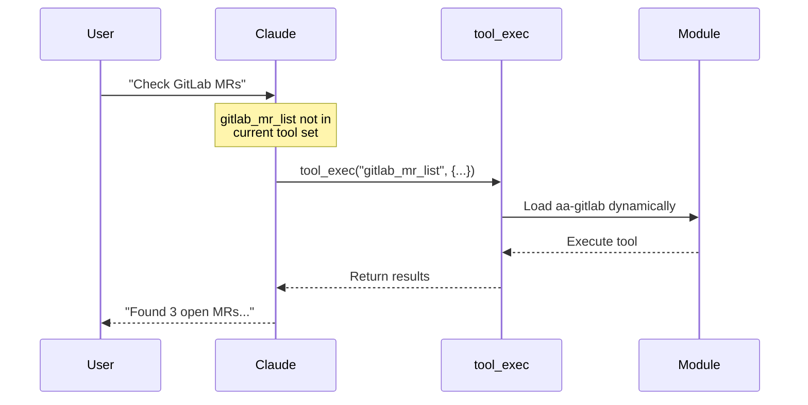

```
You: I need to check something in Prometheus but I'm using the developer agent

Claude: No problem! I can use tool_exec to access Prometheus tools:
        
        [Calls tool_exec("prometheus_get_alerts", '{"environment": "stage"}')]
        
        Found 2 active alerts in stage:
        🟠 HighMemoryUsage - analytics-api at 85%
        🟢 SlowQueries - resolved 5m ago
```

### 📋 Prompts

Pre-defined conversation templates that structure common workflows:

| Prompt | Purpose |
|--------|---------|
| `session_init` | Initialize a new work session with context loading |
| `debug_guide` | Systematic production debugging walkthrough |
| `review_guide` | Structured code review checklist |

**Usage:**
```
Claude: [Uses session_init prompt]

# Session initialized
Let me start by loading your work context...
```

### 📁 Resources

Data sources the AI can read directly (without tool calls):

| Resource URI | Content |
|--------------|---------|
| `memory://state/current_work` | Active issues, branches, MRs |
| `memory://learned/patterns` | Known error patterns and solutions |
| `config://agents` | Available agent configurations |
| `config://skills` | Available skill definitions |
| `config://repositories` | Configured repositories |

**Usage:**
```
Claude: [Reads memory://learned/patterns resource]

I see there are 12 known error patterns including:
- OOMKilled: Increase memory limits or fix memory leaks
- CrashLoopBackOff: Check logs, verify config/secrets
```

---

## 💾 Memory System

Memory provides **persistent context** across Claude sessions.

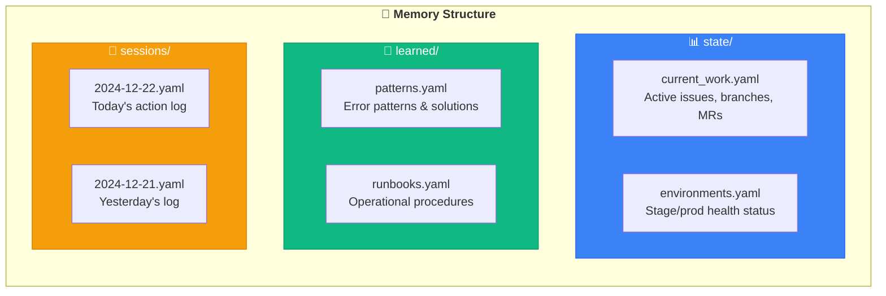

### Memory Operations

| Operation | Description | Example |
|-----------|-------------|---------|
| `memory_read()` | List all memory files | `memory_read()` |
| `memory_read(path)` | Read specific file | `memory_read("state/current_work")` |
| `memory_write(path, content)` | Overwrite file | `memory_write("learned/patterns", "...")` |
| `memory_update(path, field, value)` | Update specific field | `memory_update("state/current_work", "notes", "...")` |
| `memory_append(path, field, item)` | Append to list | `memory_append("state/current_work", "active_issues", '{"key": "AAP-123"}')` |
| `memory_session_log(action, details)` | Log to today's session | `memory_session_log("started_work", "AAP-12345")` |

**Session Logging Examples:**
```python
memory_session_log("started_work", "AAP-12345 - Implement API")
memory_session_log("created_mr", "MR !456 for AAP-12345")
memory_session_log("deployed", "v2.3.1 to stage")
memory_session_log("fixed", "OOMKilled issue by increasing limits")
```

**Best Practices:**
1. **Log important actions** - Future you will thank you
2. **Update current_work** when starting/finishing tasks
3. **Record patterns** when you solve a tricky problem
4. **Add runbooks** for procedures you might repeat

```
# Check what you were working on
You: What was I working on yesterday?

Claude: [Reads memory/sessions/2024-12-21.yaml]
        
        Yesterday you:
        • Started work on AAP-12345 (Implement API endpoint)
        • Created MR !456
        • Investigated a HighMemoryUsage alert in stage
        • Fixed by restarting analytics-api pod

# Save a learned pattern
You: Log that the ImagePullBackOff fix is to check Quay permissions

Claude: [Writes to memory/learned/patterns.yaml]
        
        ✅ Logged pattern:
        **Error:** ImagePullBackOff
        **Fix:** Check Quay image permissions and registry credentials
```

### Example: Current Work State

```yaml
# memory/state/current_work.yaml
last_updated: "2024-12-22T10:30:00Z"

active_issues:
  - key: AAP-12345
    summary: "Implement new REST API endpoint"
    status: "In Progress"
    branch: "aap-12345-implement-rest-api"
    repo: "backend"

open_mrs:
  - id: 456
    title: "AAP-12345 - feat(api): Implement new endpoint"
    url: "https://gitlab.example.com/mr/456"
    pipeline_status: "success"

current_branches:
  backend: "aap-12345-implement-rest-api"
  frontend: "main"
```

---

## 📋 Usage Scenarios

### 🔄 Daily Development Workflow

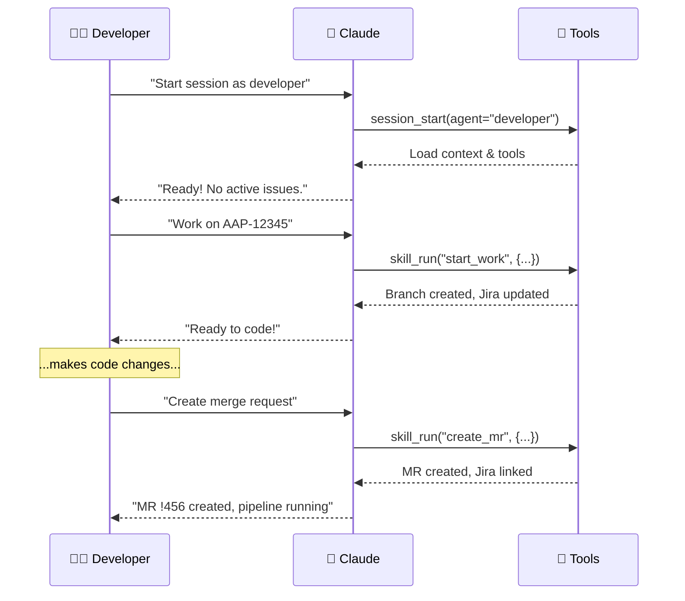

<details>
<summary><b>📝 Full conversation example</b></summary>

```
You: Start a developer session

Claude: 🚀 Developer Session Started
        
        **Current Context:**
        • No active issues
        • Branch: main
        
        **Available Skills:**
        • start_work - Begin working on an issue
        • create_mr - Create merge request
        
        What would you like to work on?

You: I need to work on AAP-12345

Claude: [Running skill: start_work]
        
        ✅ Step 1: Got issue details
           "Implement new REST API endpoint"
        
        ✅ Step 2: Switched to main
        ✅ Step 3: Pulled latest changes
        ✅ Step 4: Created branch
           aap-12345-implement-new-rest-api
        ✅ Step 5: Updated Jira status
           Status: In Progress
        
        Ready to code! Your workspace is set up.

[...you make code changes...]

You: I'm done, create the MR

Claude: [Running skill: create_mr]
        
        ✅ Step 1: Staged all changes
        ✅ Step 2: Created commit
           "AAP-12345 - feat(api): Implement new endpoint"
        ✅ Step 3: Pushed to origin
        ✅ Step 4: Created MR !456
        ✅ Step 5: Linked to Jira issue
        
        🚀 MR Created: !456
        Pipeline: Running ⏳
        
        I'll check the pipeline status in a moment...
```

</details>

### 🚨 Incident Response

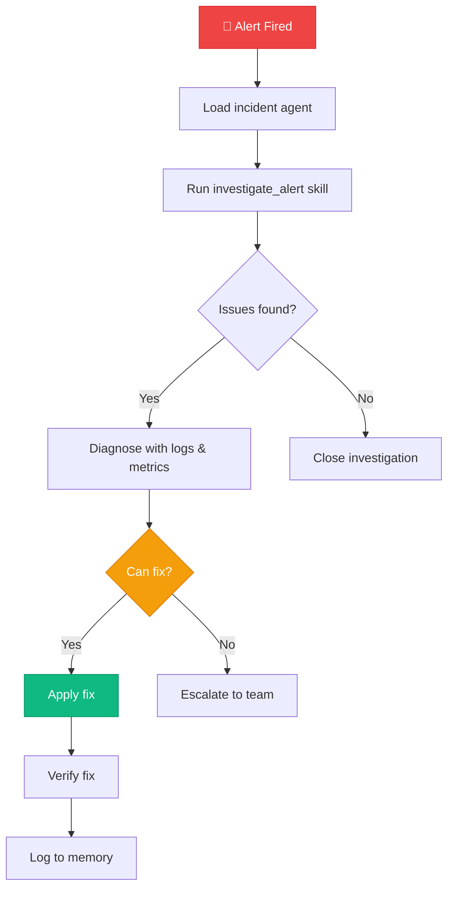

<details>
<summary><b>📝 Full conversation example</b></summary>

```
You: Load incident agent, we have alerts in prod

Claude: ## 🚨 Incident Agent Loaded
        
        Running immediate investigation...
        
        [Executing: investigate_alert for production]
        
        ## Investigation Report: production
        
        ### 🔴 Active Alerts (2)
        
        | Alert | Severity | Duration | Pod |
        |-------|----------|----------|-----|
        | HighMemoryUsage | critical | 15m | analytics-api-7d8f9 |
        | SlowResponseTime | warning | 8m | analytics-api-7d8f9 |
        
        ### 📊 Namespace Health
        
        • Pods: 4/5 running
        • 1 pod restarting (CrashLoopBackOff)
        • Recent deployments: None in 24h
        
        ### 🔍 Likely Cause
        
        analytics-api-7d8f9 is consuming 95% of its memory limit,
        causing slow responses and restarts.
        
        ### Recommended Actions
        1. Check pod logs for memory leaks
        2. Consider restarting the pod
        3. May need to increase memory limits

You: Check the logs for that pod

Claude: [Calls kubectl_logs with tail=100]
        
        ## Recent Logs: analytics-api-7d8f9
        
        ```
        2024-12-22 10:15:23 [ERROR] OutOfMemoryError in report generation
        2024-12-22 10:15:24 [WARN] Large result set: 1.2M rows
        2024-12-22 10:15:25 [ERROR] Query timeout, retrying...
        2024-12-22 10:15:26 [ERROR] OutOfMemoryError in report generation
        ```
        
        📋 **Analysis:**
        There's a runaway report query fetching 1.2M rows,
        causing OOM errors. This is likely a user-triggered
        report with too broad filters.
        
        **Options:**
        1. Restart pod (quick fix)
        2. Kill the specific process
        3. Investigate which report is causing this

You: Restart the pod

Claude: [Calls kubectl_delete_pod]
        
        ✅ Pod deleted: analytics-api-7d8f9
        
        [Calls kubectl_get_pods]
        
        New pod starting: analytics-api-8k2m1
        Status: Running (0/1 ready)
        
        [Waiting 30s...]
        
        ✅ New pod is healthy and ready!
        
        [Calls memory_session_log]
        Logged: Restarted analytics-api due to OOM from large report query
        
        Should I create a Jira issue to investigate the root cause?
```

</details>

### 🔍 Exploring & Learning

```
You: What Prometheus tools are available?

Claude: [Calls tool_list(module="prometheus")]
        
        ## 📊 Prometheus Module
        
        **13 tools available:**
        
        | Tool | Description |
        |------|-------------|
        | `prometheus_query` | Execute PromQL query |
        | `prometheus_query_range` | Time-range query |
        | `prometheus_get_alerts` | List firing alerts |
        | `prometheus_get_rules` | List alert rules |
        | `prometheus_check_health` | API health check |
        | ... | |
        
        Try: "Query CPU usage across all pods"

You: Query CPU usage for the last hour

Claude: [Calls prometheus_query_range]
        
        ## CPU Usage (Last Hour)
        
        | Pod | Avg | Max | Current |
        |-----|-----|-----|---------|
        | analytics-api | 45% | 72% | 48% |
        | analytics-worker | 68% | 89% | 71% |
        | analytics-scheduler | 12% | 25% | 15% |
        
        📈 Worker is running hot. Check if there's a backlog.
```

---

## ⚙️ Configuration

### Project Structure

```
ai-workflow/
├── 📁 agents/           # Agent personas and configs
│   ├── developer.yaml   # Developer agent config
│   ├── developer.md     # Developer persona
│   ├── devops.yaml
│   ├── incident.yaml
│   └── release.yaml
├── 📁 skills/           # Workflow definitions
│   ├── start_work.yaml
│   ├── create_mr.yaml
│   └── investigate_alert.yaml
├── 📁 memory/           # Persistent context
│   ├── state/          # Current work state
│   ├── learned/        # Patterns & runbooks
│   └── sessions/       # Daily logs
├── 📁 mcp-servers/      # MCP tool modules
│   ├── aa-git/
│   ├── aa-jira/
│   ├── aa-gitlab/
│   ├── aa-k8s/
│   └── ...
├── 📁 examples/         # Example configurations
│   ├── mcp-developer.json
│   ├── mcp-devops.json
│   └── mcp-full.json
├── 📄 config.json        # Repository configurations
└── 📄 .cursorrules      # Project rules for Claude
```

### Adding to Your Project

1. **Create `.cursor/rules/` directory** with a workflow rules file:
   ```bash
   mkdir -p /path/to/your/project/.cursor/rules
   # Create a .mdc file with project-specific context
   ```

2. **Create `.cursor/mcp.json`**:
   ```json
   {
     "mcpServers": {
       "aa-developer": {
         "command": "bash",
         "args": ["-c", "cd /path/to/redhat-ai-workflow/mcp-servers/aa-common && python3 -m src.server --agent developer"]
       }
     }
   }
   ```

3. **Customize `config.json`** with your repositories

4. **Restart Cursor** (Ctrl+Shift+P → "Developer: Reload Window")

---

## 🛠️ Extending

### Adding a New Tool

```python
# mcp-servers/aa-newtool/src/tools.py
from mcp.types import TextContent

def register_tools(server):
    @server.tool()
    async def newtool_action(param: str) -> list[TextContent]:
        """Description of what this tool does."""
        result = do_something(param)
        return [TextContent(type="text", text=f"Result: {result}")]
    
    return 1  # Return tool count
```

### Adding a New Skill

```yaml
# skills/my_skill.yaml
name: my_skill
description: What this skill does

inputs:
  - name: required_param
    required: true
  - name: optional_param
    default: "default_value"

steps:
  - name: step_one
    tool: some_tool
    args:
      param: "{{ inputs.required_param }}"
    output: step_result

  - name: conditional_step
    condition: "step_result.success"
    tool: another_tool
    args:
      data: "{{ step_result.data }}"

outputs:
  - name: summary
    value: "Completed: {{ step_result.message }}"
```

### Adding a New Agent

```yaml
# agents/myagent.yaml
name: myagent
description: What this agent specializes in
persona: agents/myagent.md

tools:
  - git
  - jira
  - workflow

skills:
  - start_work
  - my_custom_skill
```

```markdown
# agents/myagent.md
# My Agent

You are a specialized agent for [domain].

## Your Role
- Focus on [specific tasks]
- Use [specific tools]

## Guidelines
- Always [best practice]
- Never [anti-pattern]
```

---

## 🤝 Contributing

1. Fork the repository
2. Create a feature branch (`git checkout -b feature/amazing-tool`)
3. Add tests for new functionality
4. Submit a merge request

### Development Setup

```bash
# Clone your fork
git clone https://github.com/yourusername/ai-workflow.git
cd ai-workflow

# Install dev dependencies
pip install -e ".[dev]"

# Run tests
pytest tests/

# Test the server
python mcp-servers/aa-common/src/server.py --http --port 8080
# Visit http://localhost:8080
```

---

## 📄 License

MIT License - See [LICENSE](LICENSE) for details.

---

<picture>
  <source media="(prefers-color-scheme: dark)" srcset="https://capsule-render.vercel.app/api?type=waving&color=0:667eea,100:764ba2&height=100&section=footer">
  
</picture>

<div align="center">
  <sub>Built with ❤️ for developers who want AI that actually does things</sub>
</div>
