```mermaid
graph LR
    DEV[👨‍💻 Developer] --> |"persona_load"| DEVOPS[🔧 DevOps]
    DEVOPS --> |"persona_load"| INCIDENT[🚨 Incident]
    INCIDENT --> |"persona_load"| DEV

    style DEV fill:#3b82f6,stroke:#2563eb,color:#fff
    style DEVOPS fill:#10b981,stroke:#059669,color:#fff
    style INCIDENT fill:#ef4444,stroke:#dc2626,color:#fff
```

<picture>
  <source media="(prefers-color-scheme: dark)" srcset="https://capsule-render.vercel.app/api?type=waving&color=0:667eea,100:764ba2&height=200&section=header&text=AI%20Workflow&fontSize=80&fontColor=fff&animation=twinkling&fontAlignY=35&desc=Your%20AI-Powered%20Development%20Command%20Center&descSize=20&descAlignY=55">
  
</picture>

<div align="center">

[](https://modelcontextprotocol.io/)
[](https://www.python.org/)
[](https://anthropic.com/)
[](https://cursor.sh/)
[](#-tool-modules)
[](#-skills)
[](LICENSE)

**Transform Claude into your personal DevOps engineer, developer assistant, and incident responder.**

*Works with both **Claude Code** and **Cursor IDE***

[Getting Started](#-quick-start) •
[Commands](docs/commands/README.md) •
[Skills](docs/skills/README.md) •
[Personas](docs/personas/README.md) •
[Tool Modules](docs/tool-modules/README.md) •
[Architecture](docs/architecture/README.md)

</div>

---

## ✨ What is This?

AI Workflow is a **comprehensive MCP (Model Context Protocol) server** that gives Claude AI superpowers for software development:

| Capability | Description |
|------------|-------------|
| 🔧 **Execute Actions** | Create branches, update Jira, deploy code |
| 🧠 **Remember Context** | Track your work across sessions |
| 🎭 **Adopt Personas** | DevOps, Developer, Incident modes |
| ⚡ **Run Workflows** | Multi-step skills that chain tools |
| 🔄 **Auto-Heal** | Detect failures, fix auth/VPN, retry automatically |
| 🔍 **Self-Debug** | Analyze and fix its own tools |

---

## 🚀 Quick Start

### 1️⃣ Clone & Install

```bash
git clone https://github.com/yourusername/ai-workflow.git ~/src/ai-workflow
cd ~/src/ai-workflow

# Option 1: Using UV (recommended - fast!)
uv venv
uv pip install -e .

# Option 2: Traditional pip
python3 -m venv .venv
source .venv/bin/activate
pip install -e .
```

> **Don't have UV?** Install it: `curl -LsSf https://astral.sh/uv/install.sh | sh`

### 2️⃣ Configure Your IDE

<details>
<summary><strong>🔷 Claude Code (claude.ai/code)</strong></summary>

Create `.mcp.json` in your **project root**:

```json
{
  "mcpServers": {
    "aa_workflow": {
      "command": "bash",
      "args": [
        "-c",
        "cd ~/src/ai-workflow && source .venv/bin/activate && python3 -m server"
      ]
    }
  }
}
```

Then restart Claude Code or run `/mcp` to reload.

</details>

<details>
<summary><strong>⬛ Cursor IDE</strong></summary>

Create `.cursor/mcp.json` in your **project directory**:

```json
{
  "mcpServers": {
    "aa_workflow": {
      "command": "bash",
      "args": [
        "-c",
        "cd ~/src/ai-workflow && source .venv/bin/activate && python3 -m server"
      ]
    }
  }
}
```

Then restart Cursor (Cmd/Ctrl+Shift+P → "Reload Window").

</details>

> **Default Persona:** The server starts with the `developer` persona loaded by default (~78 tools). Use `persona_load("devops")` to switch.
>
> **Tool Organization:** Tools are split into `_basic` (used in skills, 188 tools) and `_extra` (rarely used, 75 tools) to reduce context window usage by 30%.

### 3️⃣ Restart & Go!

```
You: Load the developer persona

Claude: 👨‍💻 Developer Persona Loaded
        Tools: workflow, git_basic, gitlab_basic, jira_basic (~78 tools)

You: Start working on AAP-12345

Claude: [Runs start_work skill]
        ✅ Created branch: aap-12345-implement-api
        ✅ Updated Jira: In Progress
        Ready to code!
```

---

## 💬 Slack Bot Setup

The Slack bot is an autonomous agent that monitors channels, responds to queries, and investigates alerts.

### 1. Get Slack Credentials

The bot uses Slack's web API. Extract credentials from Chrome:

```bash
pip install pycookiecheat
python scripts/get_slack_creds.py
```

### 2. Configure

Add to `config.json`:

```json
{
  "slack": {
    "auth": {
      "xoxc_token": "xoxc-...",
      "d_cookie": "xoxd-...",
      "workspace_id": "E...",
      "host": "your-company.enterprise.slack.com"
    },
    "channels": {
      "team": { "id": "C01234567", "name": "my-team" }
    },
    "alert_channels": {
      "C089XXXXXX": { "name": "alerts", "environment": "stage" }
    }
  }
}
```

### 3. Configure Claude AI (Optional)

For autonomous responses:

```bash
# Vertex AI (recommended)
export CLAUDE_CODE_USE_VERTEX=1
export ANTHROPIC_VERTEX_PROJECT_ID="your-gcp-project"

# Or Anthropic API
export ANTHROPIC_API_KEY="your-key"
```

### 4. Run

```bash
# Test credentials
make slack-test

# Foreground (Ctrl+C to stop)
make slack-daemon

# Background with D-Bus control
make slack-daemon-bg
make slack-status
make slack-daemon-logs
make slack-daemon-stop
```

See [Slack Persona docs](docs/personas/slack.md) for full setup guide.

---

## 🎭 Personas (Tool Profiles)

> **Note:** "Agents" in this project are **tool configuration profiles** (personas), not separate AI instances. When you "load an agent," you're configuring which tools Claude has access to.

Switch personas to get different tool sets. See [full persona reference](docs/personas/README.md).

| Persona | Command | Tools | Focus |
|---------|---------|-------|-------|
| [👨‍💻 developer](docs/personas/developer.md) | `Load developer persona` | ~78 | Daily coding, PRs |
| [🔧 devops](docs/personas/devops.md) | `Load devops persona` | ~74 | Deployments, K8s |
| [🚨 incident](docs/personas/incident.md) | `Load incident persona` | ~78 | Production debugging |
| [📦 release](docs/personas/release.md) | `Load release persona` | ~91 | Shipping releases |
| [💬 slack](docs/personas/slack.md) | `Load slack persona` | ~85 | Slack bot daemon |



---

## ⚡ Skills

Skills are reusable multi-step workflows with **built-in auto-healing**. See [full skills reference](docs/skills/README.md).

### Daily Workflow

| Time | Command | What It Does |
|------|---------|--------------|
| ☕ Morning | `/coffee` | Email, PRs, calendar, Jira summary |
| 💻 Work | `/start-work AAP-12345` | Create branch, update Jira |
| 🚀 Submit | `/create-mr` | Validate, lint, create MR |
| 🍺 Evening | `/beer` | Wrap-up, standup prep |

### Popular Skills

| Skill | Description | Auto-Heal |
|-------|-------------|-----------|
| [☕ coffee](docs/skills/coffee.md) | Morning briefing | ✅ |
| [🍺 beer](docs/skills/beer.md) | End-of-day wrap-up | ✅ |
| [⚡ start_work](docs/skills/start_work.md) | Begin Jira issue | ✅ VPN + Auth |
| [🚀 create_mr](docs/skills/create_mr.md) | Create MR + Slack notify | ✅ VPN + Auth |
| [✅ mark_mr_ready](docs/skills/mark_mr_ready.md) | Mark draft as ready | ✅ |
| [👀 review_pr](docs/skills/review_pr.md) | Review MR | ✅ VPN + Auth |
| [🔄 sync_branch](docs/skills/sync_branch.md) | Rebase onto main | ✅ VPN |
| [📋 standup_summary](docs/skills/standup_summary.md) | Generate standup | ✅ |
| [🧪 test_mr_ephemeral](docs/skills/test_mr_ephemeral.md) | Deploy to ephemeral | ✅ VPN + Auth |
| [🚨 investigate_alert](docs/skills/investigate_alert.md) | Triage alerts | ✅ VPN + Auth |
| [🎫 create_jira_issue](docs/skills/create_jira_issue.md) | Create Jira issue | ✅ |
| [✅ close_issue](docs/skills/close_issue.md) | Close issue with summary | ✅ VPN |
| [📚 update_docs](docs/skills/update_docs.md) | Check/update documentation | ✅ |

### 🔄 Auto-Heal: Tools + Skills

**All MCP tools** include auto-healing via Python decorators. **All skills** also auto-retry with VPN/auth fixes.

#### Tool-Level Auto-Heal

When a decorated tool fails due to VPN or auth issues:

1. **Detects** the failure pattern (network timeout, unauthorized, forbidden)
2. **Fixes** by calling `vpn_connect()` or `kube_login()`
3. **Retries** the operation automatically
4. **Logs** the fix to `memory/learned/tool_failures.yaml` for learning

```python
from server.auto_heal_decorator import auto_heal

@auto_heal()  # Covers all tool types
@registry.tool()
async def git_push(repo: str, branch: str = "") -> str:
    """Push commits - auto-heals auth failures."""
    ...
```

| Decorator | Use Case | Coverage |
|-----------|----------|----------|
| `@auto_heal()` | All tools (auto-detect cluster) | Git, GitLab, Jira + all |
| `@auto_heal_ephemeral()` | Bonfire namespace tools | Bonfire |
| `@auto_heal_konflux()` | Tekton pipeline tools | Konflux |
| `@auto_heal_k8s()` | Kubectl tools | K8s, Prometheus |

#### Skill-Level Auto-Retry

Skills automatically retry failing tools after applying fixes:

1. **Checks memory** for known fixes via `check_known_issues()`
2. **Detects** auth/network patterns in error output
3. **Applies** VPN connect or kube_login based on context
4. **Retries** the tool call once after successful fix

This means skills like `start_work`, `create_mr`, and `deploy_ephemeral` self-heal transparently.

---

## 🎯 Slash Commands

66 slash commands for quick access. See [full commands reference](docs/commands/README.md).

| Category | Commands |
|----------|----------|
| ☀️ **Daily** | `/coffee` `/beer` `/standup` `/weekly-summary` |
| 🔧 **Development** | `/start-work` `/create-mr` `/mark-ready` `/close-issue` `/sync-branch` `/rebase-pr` `/hotfix` |
| 👀 **Review** | `/review-mr` `/review-all-open` `/check-feedback` `/check-prs` `/close-mr` |
| 🧪 **Testing** | `/deploy-ephemeral` `/test-ephemeral` `/check-namespaces` `/extend-ephemeral` `/run-local-tests` |
| 🚨 **Operations** | `/investigate-alert` `/debug-prod` `/release-prod` `/env-overview` `/rollout-restart` `/scale-deployment` `/silence-alert` |
| 📋 **Jira** | `/jira-hygiene` `/create-issue` `/clone-issue` `/sprint-planning` |
| 📚 **Documentation** | `/check-docs` `/update-docs` |
| 🔍 **Discovery** | `/tools` `/personas` `/list-skills` `/smoke-tools` `/smoke-skills` `/memory` |
| 📅 **Calendar** | `/my-calendar` `/schedule-meeting` `/setup-gmail` `/google-reauth` |
| 🔐 **Infrastructure** | `/vpn` `/konflux-status` `/appinterface-check` `/ci-health` `/cancel-pipeline` `/check-secrets` `/scan-vulns` |

### Example Workflow

```bash
/coffee                    # Morning briefing
/start-work AAP-12345      # Begin work on issue
# ... code ...
/update-docs               # Check if docs need updating
/create-mr                 # Create merge request (auto-checks docs)
/deploy-ephemeral          # Test in ephemeral
/mark-ready                # Remove draft, notify team (auto-checks docs)
# ... review cycle ...
/close-issue AAP-12345     # Wrap up
/beer                      # End of day summary
```

---

## 📚 Documentation Checks

Repositories can have automatic documentation checks before creating MRs. Configure in `config.json`:

```json
"my-repo": {
  "docs": {
    "enabled": true,
    "path": "docs/",
    "readme": "README.md",
    "api_docs": "docs/api/",
    "diagrams": ["docs/architecture/*.md"],
    "check_on_mr": true
  }
}
```

When enabled, `/create-mr` and `/mark-ready` will:
- Scan for changed files in the branch
- Check README.md for broken links
- Review API docs if endpoints changed
- Check mermaid diagrams if architecture changed
- Report issues and suggestions (non-blocking)

---

## 🔧 Tool Modules

**263 tools** across 16 modules, split into **188 basic** (used in skills, 71%) and **75 extra** (rarely used, 29%). See [full MCP server reference](docs/tool-modules/README.md).

> **Performance:** Loading basic tools only reduces context window usage by **30%** while maintaining full functionality for common workflows.

| Module | Total | Basic (Used) | Extra (Unused) | Description |
|--------|-------|--------------|----------------|-------------|
| [workflow](docs/tool-modules/workflow.md) | 18 | 18 | 0 | Core: agents, skills, memory, vpn, kube_login |
| [git](docs/tool-modules/git.md) | 30 | 27 | 3 | Git operations (90% usage) |
| [gitlab](docs/tool-modules/gitlab.md) | 30 | 16 | 14 | MRs, pipelines, code review (53% usage) |
| [jira](docs/tool-modules/jira.md) | 28 | 17 | 11 | Issue tracking (61% usage) |
| [k8s](docs/tool-modules/k8s.md) | 28 | 22 | 6 | Kubernetes operations (79% usage) |
| [bonfire](docs/tool-modules/bonfire.md) | 20 | 10 | 10 | Ephemeral environments (50% usage) |
| [konflux](docs/tool-modules/konflux.md) | 35 | 22 | 13 | Build pipelines (63% usage) |
| [prometheus](docs/tool-modules/prometheus.md) | 13 | 5 | 8 | Metrics queries (38% usage) |
| [kibana](docs/tool-modules/kibana.md) | 9 | 1 | 8 | Log search (11% usage) |
| [alertmanager](docs/tool-modules/alertmanager.md) | 7 | 4 | 3 | Alert management (57% usage) |
| [quay](docs/tool-modules/quay.md) | 7 | 5 | 2 | Container registry (71% usage) |
| [slack](docs/tool-modules/slack.md) | 9 | 6 | 3 | Slack integration (67% usage) |
| [google_calendar](docs/tool-modules/google_calendar.md) | 6 | 6 | 0 | Calendar & meetings (100% usage) |
| [appinterface](docs/tool-modules/appinterface.md) | 7 | 4 | 3 | GitOps config (57% usage) |
| [lint](docs/tool-modules/lint.md) | 7 | 1 | 6 | Python/YAML linting (14% usage) |
| [dev_workflow](docs/tool-modules/dev_workflow.md) | 9 | 9 | 0 | Development helpers (100% usage) |

> Plus **45+ shared parsers** in `scripts/common/parsers.py` and **config helpers** in `scripts/common/config_loader.py`

See [MCP Server Architecture](docs/architecture/README.md) for implementation details.

---

## 🛠️ Auto-Debug & Learning Loop

When tools fail, Claude can fix them **and remember the fix forever**:

```
Tool: ❌ Failed to release namespace
      💡 Known Issues Found!
         Previous fix for `bonfire_release`: Add --force flag

      💡 Auto-fix: debug_tool('bonfire_namespace_release')
```

### The Learning Loop

```
┌────────────────────────────────────────────────────────────────┐
│  Tool fails → Check memory → Apply known fix → ✓              │
│       ↓                                                        │
│  Unknown? → debug_tool() → Fix code → learn_tool_fix() → ✓    │
│                                              ↓                 │
│                                    Saved to memory forever     │
└────────────────────────────────────────────────────────────────┘
```

### Key Tools

| Tool | Purpose |
|------|---------|
| `check_known_issues(tool, error)` | Check if we've seen this before |
| `debug_tool(tool, error)` | Analyze source and propose fix |
| `learn_tool_fix(tool, pattern, cause, fix)` | Save fix to memory |

### Session Start with Memory

When you start a session with `session_start()`, the system automatically:

1. **Loads current work state** - Active issues, branches, MRs
2. **Loads learned patterns** - Shows count of patterns by category
3. **Shows loaded tools** - Which tool modules are active
4. **Provides guidance** - Prefer MCP tools over raw CLI commands

```
You: session_start(agent="developer")

Claude: 📋 Session Started
        🧠 Learned Patterns: 12 patterns loaded
           - Jira CLI: 3 patterns
           - Error handling: 5 patterns
           - Authentication: 4 patterns
        🛠️ Currently Loaded Tools: git, gitlab, jira (~78 tools)
```

### Memory Files

| File | Purpose |
|------|---------|
| `memory/learned/tool_fixes.yaml` | Tool-specific fixes from auto-remediation |
| `memory/learned/patterns.yaml` | General error patterns and solutions |
| `memory/learned/runbooks.yaml` | Operational procedures that worked |
| `memory/learned/tool_failures.yaml` | Auto-heal history with success/failure tracking |
| `memory/state/current_work.yaml` | Active issues, branches, MRs |
| `memory/sessions/*.yaml` | Session logs for continuity |

---

## 📁 Project Structure

```
ai-workflow/
├── server/              # MCP server infrastructure
│   ├── main.py          # Server entry point
│   ├── persona_loader.py # Dynamic persona loading
│   ├── auto_heal_decorator.py  # Auto-heal decorators
│   └── utils.py         # Shared utilities
├── tool_modules/        # Tool plugins (aa_git/, aa_jira/, etc.)
├── personas/            # Persona configs (developer.yaml, devops.yaml)
├── skills/              # 55 workflow definitions (start_work.yaml, etc.)
├── memory/              # Persistent context
│   ├── state/           # Active issues, MRs, environments
│   └── learned/         # Patterns, tool fixes, runbooks
├── extensions/          # IDE integrations
│   └── aa_workflow-vscode/  # VSCode/Cursor extension
├── docs/                # Documentation
├── scripts/             # Python utilities
│   └── common/
│       ├── auto_heal.py   # Skill auto-healing utilities
│       ├── config_loader.py # Config helpers (commit format, repos)
│       └── parsers.py     # 44 shared parser functions
├── config.json          # Configuration (commit format, repos, Slack, etc.)
├── .cursor/commands/    # 64 slash commands (Cursor)
└── .claude/commands/    # 64 slash commands (Claude Code)
```

---

## 📚 Documentation

| Document | Description |
|----------|-------------|
| [Commands Reference](docs/commands/README.md) | 64 slash commands (Claude/Cursor) |
| [Skills Reference](docs/skills/README.md) | All 55 available skills |
| [Personas Reference](docs/personas/README.md) | 5 tool configuration profiles |
| [Tool Modules Reference](docs/tool-modules/README.md) | 16 tool plugins with 263 tools (188 basic, 75 extra) |
| [Tool Organization](docs/tool-organization.md) | Basic vs Extra split strategy |
| [Learning Loop](docs/learning-loop.md) | Auto-remediation + memory |
| [Skill Auto-Heal](docs/plans/skill-auto-heal.md) | Auto-healing implementation |
| [IDE Extension](docs/ide-extension.md) | VSCode/Cursor extension |
| [Architecture Overview](docs/architecture/README.md) | High-level design |
| [MCP Server Implementation](docs/architecture/mcp-implementation.md) | Server code details |
| [Development Guide](docs/DEVELOPMENT.md) | Contributing and development setup |

---

## 🤝 Contributing

1. Fork the repository
2. Create a feature branch
3. Add tests for new functionality
4. Submit a merge request

---

## 📄 License

MIT License - See [LICENSE](LICENSE) for details.

---

<picture>
  <source media="(prefers-color-scheme: dark)" srcset="https://capsule-render.vercel.app/api?type=waving&color=0:667eea,100:764ba2&height=100&section=footer">
  
</picture>

<div align="center">
  <sub>Built with ❤️ for developers who want AI that actually does things</sub>
</div>
