<picture>
  <source media="(prefers-color-scheme: dark)" srcset="https://capsule-render.vercel.app/api?type=waving&color=0:667eea,100:764ba2&height=200&section=header&text=AI%20Workflow&fontSize=80&fontColor=fff&animation=twinkling&fontAlignY=35&desc=Your%20AI-Powered%20Development%20Command%20Center&descSize=20&descAlignY=55">
  
</picture>

<div align="center">

[](https://modelcontextprotocol.io/)
[](https://www.python.org/)
[](https://cursor.sh/)
[](#-tool-modules)
[](LICENSE)

**Transform Claude into your personal DevOps engineer, developer assistant, and incident responder.**

[Getting Started](#-quick-start) •
[Skills](docs/skills/README.md) •
[Agents](docs/agents/README.md) •
[MCP Servers](docs/mcp-servers/README.md) •
[Architecture](docs/architecture/README.md)

</div>

---

## ✨ What is This?

AI Workflow is a **comprehensive MCP (Model Context Protocol) server** that gives Claude AI superpowers for software development:

| Capability | Description |
|------------|-------------|
| 🔧 **Execute Actions** | Create branches, update Jira, deploy code |
| 🧠 **Remember Context** | Track your work across sessions |
| 🎭 **Adopt Personas** | DevOps, Developer, Incident modes |
| ⚡ **Run Workflows** | Multi-step skills that chain tools |
| 🔍 **Self-Heal** | Debug and fix its own tools |

---

## 🚀 Quick Start

### 1️⃣ Clone & Install

```bash
git clone https://github.com/yourusername/ai-workflow.git ~/src/ai-workflow
cd ~/src/ai-workflow

# Option 1: Using UV (recommended - fast!)
uv venv
uv pip install -e .

# Option 2: Traditional pip
python3 -m venv .venv
source .venv/bin/activate
pip install -e .
```

> **Don't have UV?** Install it: `curl -LsSf https://astral.sh/uv/install.sh | sh`

### 2️⃣ Add to Your Project

Create `.cursor/mcp.json` in your project:

```json
{
  "mcpServers": {
    "aa-workflow": {
      "command": "bash",
      "args": [
        "-c",
        "cd ~/src/ai-workflow/mcp-servers/aa-common && source ~/src/ai-workflow/.venv/bin/activate && python3 -m src.server"
      ]
    }
  }
}
```

### 3️⃣ Restart Cursor & Go!

```
You: Load the developer agent

Claude: 👨‍💻 Developer Agent Loaded
        Tools: git, gitlab, jira, calendar, gmail (~86 tools)

You: Start working on AAP-12345

Claude: [Runs start_work skill]
        ✅ Created branch: aap-12345-implement-api
        ✅ Updated Jira: In Progress
        Ready to code!
```

---

## 🎭 Agents

Switch agents to get different tool sets. See [full agent reference](docs/agents/README.md).

| Agent | Command | Tools | Focus |
|-------|---------|-------|-------|
| [👨‍💻 developer](docs/agents/developer.md) | `Load developer agent` | ~86 | Daily coding, PRs |
| [🔧 devops](docs/agents/devops.md) | `Load devops agent` | ~90 | Deployments, K8s |
| [🚨 incident](docs/agents/incident.md) | `Load incident agent` | ~78 | Production debugging |
| [📦 release](docs/agents/release.md) | `Load release agent` | ~69 | Shipping releases |

```mermaid
graph LR
    DEV[👨‍💻 Developer] --> |"agent_load"| DEVOPS[🔧 DevOps]
    DEVOPS --> |"agent_load"| INCIDENT[🚨 Incident]
    INCIDENT --> |"agent_load"| DEV
    
    style DEV fill:#3b82f6,stroke:#2563eb,color:#fff
    style DEVOPS fill:#10b981,stroke:#059669,color:#fff
    style INCIDENT fill:#ef4444,stroke:#dc2626,color:#fff
```



---

## ⚡ Skills

Skills are reusable workflows. See [full skills reference](docs/skills/README.md).

### Daily Workflow

| Time | Command | What It Does |
|------|---------|--------------|
| ☕ Morning | `/coffee` | Email, PRs, calendar, Jira summary |
| 💻 Work | `/start-work AAP-12345` | Create branch, update Jira |
| 🚀 Submit | `/create-mr` | Validate, lint, create MR |
| 🍺 Evening | `/beer` | Wrap-up, standup prep |

### Popular Skills

| Skill | Description |
|-------|-------------|
| [☕ coffee](docs/skills/coffee.md) | Morning briefing |
| [🍺 beer](docs/skills/beer.md) | End-of-day wrap-up |
| [⚡ start_work](docs/skills/start_work.md) | Begin Jira issue |
| [🚀 create_mr](docs/skills/create_mr.md) | Create merge request |
| [👀 review_pr](docs/skills/review_pr.md) | Review MR |
| [🧪 test_mr_ephemeral](docs/skills/test_mr_ephemeral.md) | Deploy to ephemeral |
| [🚨 investigate_alert](docs/skills/investigate_alert.md) | Triage alerts |

---

## 🔧 Tool Modules

150+ tools across 14 modules. See [full MCP server reference](docs/mcp-servers/README.md).

| Module | Tools | Description |
|--------|-------|-------------|
| [git](docs/mcp-servers/git.md) | 19 | Git operations |
| [gitlab](docs/mcp-servers/gitlab.md) | 35 | MRs, pipelines |
| [jira](docs/mcp-servers/jira.md) | 24 | Issue tracking |
| [k8s](docs/mcp-servers/k8s.md) | 26 | Kubernetes |
| [bonfire](docs/mcp-servers/bonfire.md) | 21 | Ephemeral envs |
| [quay](docs/mcp-servers/quay.md) | 8 | Container registry |
| [google-calendar](docs/mcp-servers/google-calendar.md) | 6 | Calendar & meetings |
| [gmail](docs/mcp-servers/gmail.md) | 6 | Email processing |

See [MCP Server Architecture](docs/architecture/README.md) for implementation details.

---

## 🛠️ Auto-Debug

When tools fail, Claude can fix them:

```
Tool: ❌ Failed to release namespace
      💡 To auto-fix: debug_tool('bonfire_namespace_release')

Claude: Found the bug - missing --force flag.
        
        - args = ['namespace', 'release', namespace]
        + args = ['namespace', 'release', namespace, '--force']
        
        Apply fix?
```

---

## 📁 Project Structure

```
ai-workflow/
├── agents/              # Agent personas (developer.yaml, devops.yaml)
├── skills/              # Workflow definitions (start_work.yaml, etc.)
├── memory/              # Persistent context
├── mcp-servers/         # Tool modules (aa-git/, aa-jira/, etc.)
├── docs/                # Documentation
│   ├── skills/          # Skill reference docs
│   ├── agents/          # Agent persona docs
│   ├── mcp-servers/     # MCP tool module docs
│   └── architecture/    # Architecture overview
├── scripts/             # Python utilities and runners
├── config.json          # Configuration
└── .cursor/commands/    # Cursor slash commands (/coffee, /beer, etc.)
```

---

## 📚 Documentation

| Document | Description |
|----------|-------------|
| [Skills Reference](docs/skills/README.md) | All 20+ available skills |
| [Agents Reference](docs/agents/README.md) | 5 specialized agent personas |
| [MCP Servers Reference](docs/mcp-servers/README.md) | 14 tool modules |
| [Architecture Overview](docs/architecture/README.md) | High-level design |
| [MCP Server Implementation](mcp-servers/ARCHITECTURE.md) | Server code details |

---

## 🤝 Contributing

1. Fork the repository
2. Create a feature branch
3. Add tests for new functionality
4. Submit a merge request

---

## 📄 License

MIT License - See [LICENSE](LICENSE) for details.

---

<picture>
  <source media="(prefers-color-scheme: dark)" srcset="https://capsule-render.vercel.app/api?type=waving&color=0:667eea,100:764ba2&height=100&section=footer">
  
</picture>

<div align="center">
  <sub>Built with ❤️ for developers who want AI that actually does things</sub>
</div>
