<picture>
  <source media="(prefers-color-scheme: dark)" srcset="https://capsule-render.vercel.app/api?type=waving&color=0:667eea,100:764ba2&height=200&section=header&text=AI%20Workflow&fontSize=80&fontColor=fff&animation=twinkling&fontAlignY=35&desc=Your%20AI-Powered%20Development%20Command%20Center&descSize=20&descAlignY=55">
  
</picture>

<div align="center">

[](https://modelcontextprotocol.io/)
[](https://www.python.org/)
[](https://cursor.sh/)
[](#-tool-modules)
[](LICENSE)

**Transform Claude into your personal DevOps engineer, developer assistant, and incident responder.**

[Getting Started](#-quick-start) •
[Features](#-features) •
[Architecture](#-architecture) •
[Agents](#-agents) •
[Skills](#-skills) •
[Examples](#-usage-scenarios)

</div>

---

## ✨ What is This?

AI Workflow is a **comprehensive MCP (Model Context Protocol) server** that gives Claude AI superpowers for software development. Instead of just answering questions, Claude can now:

```
┌─────────────────────────────────────────────────────────────────────┐
│  🔧 Execute Real Actions     Create branches, update Jira, deploy  │
│  🧠 Remember Context         Track your work across sessions       │
│  🎭 Adopt Personas           DevOps, Developer, Incident modes     │
│  📋 Run Workflows            Multi-step skills that chain tools    │
│  🔍 Debug Everything         See exactly what's happening          │
└─────────────────────────────────────────────────────────────────────┘
```

<details>
<summary><b>🎬 See it in action</b></summary>

```
You: Start working on AAP-12345 in the backend repo

Claude: 🚀 Executing Skill: start_work
        
        🔧 Step 1: get_issue ✅
           Issue: "Implement new REST API endpoint"
        
        🔧 Step 2: checkout_main ✅
           Switched to 'main'
        
        🔧 Step 3: pull_latest ✅
           Already up to date
        
        🔧 Step 4: create_branch ✅
           Created: aap-12345-implement-new-rest-api-endpoint
        
        🔧 Step 5: update_jira ✅
           Status → In Progress
        
        ─────────────────────────────────
        ⏱️ Completed in 2.3s | ✅ 5/5 steps
        
        Ready to code! Your branch is set up.
```

</details>

---

## 🚀 Quick Start

Get up and running in 3 minutes:

### 1️⃣ Clone & Install

```bash
git clone https://github.com/yourusername/ai-workflow.git ~/src/ai-workflow
cd ~/src/ai-workflow
pip install fastmcp pyyaml httpx jinja2
```

### 2️⃣ Add to Your Project

Create `.cursor/mcp.json` in your project:

```json
{
  "mcpServers": {
    "aa-workflow": {
      "command": "bash",
      "args": ["-c", "cd ~/src/ai-workflow/mcp-servers/aa-common && source ~/bonfire_venv/bin/activate && python3 -m src.server"]
    }
  }
}
```

### 3️⃣ Restart Cursor & Go!

```
You: Load the devops agent

Claude: 🔧 DevOps Agent Loaded
        I'm now focused on infrastructure and deployments.
        Tools loaded: k8s, bonfire, quay, gitlab (~90 tools)

You: Deploy MR 1459 to ephemeral

Claude: 🚀 Deploying to ephemeral...
        ✅ Reserved namespace: ephemeral-nx6n2s
        ✅ Image verified in Quay
        ✅ Deployed tower-analytics-clowdapp
        
        Your namespace is ready!
```

### 🔄 Dynamic Agent Loading

Switch agents mid-session with tools updating dynamically:

```
You: Load the developer agent

Claude: 👨‍💻 Developer Agent Loaded (git, gitlab, jira - 74 tools)

You: Now I need to deploy. Load devops agent

Claude: 🔧 DevOps Agent Loaded (k8s, bonfire, quay, gitlab - 90 tools)
        [Tools automatically switch!]
```

<details>
<summary><b>📁 Available agents and tool counts</b></summary>

| Agent | Modules | Tools | Best For |
|-------|---------|-------|----------|
| developer | git, gitlab, jira | ~74 | Daily coding, PRs |
| devops | k8s, bonfire, quay, gitlab | ~90 | Deployments, ephemeral |
| incident | k8s, kibana, jira | ~78 | Production debugging |
| release | konflux, quay, appinterface, git | ~69 | Shipping releases |

</details>

---

## 🏗️ Architecture


### The Four Pillars

```mermaid
graph LR
    subgraph PILLARS["<b>AI Workflow Architecture</b>"]
        direction TB
        
        subgraph P1["🔧 <b>TOOLS</b>"]
            T1[150+ MCP Tools]
            T2[13 Modules]
            T3[Dynamic Loading]
        end
        
        subgraph P2["🎭 <b>AGENTS</b>"]
            A1[Specialized Personas]
            A2[Focused Tool Sets]
            A3[Domain Expertise]
        end
        
        subgraph P3["⚡ <b>SKILLS</b>"]
            S1[Multi-Step Workflows]
            S2[Tool Chaining]
            S3[Conditional Logic]
        end
        
        subgraph P4["💾 <b>MEMORY</b>"]
            M1[Session Context]
            M2[Learned Patterns]
            M3[Work State]
        end
    end
    
    P1 --> P2
    P2 --> P3
    P3 --> P4
    
    style P1 fill:#3b82f6,stroke:#2563eb,color:#fff
    style P2 fill:#f59e0b,stroke:#d97706,color:#fff
    style P3 fill:#ec4899,stroke:#db2777,color:#fff
    style P4 fill:#8b5cf6,stroke:#7c3aed,color:#fff
```

---

## 🎭 Agents

Agents are **specialized personas** that focus Claude on specific domains with curated tool sets.

```mermaid
graph TD
    subgraph AGENTS["<b>Available Agents</b>"]
        direction LR
        
        subgraph DEV["<b>👨‍💻 Developer</b>"]
            DEV_DESC[Write code & ship features]
            DEV_TOOLS[git, gitlab, jira]
            DEV_SKILLS[start_work, create_mr, close_issue]
        end
        
        subgraph OPS["<b>🔧 DevOps</b>"]
            OPS_DESC[Monitor & maintain]
            OPS_TOOLS[k8s, prometheus, alertmanager, kibana, bonfire]
            OPS_SKILLS[investigate_alert, debug_prod]
        end
        
        subgraph INC["<b>🚨 Incident</b>"]
            INC_DESC[Respond to production issues]
            INC_TOOLS[k8s, prometheus, alertmanager, kibana, jira]
            INC_SKILLS[investigate_alert, debug_prod]
        end
        
        subgraph REL["<b>📦 Release</b>"]
            REL_DESC[Ship software safely]
            REL_TOOLS[konflux, quay, appinterface, git]
            REL_SKILLS[release_aa_backend_prod]
        end
        
        subgraph SLACK["<b>💬 Slack</b>"]
            SLACK_DESC[Autonomous responder]
            SLACK_TOOLS[slack, jira, gitlab]
            SLACK_SKILLS[slack_agent, start_work, review_pr]
        end
    end
    
    style DEV fill:#3b82f6,stroke:#2563eb,color:#fff
    style OPS fill:#10b981,stroke:#059669,color:#fff
    style INC fill:#ef4444,stroke:#dc2626,color:#fff
    style REL fill:#8b5cf6,stroke:#7c3aed,color:#fff
    style SLACK fill:#4a154b,stroke:#611f69,color:#fff
```

### Agent Comparison

| Agent | Focus | Tools Loaded | Best For |
|-------|-------|--------------|----------|
| 👨‍💻 **developer** | Code & MRs | ~74 tools | Daily development work |
| 🔧 **devops** | Infrastructure | ~90 tools | Ephemeral deployments, K8s ops |
| 🚨 **incident** | Production issues | ~78 tools | Alert triage, debugging |
| 📦 **release** | Shipping | ~69 tools | Releases, promotions |
| 💬 **slack** | Autonomous chat | ~74 tools | Slack-based workflows |

> **Note:** Each agent is limited to ~90 tools to stay within Cursor's 128 limit. Use `agent_load()` to switch agents dynamically and get different tool sets.

### Agent Tool Modules

| Agent | Modules Loaded |
|-------|----------------|
| developer | git, gitlab, jira |
| devops | k8s, bonfire, quay, gitlab |
| incident | k8s, kibana, jira |
| release | konflux, quay, appinterface, git |
| slack | slack, jira, gitlab |

### Loading an Agent (Dynamic)

Agents can be loaded dynamically mid-session. Tools switch automatically!

```
You: Load the devops agent

Claude: ## 🔧 DevOps Agent Loaded
        
        I'm now focused on infrastructure and deployments.
        
        **Tools loaded:** k8s, bonfire, quay, gitlab (~90 tools)
        
        **My capabilities:**
        • Kubernetes operations (pods, deployments, logs)
        • Bonfire ephemeral namespace management
        • Quay image verification (via skopeo)
        • GitLab MR and pipeline ops
        
        **Available skills:**
        • test_mr_ephemeral - Deploy MR to ephemeral
        • investigate_alert - Systematic alert triage
        
        What infrastructure task can I help with?
```

### How Dynamic Loading Works

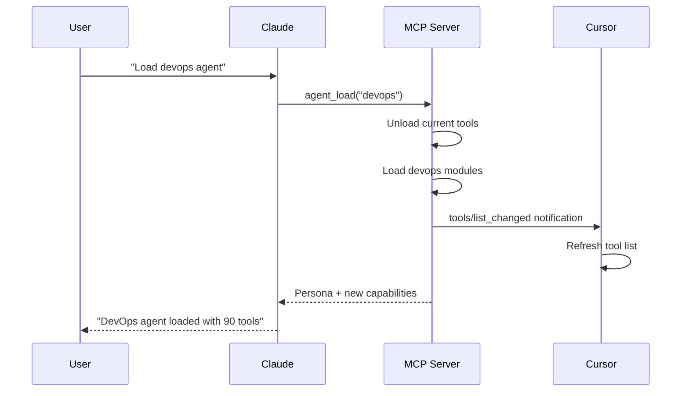

---

## ⚡ Skills

Skills are **reusable multi-step workflows** that chain tools together with logic, conditions, and templating.

```mermaid
flowchart LR
    subgraph SKILL["<b>⚡ Skill: start_work</b>"]
        direction LR
        S1[📋 Get Jira Issue] --> S2[🔀 Checkout main]
        S2 --> S3[⬇️ Pull latest]
        S3 --> S4[🌿 Create branch]
        S4 --> S5[📝 Update Jira]
    end
    
    INPUT[("issue_key: AAP-12345<br>repo: backend")] --> S1
    S5 --> OUTPUT[("✅ Branch ready<br>Jira: In Progress")]
    
    style INPUT fill:#6366f1,stroke:#4f46e5,color:#fff
    style OUTPUT fill:#10b981,stroke:#059669,color:#fff
    style S1 fill:#3b82f6,stroke:#2563eb,color:#fff
    style S2 fill:#3b82f6,stroke:#2563eb,color:#fff
    style S3 fill:#3b82f6,stroke:#2563eb,color:#fff
    style S4 fill:#3b82f6,stroke:#2563eb,color:#fff
    style S5 fill:#3b82f6,stroke:#2563eb,color:#fff
```

### 🎯 Available Skills

| Skill | Description | Agent |
|-------|-------------|-------|
| ⚡ [`start_work`](#start_work) | Begin working on a Jira issue | developer |
| 🚀 [`create_mr`](#create_mr) | Create MR with validation, linting, conflict detection | developer |
| ✅ [`close_issue`](#close_issue) | Close issue with commit summary | developer |
| 👀 [`review_pr`](#review_pr) | Review PR with auto-approve/feedback | developer |
| 📋 [`review_all_prs`](#review_all_prs) | Batch review open PRs (by others) | developer |
| 📝 [`check_my_prs`](#check_my_prs) | Check your PRs for feedback, auto-rebase conflicts | developer |
| 🔄 [`rebase_pr`](#rebase_pr) | Rebase PR onto main, auto-resolve obvious conflicts | developer |
| 🔁 [`sync_branch`](#sync_branch) | Quick sync with main (daily rebase) | developer |
| 🧪 [`test_mr_ephemeral`](#test_mr_ephemeral) | Test in ephemeral namespace | developer |
| 📋 [`jira_hygiene`](#jira_hygiene) | Validate/fix Jira quality | developer |
| 📊 [`standup_summary`](#standup_summary) | Generate standup from recent activity | developer |
| 🔍 [`investigate_alert`](#investigate_alert) | Quick alert triage (escalates to debug_prod) | devops, incident |
| 🐛 [`debug_prod`](#debug_prod) | Debug production issues | devops, incident |
| 📦 [`release_aa_backend_prod`](#release_aa_backend_prod) | Release to production | release |
| 🤖 [`slack_agent`](#slack_agent) | Autonomous Slack responder with intent routing | slack |
| 🔐 [`slack_agent_confirm`](#slack_agent_confirm) | Execute confirmed actions from Slack | slack |

---

### ⚡ start_work

Begin work on a Jira issue - creates branch, sets up context, or resumes existing work.

```
skill_run("start_work", '{"issue_key": "AAP-12345"}')
```

**Inputs:**
| Input | Required | Default | Description |
|-------|----------|---------|-------------|
| `issue_key` | Yes | - | Jira issue key (e.g., AAP-12345) |
| `repo` | No | `.` | Repository path |


---

### 🚀 create_mr

Create a Merge Request with full validation, linting, and conflict detection.

```
skill_run("create_mr", '{"issue_key": "AAP-12345"}')
skill_run("create_mr", '{"issue_key": "AAP-12345", "run_linting": true, "auto_fix_lint": true}')
```

**Inputs:**
| Input | Required | Default | Description |
|-------|----------|---------|-------------|
| `issue_key` | Yes | - | Jira issue key |
| `repo` | No | `.` | Repository path |
| `draft` | No | `true` | Create as draft MR |
| `target_branch` | No | `main` | Target branch |
| `run_linting` | No | `true` | Run black/flake8 checks |
| `auto_fix_lint` | No | `false` | Auto-fix with black |
| `check_jira` | No | `true` | Run jira_hygiene first |

**Pre-flight Checks:**
| Check | Action |
|-------|--------|
| Uncommitted changes | ❌ Error if dirty |
| Commit format | ⚠️ Warn if missing AAP-XXXXX |
| Merge conflicts | ❌ Error + suggest `rebase_pr` |
| Black | ⚠️ Warn or auto-fix |
| Flake8 | ⚠️ Warn with issues |
| Jira hygiene | Auto-fix via `jira_hygiene` skill |

```mermaid
flowchart TD
    A[Start] --> B{On feature branch?}
    B -->|No| X[❌ Error]
    B -->|Yes| C{Clean working tree?}
    C -->|No| X
    C -->|Yes| D[Validate commits]
    D --> E{Can merge cleanly?}
    E -->|No| Y[⚠️ Suggest rebase_pr]
    E -->|Yes| F[Run linting]
    F --> G[Run jira_hygiene]
    G --> H[Push branch]
    H --> I[Create GitLab MR]
    I --> J[Update Jira]
    J --> K[✅ Done]
```

---

### ✅ close_issue

Close a Jira issue with a summary of completed work from commits.

```
skill_run("close_issue", '{"issue_key": "AAP-12345"}')
```

**Inputs:**
| Input | Required | Default | Description |
|-------|----------|---------|-------------|
| `issue_key` | Yes | - | Jira issue key |
| `repo` | No | `.` | Repository path |
| `add_comment` | No | `true` | Add closing comment |

```mermaid
flowchart TD
    A[Start] --> B{Already Done?}
    B -->|Yes| C[Skip]
    B -->|No| D[Find Branch]
    D --> E[Get Commits]
    E --> F[Get MR Info]
    F --> G[Build Comment]
    G --> H["✅ Branch, MR, Commits Table"]
    H --> I[Add Comment to Jira]
    I --> J[Transition to Done]
    J --> K[Verify Status]
```

---

### 👀 review_pr

Review a colleague's PR with static analysis and local testing. **Automatically approves or posts feedback.**

```
skill_run("review_pr", '{"mr_id": 123}')
skill_run("review_pr", '{"issue_key": "AAP-61214"}')
skill_run("review_pr", '{"mr_id": 123, "skip_tests": true}')
```

**Inputs:**
| Input | Required | Default | Description |
|-------|----------|---------|-------------|
| `mr_id` | No* | - | GitLab MR ID (e.g., 123) |
| `issue_key` | No* | - | Jira issue key (e.g., AAP-61214) - finds associated MR |
| `run_tests` | No | `false` | Checkout branch and run local tests |

*One of `mr_id` or `issue_key` required. If issue_key provided, searches for the MR.

**Default behavior:** Static analysis only (no checkout). Say "also run tests" to checkout and test locally.

**Auto-Actions:**
- ✅ **Approve** if no blocking issues found
- 📝 **Post feedback** if security issues, test failures, or format problems
- 📋 **Update Jira** with review status


---

### 📋 review_all_prs

Batch review all open PRs with intelligent follow-up. **Also checks your own PRs for merge conflicts and auto-rebases.**

```
skill_run("review_all_prs", '{}')
skill_run("review_all_prs", '{"dry_run": true}')
skill_run("review_all_prs", '{"auto_rebase": true}')  # Also rebase your PRs with conflicts
```

**Inputs:**
| Input | Required | Default | Description |
|-------|----------|---------|-------------|
| `project` | No | automation-analytics/automation-analytics-backend | GitLab project |
| `reviewer` | No | - | Filter by reviewer |
| `limit` | No | `10` | Max MRs to process |
| `dry_run` | No | `false` | Preview without taking action |
| `include_my_mrs` | No | `true` | Show your own MRs |
| `auto_rebase` | No | `true` | Auto-rebase your MRs with conflicts |

**Decision Logic (for PRs by others):**
| Scenario | Action |
|----------|--------|
| No previous review from me | Run full review |
| I gave feedback, author didn't respond | Skip (waiting) |
| I gave feedback, author addressed it | Approve |
| I gave feedback, unresolved issues remain | Post follow-up |

**For Your Own PRs:**
| Scenario | Action |
|----------|--------|
| Has merge conflicts | Call `rebase_pr` skill |
| Has merge commits | Suggest rebase |
| Other | Show feedback status |


---

### 📝 check_my_prs

Check your own open PRs for feedback from reviewers. **Auto-detects and offers to rebase MRs with conflicts.**

```
skill_run("check_my_prs", '{}')
skill_run("check_my_prs", '{"auto_rebase": true}')  # Auto-rebase conflicts
skill_run("check_my_prs", '{"auto_merge": true}')   # Auto-merge approved
```

**Inputs:**
| Input | Required | Default | Description |
|-------|----------|---------|-------------|
| `project` | No | automation-analytics/... | GitLab project |
| `show_approved` | No | `true` | Include approved MRs |
| `auto_merge` | No | `false` | Auto-merge approved MRs |
| `auto_rebase` | No | `false` | Auto-rebase MRs with conflicts |

**Output Categories:**
| Status | Meaning |
|--------|---------|
| 🔄 Needs Rebase | Has merge conflicts - offers `rebase_pr` |
| 🔴 Needs Your Response | Reviewers left feedback - address it |
| 🔴 Pipeline Failed | Fix CI before review |
| 🟡 Awaiting Review | No feedback yet |
| 🟢 Approved | Ready to merge! |

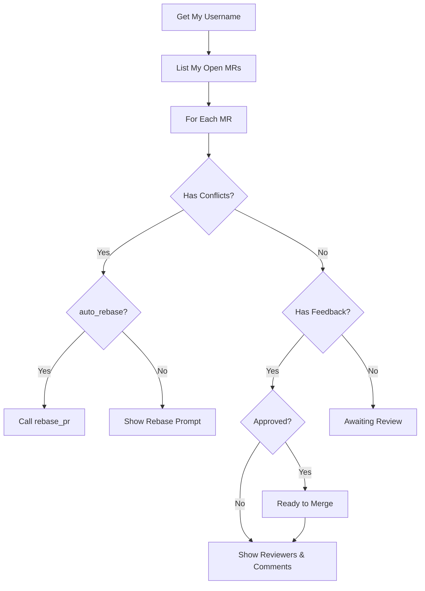

**Example Output:**
```
## 📋 Your Open MRs

**User:** daoneill
**Open MRs:** 3

### 🔴 Needs Your Response
**!240**: AAP-61210 - feat: Caching
  - Feedback from: jsmith, mwilson
  - ⚠️ Has unresolved discussions

### 🟡 Awaiting Review
- !241: AAP-61212 - fix: Memory leak

### 🟢 Approved - Ready to Merge
- !239: AAP-61208 - docs: Update README ✅
```

---

### 🔄 rebase_pr

Rebase a PR branch onto main, cleaning up merge commits and handling conflicts.
**Automatically resolves obvious conflicts** (additions, deletions, whitespace-only changes).

```
skill_run("rebase_pr", '{"mr_id": 123}')
skill_run("rebase_pr", '{"issue_key": "AAP-61214"}')
skill_run("rebase_pr", '{"branch": "AAP-61214-feature"}')
```

**Inputs:**
| Input | Required | Default | Description |
|-------|----------|---------|-------------|
| `mr_id` | No* | - | GitLab MR ID |
| `issue_key` | No* | - | Jira issue key |
| `branch` | No* | - | Branch name directly |
| `base_branch` | No | `main` | Branch to rebase onto |
| `force_push` | No | `false` | Auto force-push when done |

*One of `mr_id`, `issue_key`, or `branch` required

**Flow:**
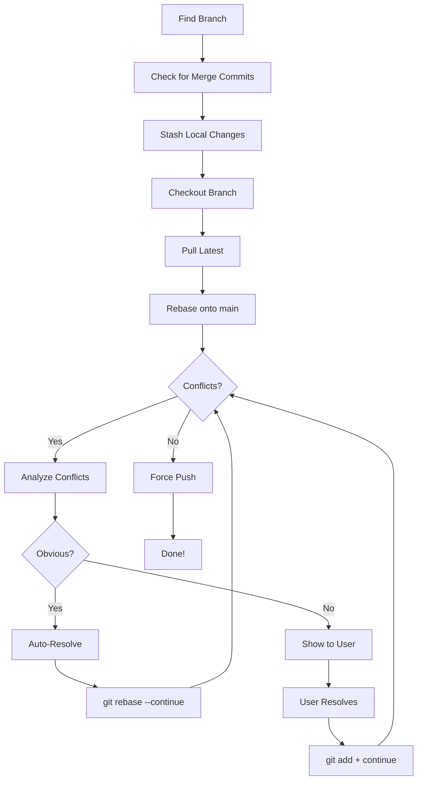

**Auto-Resolution Strategies:**
| Conflict Type | Action |
|--------------|--------|
| Ours empty, theirs has content | Accept theirs (new addition) |
| Theirs empty, ours has content | Keep ours (they deleted) |
| Identical content | Remove markers |
| Whitespace-only difference | Accept theirs |
| One side subset of other | Merge (keep superset) |
| Both sides changed differently | **Ask user** |

**Example Output:**
```
## 🔄 Rebase PR Summary

**Branch:** `AAP-61214-feature`
**Base:** `main`

### 🤖 Auto-Resolved: 2 file(s)
- ✅ `src/config.py` (accept_theirs)
- ✅ `tests/test_api.py` (whitespace_only)

### 🙋 Needs Your Help: 1 file(s)
- ⚠️ `src/api/views.py` (3 conflicts) - Complex changes on both sides

### ⚠️ Manual Resolution Required

## 🛠️ Resolve Remaining Conflicts
Step 1: Edit `src/api/views.py` (look for <<<<<<< markers)
Step 2: git add src/api/views.py
Step 3: git rebase --continue
Step 4: git push --force-with-lease origin AAP-61214-feature
```

---

### 🔁 sync_branch

Quick daily sync of current branch with main using rebase.

```
skill_run("sync_branch", '{}')
skill_run("sync_branch", '{"force_push": true}')
```

**Inputs:**
| Input | Required | Default | Description |
|-------|----------|---------|-------------|
| `repo` | No | `.` | Repository path |
| `base_branch` | No | `main` | Branch to sync with |
| `stash_changes` | No | `true` | Stash uncommitted changes |
| `force_push` | No | `false` | Force push after rebase |

**Flow:**
```mermaid
flowchart TD
    A[Get Current Branch] --> B{On main?}
    B -->|Yes| X[❌ Error]
    B -->|No| C{Uncommitted changes?}
    C -->|Yes| D[Stash]
    C -->|No| E[Fetch origin/main]
    D --> E
    E --> F{Behind main?}
    F -->|No| G[✅ Up to date]
    F -->|Yes| H[Rebase onto main]
    H --> I{Conflicts?}
    I -->|No| J[Pop stash]
    I -->|Yes| K[Show conflicts]
    J --> L{force_push?}
    L -->|Yes| M[Push]
    L -->|No| N[Ready to push]
```

---

### 📊 standup_summary

Generate standup summary from recent activity.

```
skill_run("standup_summary", '{}')
skill_run("standup_summary", '{"days": 1}')
```

**Inputs:**
| Input | Required | Default | Description |
|-------|----------|---------|-------------|
| `repo` | No | `.` | Repository path |
| `days` | No | `1` | Days to look back |
| `include_jira` | No | `true` | Include Jira issues |
| `include_gitlab` | No | `true` | Include MR activity |

**Output Example:**
```markdown
## 📋 Standup Summary
**Date:** 2025-01-15
**Author:** Dave O'Neill

### ✅ What I Did
**Commits:** 5
- `a1b2c3d` AAP-61214 - feat: Add user validation
- `e4f5g6h` AAP-61214 - fix: Handle edge case
- ... and 3 more

**Issues Closed:**
- [AAP-61200] Fix memory leak in processor

**PRs Reviewed:**
- !245: AAP-61210 - docs: Update API guide

### 🔄 What I'm Working On
- [AAP-61214] Implement user validation
- [AAP-61220] Refactor auth module

**Open MRs:**
- !248: AAP-61214 - feat: Add user validation

### 🚧 Blockers
- None
```

---

### 🧪 test_mr_ephemeral

Test an MR image in an ephemeral Kubernetes namespace.

```
skill_run("test_mr_ephemeral", '{"mr_id": 123}')
skill_run("test_mr_ephemeral", '{"commit_sha": "abc123"}')
```

**Inputs:**
| Input | Required | Default | Description |
|-------|----------|---------|-------------|
| `mr_id` | No* | - | GitLab MR ID |
| `commit_sha` | No* | - | Commit SHA to test |
| `duration` | No | `2h` | Namespace duration |
| `billing` | No | `false` | Include billing component |

*One of `mr_id` or `commit_sha` required


---

### 📋 jira_hygiene

Validate and fix Jira issue quality - descriptions, acceptance criteria, links.

```
skill_run("jira_hygiene", '{"issue_key": "AAP-12345"}')
skill_run("jira_hygiene", '{"issue_key": "AAP-12345", "auto_fix": true}')
```

**Inputs:**
| Input | Required | Default | Description |
|-------|----------|---------|-------------|
| `issue_key` | Yes | - | Jira issue key |
| `auto_fix` | No | `false` | Auto-fix issues |
| `auto_transition` | No | `false` | Auto-transition New→Refinement |


**Checks Performed:**
- ✅ Has description (not empty)
- ✅ Has acceptance criteria
- ✅ Priority is set
- ✅ Has labels/components
- ✅ Linked to epic (stories only)
- ✅ Has fix version
- ✅ Story points (if In Progress)
- ✅ Proper Jira markup

---

### 🔍 investigate_alert

Investigate a firing Prometheus alert.

```
skill_run("investigate_alert", '{"environment": "production"}')
skill_run("investigate_alert", '{"environment": "stage", "alert_name": "HighErrorRate"}')
```

**Inputs:**
| Input | Required | Default | Description |
|-------|----------|---------|-------------|
| `environment` | Yes | - | `production` or `stage` |
| `alert_name` | No | - | Specific alert to investigate |


---

### 🐛 debug_prod

Comprehensive production debugging with memory-backed pattern matching.

```
skill_run("debug_prod", '{"namespace": "main"}')
skill_run("debug_prod", '{"namespace": "billing", "alert_name": "HighLatency"}')
```

**Inputs:**
| Input | Required | Default | Description |
|-------|----------|---------|-------------|
| `namespace` | No | asks | `main` or `billing` |
| `alert_name` | No | - | Prometheus alert name |
| `pod_filter` | No | - | Filter pods by name |
| `time_range` | No | `1h` | How far back (15m, 1h, 6h, 24h) |


**Locations Checked:**
- Pod status: CrashLoopBackOff, OOMKilled, restarts
- Events: warnings, errors
- Logs: filtered for errors (truncated)
- Alert definitions: `app-interface/resources/insights-prod/`
- CICD config: `app-interface/data/services/insights/tower-analytics/cicd/`
- Namespace config: `app-interface/data/services/insights/tower-analytics/namespaces/`

---

### 📦 release_aa_backend_prod

Release Automation Analytics backend to production via app-interface.

```
skill_run("release_aa_backend_prod", '{"commit_sha": "abc123def456"}')
```

**Inputs:**
| Input | Required | Default | Description |
|-------|----------|---------|-------------|
| `commit_sha` | Yes | - | Commit SHA to release |
| `release_date` | No | today | Release date for Jira |
| `include_billing` | No | `false` | Also update billing namespace |


**Files Modified:**
```
app-interface/data/services/insights/tower-analytics/cicd/deploy-clowder.yml
```

---

### 🤖 slack_agent

Autonomous Slack responder that processes incoming messages, detects intent, and routes to appropriate skills.

```
skill_run("slack_agent", '{}')                     # Process all pending
skill_run("slack_agent", '{"channel": "C123"}')    # Process specific channel
skill_run("slack_agent", '{"dry_run": true}')      # Analyze without responding
```

**Inputs:**
| Input | Required | Default | Description |
|-------|----------|---------|-------------|
| `channel` | No | - | Filter to specific channel ID |
| `limit` | No | `10` | Max messages to process |
| `dry_run` | No | `false` | Analyze but don't respond |
| `auto_mark` | No | `true` | Mark messages as processed |

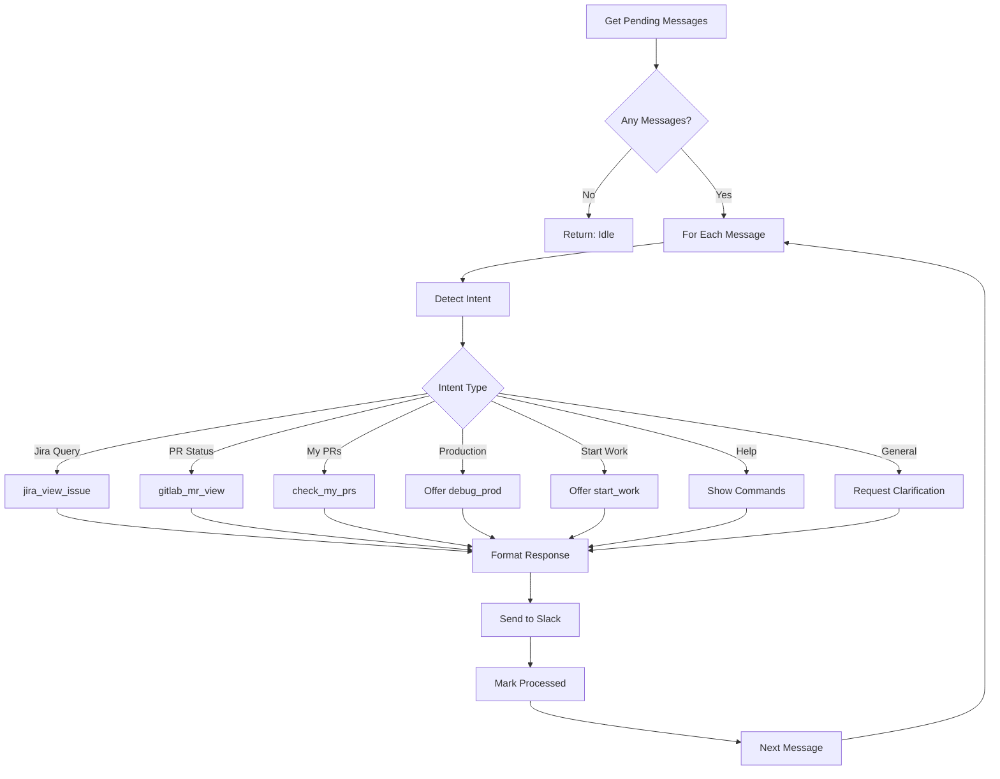

**Detected Intents:**
| Intent | Trigger Examples | Action |
|--------|------------------|--------|
| `jira_query` | "AAP-12345", "issue 12345" | Show issue details |
| `pr_status` | "!123", "MR 123" | Show MR status |
| `check_my_prs` | "my MRs", "my PRs" | Run check_my_prs |
| `prod_debug` | "prod down", "alert firing" | Offer debug_prod |
| `start_work` | "start AAP-12345" | Offer start_work |
| `standup` | "standup", "status update" | Run standup_summary |
| `help` | "help", "how do I" | Show available commands |

---

### 🔐 slack_agent_confirm

Executes confirmed actions from the slack_agent when user approves.

```
skill_run("slack_agent_confirm", '{"action": "start_work", "issue_key": "AAP-12345"}')
skill_run("slack_agent_confirm", '{"action": "debug_prod", "namespace": "tower-analytics-prod"}')
```

**Inputs:**
| Input | Required | Default | Description |
|-------|----------|---------|-------------|
| `action` | Yes | - | Action to execute |
| `issue_key` | No | - | Jira issue key (for Jira actions) |
| `mr_id` | No | - | MR ID (for MR actions) |
| `namespace` | No | - | K8s namespace (for debug_prod) |
| `channel_id` | No | - | Channel to respond in |
| `thread_ts` | No | - | Thread for responses |

**Supported Actions:**
- `start_work` - Start working on issue
- `close_issue` - Close completed issue
- `review_pr` - Review an MR
- `rebase_pr` - Rebase an MR
- `sync_branch` - Sync branch with main
- `create_mr` - Create new MR
- `debug_prod` - Debug production namespace
- `jira_hygiene` - Check issue quality
- `standup_summary` - Generate standup

---

### 📝 Skill Format

```yaml
name: skill_name
description: What this skill does
version: "1.0"

inputs:
  - name: input_name
    type: string
    required: true
    description: "What this input is for"

constants:
  some_value: "constant data"

steps:
  - name: step_one
    tool: tool_name
    args:
      param: "{{ inputs.input_name }}"
    output: step1_result

  - name: step_two
    condition: "{{ step1_result.success }}"
    compute: |
      # Python code here
      result = {"processed": step1_result.data}
    output: step2_result

  - name: step_three
    condition: "{{ not step2_result.processed }}"
    tool: fallback_tool
    on_error: continue

outputs:
  - name: summary
    value: |
      ## Results
      {{ step2_result | json }}
```

### ▶️ Running Skills

**In chat:**
```
Run skill: start_work with issue AAP-12345
```

**Via tool:**
```
skill_run("start_work", '{"issue_key": "AAP-12345"}')
```

**From agent:**
```
Use the investigate_alert skill to check what's happening in production
```

---

## 🔧 Tool Modules

The system provides **165+ tools** organized into 14 modules:

```mermaid
graph TB
    subgraph MODULES["<b>🔧 Tool Modules</b>"]
        direction TB
        
        subgraph DEV_TOOLS["<b>Development</b>"]
            GIT[📂 git<br/>19 tools]
            JIRA[📋 jira<br/>18 tools]
            GITLAB[🦊 gitlab<br/>26 tools]
        end
        
        subgraph K8S_TOOLS["<b>Infrastructure</b>"]
            K8S[☸️ k8s<br/>26 tools]
            BONFIRE[🔥 bonfire<br/>21 tools]
            KONFLUX[🔄 konflux<br/>18 tools]
        end
        
        subgraph MON_TOOLS["<b>Monitoring</b>"]
            PROM[📊 prometheus<br/>13 tools]
            ALERT[🚨 alertmanager<br/>6 tools]
            KIBANA[📜 kibana<br/>9 tools]
        end
        
        subgraph COMM_TOOLS["<b>Communication</b>"]
            SLACK[💬 slack<br/>15 tools]
        end
        
        subgraph OTHER["<b>Other</b>"]
            QUAY[📦 quay<br/>8 tools]
            APPINT[🔗 appinterface<br/>6 tools]
            WORKFLOW[⚡ workflow<br/>28 tools]
        end
    end
    
    style GIT fill:#f97316,stroke:#ea580c,color:#fff
    style JIRA fill:#0052cc,stroke:#0747a6,color:#fff
    style GITLAB fill:#fc6d26,stroke:#e24329,color:#fff
    style K8S fill:#326ce5,stroke:#2563eb,color:#fff
    style PROM fill:#e6522c,stroke:#d14020,color:#fff
    style WORKFLOW fill:#10b981,stroke:#059669,color:#fff
    style SLACK fill:#4a154b,stroke:#611f69,color:#fff
```

### Tool Categories

<details>
<summary><b>📂 Git Tools (19)</b></summary>

| Tool | Description |
|------|-------------|
| `git_status` | Show working tree status |
| `git_branch` | List/create branches |
| `git_checkout` | Switch branches |
| `git_commit` | Commit changes |
| `git_push` | Push to remote |
| `git_pull` | Pull from remote |
| `git_log` | Show commit history |
| `git_diff` | Show changes |
| `git_stash` | Stash changes |
| `git_merge` | Merge branches |
| `git_rebase` | Rebase branch |
| `git_cherry_pick` | Cherry-pick commits |
| `git_reset` | Reset changes |
| `git_tag` | Manage tags |
| `git_remote` | Manage remotes |
| ... | and more |

</details>

<details>
<summary><b>📋 Jira Tools (23)</b></summary>

**Read Operations:**
| Tool | Description |
|------|-------------|
| `jira_view_issue` | View issue details |
| `jira_view_issue_json` | Get issue as JSON |
| `jira_search` | Search with JQL |
| `jira_list_issues` | List project issues |
| `jira_my_issues` | List your assigned issues |
| `jira_list_blocked` | List blocked issues |
| `jira_lint` | Check issue quality |

**Write Operations:**
| Tool | Description |
|------|-------------|
| `jira_set_status` | Transition issue status |
| `jira_assign` | Assign to user |
| `jira_unassign` | Remove assignee |
| `jira_add_comment` | Add comment |
| `jira_block` | Mark as blocked |
| `jira_unblock` | Remove block |
| `jira_add_to_sprint` | Add to sprint |
| `jira_remove_sprint` | Remove from sprint |
| `jira_create_issue` | Create new issue |
| `jira_clone_issue` | Clone existing issue |
| `jira_add_link` | Link issues |
| `jira_add_flag` | Add impediment flag |
| `jira_remove_flag` | Remove flag |
| `jira_open_browser` | Open in browser |

*Requires: `rh-issue` CLI and `JIRA_JPAT` environment variable*

</details>

<details>
<summary><b>🦊 GitLab Tools (26)</b></summary>

| Tool | Description |
|------|-------------|
| `gitlab_mr_list` | List MRs |
| `gitlab_mr_create` | Create MR |
| `gitlab_mr_view` | View MR details |
| `gitlab_mr_approve` | Approve MR |
| `gitlab_mr_merge` | Merge MR |
| `gitlab_pipeline_list` | List pipelines |
| `gitlab_pipeline_view` | Pipeline details |
| `gitlab_pipeline_retry` | Retry pipeline |
| `gitlab_job_logs` | Job logs |
| `gitlab_project_info` | Project info |
| ... | and more |

</details>

<details>
<summary><b>💬 Slack Tools (15)</b> - Event-Driven Slack Integration</summary>

**Message Operations:**
| Tool | Description |
|------|-------------|
| `slack_list_messages` | Get recent messages from a channel |
| `slack_send_message` | Send message (with threading) |
| `slack_search_messages` | Search Slack messages |
| `slack_add_reaction` | Add emoji reaction to message |

**Pending Message Queue:**
| Tool | Description |
|------|-------------|
| `slack_get_pending` | Get messages waiting for agent |
| `slack_mark_processed` | Mark message as handled |
| `slack_respond_and_mark` | Respond and mark in one step |

**User & Channel Info:**
| Tool | Description |
|------|-------------|
| `slack_get_user` | Resolve user ID to profile |
| `slack_list_channels` | List available channels |
| `slack_validate_session` | Check session credentials |

**Listener Control:**
| Tool | Description |
|------|-------------|
| `slack_listener_start` | Start background listener |
| `slack_listener_stop` | Stop background listener |
| `slack_listener_status` | Get listener status/stats |

> ⚠️ **Note:** This uses Slack's internal web API (not official Bot API).
> See [Slack Integration](#-slack-integration) for setup.

</details>

<details>
<summary><b>☸️ Kubernetes Tools (22)</b></summary>

**Pods:**
| Tool | Description |
|------|-------------|
| `kubectl_get_pods` | List pods |
| `kubectl_describe_pod` | Describe pod |
| `kubectl_logs` | Get pod logs |
| `kubectl_delete_pod` | Delete pod |

**Deployments:**
| Tool | Description |
|------|-------------|
| `kubectl_get_deployments` | List deployments |
| `kubectl_describe_deployment` | Describe deployment |
| `kubectl_rollout_status` | Check rollout status |
| `kubectl_rollout_restart` | Rolling restart |
| `kubectl_scale` | Scale replicas |

**Networking:**
| Tool | Description |
|------|-------------|
| `kubectl_get_services` | List services |
| `kubectl_get_ingress` | List ingress |

**Config:**
| Tool | Description |
|------|-------------|
| `kubectl_get_configmaps` | List configmaps |
| `kubectl_get_secrets` | List secrets |

**Debugging:**
| Tool | Description |
|------|-------------|
| `kubectl_get_events` | Get events |
| `kubectl_top_pods` | Resource usage |
| `kubectl_get` | Get any resource |
| `kubectl_exec` | Exec command |

**SaaS/App-SRE:**
| Tool | Description |
|------|-------------|
| `kubectl_saas_pipelines` | SaaS pipelines |
| `kubectl_saas_deployments` | SaaS deployments |
| `kubectl_saas_pods` | SaaS pods |
| `kubectl_saas_logs` | SaaS logs |

*Authentication via kubeconfig files: `~/.kube/config.s` (stage), `~/.kube/config.p` (prod), `~/.kube/config.e` (ephemeral)*

</details>

### Environment Variables

| Variable | Server | Description |
|----------|--------|-------------|
| `JIRA_URL` | aa-jira | Jira instance URL |
| `JIRA_JPAT` | aa-jira | Jira Personal Access Token |
| `GITLAB_TOKEN` | aa-gitlab | GitLab API token |
| `KUBECONFIG` | aa-k8s | Default kubeconfig path |
| `KUBECONFIG_KONFLUX` | aa-konflux | Konflux cluster kubeconfig |

> **Note:** Quay tools use `skopeo` which leverages your existing `podman login` or `docker login` credentials - no separate token needed!

### Server Architecture

Each MCP server follows the same pattern:

```
mcp-servers/aa-{name}/
├── pyproject.toml      # Package definition
└── src/
    ├── __init__.py
    ├── server.py       # Entry point
    └── tools.py        # @mcp.tool() decorated functions
```

**Installation:**
```bash
# Individual server
cd mcp-servers/aa-git && pip install -e .

# All servers
for d in mcp-servers/aa-*/; do pip install -e "$d"; done
```

### Dynamic Agent Loading

To work around Cursor's 128-tool limit, we use **dynamic agent loading** where tools switch when you change agents:

```mermaid
sequenceDiagram
    participant User
    participant Claude
    participant MCP as MCP Server
    participant Cursor
    
    User->>Claude: "Load devops agent"
    Claude->>MCP: agent_load("devops")
    MCP->>MCP: Unload developer tools
    MCP->>MCP: Load k8s, bonfire, quay, gitlab
    MCP->>Cursor: tools/list_changed
    Cursor->>Cursor: Refresh available tools
    MCP-->>Claude: "Loaded 90 tools"
    Claude-->>User: "DevOps agent ready!"
    
    User->>Claude: "Check my namespaces"
    Claude->>MCP: bonfire_namespace_list()
    MCP-->>Claude: Namespace list
    Claude-->>User: "Found ephemeral-nx6n2s..."
```

```
You: I need to deploy but I'm using the developer agent

Claude: Let me switch to the devops agent for deployment tools:
        
        [Calls agent_load("devops")]
        
        🔧 DevOps Agent Loaded
        Now I have access to bonfire, k8s, and quay tools.
        
        [Calls bonfire_namespace_list(mine_only=true)]
        
        Your namespaces:
        • ephemeral-nx6n2s (ready, expires in 1h38m)
```

### 📋 Prompts

Pre-defined conversation templates that structure common workflows:

| Prompt | Purpose |
|--------|---------|
| `session_init` | Initialize a new work session with context loading |
| `debug_guide` | Systematic production debugging walkthrough |
| `review_guide` | Structured code review checklist |

**Usage:**
```
Claude: [Uses session_init prompt]

# Session initialized
Let me start by loading your work context...
```

### 📁 Resources

Data sources the AI can read directly (without tool calls):

| Resource URI | Content |
|--------------|---------|
| `memory://state/current_work` | Active issues, branches, MRs |
| `memory://learned/patterns` | Known error patterns and solutions |
| `config://agents` | Available agent configurations |
| `config://skills` | Available skill definitions |
| `config://repositories` | Configured repositories |

**Usage:**
```
Claude: [Reads memory://learned/patterns resource]

I see there are 12 known error patterns including:
- OOMKilled: Increase memory limits or fix memory leaks
- CrashLoopBackOff: Check logs, verify config/secrets
```

---

## 🔧 Auto-Debug: Self-Healing Tools

When an MCP tool fails, Claude can **diagnose and fix the tool itself**!

### How It Works

```mermaid
flowchart LR
    A[Tool Fails] --> B[Returns ❌ with hint]
    B --> C[Claude calls debug_tool]
    C --> D[Analyze source code]
    D --> E[Propose fix]
    E --> F{User confirms?}
    F -->|Yes| G[Apply fix & commit]
    F -->|No| H[Manual investigation]
    G --> I[Retry operation]
```

### The Workflow

1. **Tool fails** → Look for the hint: `💡 To auto-fix: debug_tool('tool_name')`
2. **Call debug_tool** → `debug_tool('bonfire_namespace_release', 'error message')`
3. **Analyze the source** → Claude compares error to actual code
4. **Propose a fix** → Shows exact `search_replace` edit
5. **Ask user to confirm** → "Found bug: missing --force flag. Apply fix?"
6. **Apply and commit** → `git commit -m "fix(tool_name): description"`

### Example

```
Tool output: ❌ Failed to release namespace
             💡 To auto-fix: `debug_tool('bonfire_namespace_release')`

Claude: I found the bug. The bonfire CLI prompts for confirmation but we're
        not passing --force. Here's the fix:

        File: mcp-servers/aa-bonfire/src/tools.py
        - args = ['namespace', 'release', namespace]
        + args = ['namespace', 'release', namespace, '--force']

        Apply this fix?

User: yes

Claude: [applies fix, commits, retries operation]
```

### Common Auto-Fixable Bugs

| Error Pattern | Likely Cause |
|---------------|--------------|
| "Output is not a TTY" | Missing --force/--yes flag |
| "Unknown flag: --state" | CLI syntax changed |
| "Unauthorized" | Auth not passed correctly |
| "manifest unknown" | Wrong image tag format |

### The @debuggable Decorator

All tools are automatically wrapped with debugging support:

```python
@debuggable
async def my_tool(param: str) -> str:
    """My tool description."""
    # If this fails, Claude can inspect the source and fix it!
    result = do_something(param)
    return result
```

---

## 🐛 Automatic Error Tracking

All tool and skill failures are **automatically reported** to GitHub Issues.

### How It Works

```mermaid
flowchart LR
    A[Tool Fails] --> B{GITHUB_TOKEN set?}
    B -->|Yes| C[Create Issue via API]
    B -->|No| D[Generate Issue Link]
    C --> E[Include: Tool, Error, Context]
    D --> E
    E --> F[Dedup Check]
    F -->|New| G[Create/Show Issue]
    F -->|Duplicate| H[Skip - recent similar issue]
```

### Features

- **Automatic creation**: If `GITHUB_TOKEN` is set, issues are created automatically
- **Deduplication**: Won't create duplicate issues within 1 hour
- **Rich context**: Includes tool name, error message, skill context, environment info
- **Smart labels**: Auto-labels issues based on tool type (jira, gitlab, kubernetes, etc.)

### Setup

```bash
# Optional: Set token for auto-creation (otherwise shows link to create manually)
export GITHUB_TOKEN=ghp_your_token_here
```

### Example Output

```
❌ Error: gitlab_mr_list failed: 401 Unauthorized

🐛 **Issue created:** https://github.com/dmzoneill/redhat-ai-workflow/issues/42
```

Or without token:
```
❌ Error: jira_view_issue failed: Connection refused

💡 **Report this error:**
📝 [Create GitHub Issue](https://github.com/dmzoneill/redhat-ai-workflow/issues/new?...)
```

---

## 💾 Memory System

Memory provides **persistent context** across Claude sessions.

```mermaid
graph TD
    subgraph MEMORY["<b>💾 Memory Structure</b>"]
        direction TB
        
        subgraph STATE["📊 state/"]
            CW[current_work.yaml<br/>Active issues, branches, MRs]
            ENV[environments.yaml<br/>Stage/prod health status]
        end
        
        subgraph LEARNED["🧠 learned/"]
            PAT[patterns.yaml<br/>Error patterns & solutions]
            RUN[runbooks.yaml<br/>Operational procedures]
        end
        
        subgraph SESSIONS["📅 sessions/"]
            TODAY[2024-12-22.yaml<br/>Today's action log]
            YESTERDAY[2024-12-21.yaml<br/>Yesterday's log]
        end
    end
    
    style STATE fill:#3b82f6,stroke:#2563eb,color:#fff
    style LEARNED fill:#10b981,stroke:#059669,color:#fff
    style SESSIONS fill:#f59e0b,stroke:#d97706,color:#fff
```

### Memory Operations

| Operation | Description | Example |
|-----------|-------------|---------|
| `memory_read()` | List all memory files | `memory_read()` |
| `memory_read(path)` | Read specific file | `memory_read("state/current_work")` |
| `memory_write(path, content)` | Overwrite file | `memory_write("learned/patterns", "...")` |
| `memory_update(path, field, value)` | Update specific field | `memory_update("state/current_work", "notes", "...")` |
| `memory_append(path, field, item)` | Append to list | `memory_append("state/current_work", "active_issues", '{"key": "AAP-123"}')` |
| `memory_session_log(action, details)` | Log to today's session | `memory_session_log("started_work", "AAP-12345")` |

**Session Logging Examples:**
```python
memory_session_log("started_work", "AAP-12345 - Implement API")
memory_session_log("created_mr", "MR !456 for AAP-12345")
memory_session_log("deployed", "v2.3.1 to stage")
memory_session_log("fixed", "OOMKilled issue by increasing limits")
```

**Best Practices:**
1. **Log important actions** - Future you will thank you
2. **Update current_work** when starting/finishing tasks
3. **Record patterns** when you solve a tricky problem
4. **Add runbooks** for procedures you might repeat

```
# Check what you were working on
You: What was I working on yesterday?

Claude: [Reads memory/sessions/2024-12-21.yaml]
        
        Yesterday you:
        • Started work on AAP-12345 (Implement API endpoint)
        • Created MR !456
        • Investigated a HighMemoryUsage alert in stage
        • Fixed by restarting analytics-api pod

# Save a learned pattern
You: Log that the ImagePullBackOff fix is to check Quay permissions

Claude: [Writes to memory/learned/patterns.yaml]
        
        ✅ Logged pattern:
        **Error:** ImagePullBackOff
        **Fix:** Check Quay image permissions and registry credentials
```

### Example: Current Work State

```yaml
# memory/state/current_work.yaml
last_updated: "2024-12-22T10:30:00Z"

active_issues:
  - key: AAP-12345
    summary: "Implement new REST API endpoint"
    status: "In Progress"
    branch: "aap-12345-implement-rest-api"
    repo: "backend"

open_mrs:
  - id: 456
    title: "AAP-12345 - feat(api): Implement new endpoint"
    url: "https://gitlab.example.com/mr/456"
    pipeline_status: "success"

current_branches:
  backend: "aap-12345-implement-rest-api"
  frontend: "main"
```

---

## 📋 Usage Scenarios

### 🔄 Daily Development Workflow

```mermaid
sequenceDiagram
    participant Dev as 👨‍💻 Developer
    participant AI as 🤖 Claude
    participant Tools as 🔧 Tools
    
    Dev->>AI: "Start session as developer"
    AI->>Tools: session_start(agent="developer")
    Tools-->>AI: Load context & tools
    AI-->>Dev: "Ready! No active issues."
    
    Dev->>AI: "Work on AAP-12345"
    AI->>Tools: skill_run("start_work", {...})
    Tools-->>AI: Branch created, Jira updated
    AI-->>Dev: "Ready to code!"
    
    Note over Dev: ...makes code changes...
    
    Dev->>AI: "Create merge request"
    AI->>Tools: skill_run("create_mr", {...})
    Tools-->>AI: MR created, Jira linked
    AI-->>Dev: "MR !456 created, pipeline running"
```

<details>
<summary><b>📝 Full conversation example</b></summary>

```
You: Start a developer session

Claude: 🚀 Developer Session Started
        
        **Current Context:**
        • No active issues
        • Branch: main
        
        **Available Skills:**
        • start_work - Begin working on an issue
        • create_mr - Create merge request
        
        What would you like to work on?

You: I need to work on AAP-12345

Claude: [Running skill: start_work]
        
        ✅ Step 1: Got issue details
           "Implement new REST API endpoint"
        
        ✅ Step 2: Switched to main
        ✅ Step 3: Pulled latest changes
        ✅ Step 4: Created branch
           aap-12345-implement-new-rest-api
        ✅ Step 5: Updated Jira status
           Status: In Progress
        
        Ready to code! Your workspace is set up.

[...you make code changes...]

You: I'm done, create the MR

Claude: [Running skill: create_mr]
        
        ✅ Step 1: Staged all changes
        ✅ Step 2: Created commit
           "AAP-12345 - feat(api): Implement new endpoint"
        ✅ Step 3: Pushed to origin
        ✅ Step 4: Created MR !456
        ✅ Step 5: Linked to Jira issue
        
        🚀 MR Created: !456
        Pipeline: Running ⏳
        
        I'll check the pipeline status in a moment...
```

</details>

### 🚨 Incident Response

```mermaid
flowchart TD
    ALERT[🚨 Alert Fired] --> LOAD[Load incident agent]
    LOAD --> INVESTIGATE[Run investigate_alert skill]
    INVESTIGATE --> CHECK{Issues found?}
    CHECK -->|Yes| DIAGNOSE[Diagnose with logs & metrics]
    CHECK -->|No| CLOSE[Close investigation]
    DIAGNOSE --> FIX{Can fix?}
    FIX -->|Yes| APPLY[Apply fix]
    FIX -->|No| ESCALATE[Escalate to team]
    APPLY --> VERIFY[Verify fix]
    VERIFY --> LOG[Log to memory]
    
    style ALERT fill:#ef4444,stroke:#dc2626,color:#fff
    style FIX fill:#f59e0b,stroke:#d97706,color:#fff
    style APPLY fill:#10b981,stroke:#059669,color:#fff
```

<details>
<summary><b>📝 Full conversation example</b></summary>

```
You: Load incident agent, we have alerts in prod

Claude: ## 🚨 Incident Agent Loaded
        
        Running immediate investigation...
        
        [Executing: investigate_alert for production]
        
        ## Investigation Report: production
        
        ### 🔴 Active Alerts (2)
        
        | Alert | Severity | Duration | Pod |
        |-------|----------|----------|-----|
        | HighMemoryUsage | critical | 15m | analytics-api-7d8f9 |
        | SlowResponseTime | warning | 8m | analytics-api-7d8f9 |
        
        ### 📊 Namespace Health
        
        • Pods: 4/5 running
        • 1 pod restarting (CrashLoopBackOff)
        • Recent deployments: None in 24h
        
        ### 🔍 Likely Cause
        
        analytics-api-7d8f9 is consuming 95% of its memory limit,
        causing slow responses and restarts.
        
        ### Recommended Actions
        1. Check pod logs for memory leaks
        2. Consider restarting the pod
        3. May need to increase memory limits

You: Check the logs for that pod

Claude: [Calls kubectl_logs with tail=100]
        
        ## Recent Logs: analytics-api-7d8f9
        
        ```
        2024-12-22 10:15:23 [ERROR] OutOfMemoryError in report generation
        2024-12-22 10:15:24 [WARN] Large result set: 1.2M rows
        2024-12-22 10:15:25 [ERROR] Query timeout, retrying...
        2024-12-22 10:15:26 [ERROR] OutOfMemoryError in report generation
        ```
        
        📋 **Analysis:**
        There's a runaway report query fetching 1.2M rows,
        causing OOM errors. This is likely a user-triggered
        report with too broad filters.
        
        **Options:**
        1. Restart pod (quick fix)
        2. Kill the specific process
        3. Investigate which report is causing this

You: Restart the pod

Claude: [Calls kubectl_delete_pod]
        
        ✅ Pod deleted: analytics-api-7d8f9
        
        [Calls kubectl_get_pods]
        
        New pod starting: analytics-api-8k2m1
        Status: Running (0/1 ready)
        
        [Waiting 30s...]
        
        ✅ New pod is healthy and ready!
        
        [Calls memory_session_log]
        Logged: Restarted analytics-api due to OOM from large report query
        
        Should I create a Jira issue to investigate the root cause?
```

</details>

### 🔍 Exploring & Learning

```
You: What Prometheus tools are available?

Claude: [Calls tool_list(module="prometheus")]
        
        ## 📊 Prometheus Module
        
        **13 tools available:**
        
        | Tool | Description |
        |------|-------------|
        | `prometheus_query` | Execute PromQL query |
        | `prometheus_query_range` | Time-range query |
        | `prometheus_get_alerts` | List firing alerts |
        | `prometheus_get_rules` | List alert rules |
        | `prometheus_check_health` | API health check |
        | ... | |
        
        Try: "Query CPU usage across all pods"

You: Query CPU usage for the last hour

Claude: [Calls prometheus_query_range]
        
        ## CPU Usage (Last Hour)
        
        | Pod | Avg | Max | Current |
        |-----|-----|-----|---------|
        | analytics-api | 45% | 72% | 48% |
        | analytics-worker | 68% | 89% | 71% |
        | analytics-scheduler | 12% | 25% | 15% |
        
        📈 Worker is running hot. Check if there's a backlog.
```

---

## ⚙️ Configuration

### Project Structure

```
ai-workflow/
├── 📁 agents/           # Agent personas and configs
│   ├── developer.yaml   # Developer agent config
│   ├── developer.md     # Developer persona
│   ├── devops.yaml
│   ├── incident.yaml
│   └── release.yaml
├── 📁 skills/           # Workflow definitions
│   ├── start_work.yaml
│   ├── create_mr.yaml
│   └── investigate_alert.yaml
├── 📁 memory/           # Persistent context
│   ├── state/          # Current work state
│   ├── learned/        # Patterns & runbooks
│   └── sessions/       # Daily logs
├── 📁 mcp-servers/      # MCP tool modules
│   ├── aa-git/
│   ├── aa-jira/
│   ├── aa-gitlab/
│   ├── aa-k8s/
│   └── ...
├── 📁 examples/         # Example configurations
│   ├── mcp-developer.json
│   ├── mcp-devops.json
│   └── mcp-full.json
├── 📄 config.json        # Repository configurations
└── 📄 .cursorrules      # Project rules for Claude
```

### Adding to Your Project

1. **Create `.cursor/rules/` directory** with a workflow rules file:
   ```bash
   mkdir -p /path/to/your/project/.cursor/rules
   # Create a .mdc file with project-specific context
   ```

2. **Create `.cursor/mcp.json`**:
   ```json
   {
     "mcpServers": {
       "aa-developer": {
         "command": "bash",
         "args": ["-c", "cd /path/to/redhat-ai-workflow/mcp-servers/aa-common && python3 -m src.server --agent developer"]
       }
     }
   }
   ```

3. **Customize `config.json`** with your repositories

4. **Restart Cursor** (Ctrl+Shift+P → "Developer: Reload Window")

---

## 🛠️ Extending

### Adding a New Tool

```python
# mcp-servers/aa-newtool/src/tools.py
from mcp.types import TextContent

def register_tools(server):
    @server.tool()
    async def newtool_action(param: str) -> list[TextContent]:
        """Description of what this tool does."""
        result = do_something(param)
        return [TextContent(type="text", text=f"Result: {result}")]
    
    return 1  # Return tool count
```

### Adding a New Skill

```yaml
# skills/my_skill.yaml
name: my_skill
description: What this skill does

inputs:
  - name: required_param
    required: true
  - name: optional_param
    default: "default_value"

steps:
  - name: step_one
    tool: some_tool
    args:
      param: "{{ inputs.required_param }}"
    output: step_result

  - name: conditional_step
    condition: "step_result.success"
    tool: another_tool
    args:
      data: "{{ step_result.data }}"

outputs:
  - name: summary
    value: "Completed: {{ step_result.message }}"
```

### Adding a New Agent

```yaml
# agents/myagent.yaml
name: myagent
description: What this agent specializes in
persona: agents/myagent.md

tools:
  - git
  - jira
  - workflow

skills:
  - start_work
  - my_custom_skill
```

```markdown
# agents/myagent.md
# My Agent

You are a specialized agent for [domain].

## Your Role
- Focus on [specific tasks]
- Use [specific tools]

## Guidelines
- Always [best practice]
- Never [anti-pattern]
```

---

## 💬 Slack Integration

The `aa-slack` module provides **proactive Slack integration** using an event-driven architecture. Unlike traditional Slack bots, this uses the internal web API for full feature access.

### How It Works

```mermaid
sequenceDiagram
    participant S as Slack
    participant L as Background Listener
    participant DB as SQLite State
    participant MCP as MCP Server
    participant LLM as Claude/AI
    
    loop Every 5 seconds
        L->>S: Poll watched channels
        S-->>L: New messages
        L->>L: Filter by @mentions/keywords
        L->>DB: Queue relevant messages
    end
    
    LLM->>MCP: slack_get_pending()
    MCP->>DB: Fetch pending queue
    DB-->>MCP: Pending messages
    MCP-->>LLM: Messages to process
    
    LLM->>MCP: slack_respond_and_mark(id, text)
    MCP->>S: Send response
    MCP->>DB: Mark processed
    MCP-->>LLM: Confirmation
```

### Quick Setup

1. **Get Credentials** (from browser dev tools):
   - Open Slack in browser → F12 → Network tab
   - Find any API call to `slack.com/api/*`
   - Extract `xoxc-...` token from request body
   - Extract `d` cookie value from Cookie header

2. **Configure Environment**:
   ```bash
   export SLACK_XOXC_TOKEN="xoxc-your-token"
   export SLACK_D_COOKIE="your-d-cookie"
   export SLACK_WATCHED_CHANNELS="C12345678,C87654321"
   export SLACK_WATCHED_KEYWORDS="help,question,urgent"
   export SLACK_SELF_USER_ID="U12345678"  # Your user ID
   ```

3. **Add to Cursor**:
   ```json
   {
     "mcpServers": {
       "aa-slack": {
         "command": "bash",
         "args": ["-c", "cd ~/src/ai-workflow/mcp-servers/aa-slack && python3 -m src.server --auto-start"]
       }
     }
   }
   ```

### Usage Examples

**Check for pending messages:**
```
slack_get_pending()
```

**Respond to a message:**
```
slack_respond_and_mark("C123_1234567890.123456", "Here's your answer: ...")
```

**Send to a specific channel:**
```
slack_send_message("C12345678", "Hello team!", thread_ts="1234567890.123456")
```

**Start/stop the listener:**
```
slack_listener_start()
slack_listener_status()
slack_listener_stop()
```

### Running as a Durable Process

For continuous listening (e.g., via systemd or pm2):

```bash
# Durable mode - keeps running in background
python -m src.server --durable --auto-start
```

**systemd example** (`/etc/systemd/system/aa-slack.service`):
```ini
[Unit]
Description=AI Workflow Slack Listener
After=network.target

[Service]
Type=simple
User=youruser
WorkingDirectory=/home/youruser/src/ai-workflow/mcp-servers/aa-slack
EnvironmentFile=/home/youruser/.slack-env
ExecStart=/usr/bin/python3 -m src.server --durable --auto-start
Restart=always
RestartSec=10

[Install]
WantedBy=multi-user.target
```

### User Classification

The Slack agent classifies users to modulate responses appropriately:

| Category | Response Style | Auto-Respond | Example |
|----------|----------------|--------------|---------|
| **Safe** (teammates) | Casual, emojis ✅ | Yes | "Hey! 📋 Here's the info..." |
| **Concerned** (managers) | Formal, no emojis | No (queued for review) | "Hello, Please find below..." |
| **Unknown** (everyone else) | Professional | Yes | "Hi, Here's what I found..." |

Configure in `config.json`:
```json
{
  "slack": {
    "user_classification": {
      "safe_list": {
        "user_ids": ["U11111111"],
        "user_names": ["alice", "bob"]
      },
      "concerned_list": {
        "user_ids": ["U99999999"],
        "user_names": ["manager_name"]
      }
    }
  }
}
```

When a **concerned user** sends a message:
1. Response is generated but NOT sent
2. Message is queued for your review
3. Optional notification sent to you via DM or channel
4. You can review and approve/modify before sending

### Autonomous Daemon Mode

For truly autonomous Slack response (outside Cursor), use the standalone daemon:

```bash
# Quick start (foreground)
make slack-daemon

# Dry-run mode (process but don't respond)
make slack-daemon-dry

# Background mode
make slack-daemon-bg
make slack-daemon-logs   # Watch logs
make slack-daemon-stop   # Stop daemon

# With LLM for intelligent responses
make slack-daemon-llm
```

**Terminal Output:**
```
╔══════════════════════════════════════════════════════════════════╗
║  🤖 AI Workflow - Autonomous Slack Agent                        ║
║                                                                  ║
║  Monitoring Slack channels for messages...                       ║
║  Press Ctrl+C to stop                                            ║
╚══════════════════════════════════════════════════════════════════╝

✅ Authenticated as: david
✅ State database connected
✅ Watching 2 channels
✅ Keywords: help, question, urgent

[00:05:23] 📊 Polls: 63 | 📬 Seen: 5 | ✅ Processed: 3 | 💬 Responded: 3

━━━━━━━━━━━━━━━━━━━━━━━━━━━━━━━━━━━━━━━━━━━━━━━━━━━━━━
📩 New Message
   Channel: #dev-help
   From: sarah
   Intent: jira_query
   Text: Can someone check AAP-12345?
   Response: ✅
━━━━━━━━━━━━━━━━━━━━━━━━━━━━━━━━━━━━━━━━━━━━━━━━━━━━━━
```

### Security Considerations

> ⚠️ **Warning:** This uses Slack's internal web API, not the official Bot API.
> - May violate Slack's Terms of Service
> - Credentials expire and need re-obtaining periodically
> - Use at your own risk

**Best practices:**
- Store credentials in environment variables, not code
- Use a dedicated Slack account for the agent
- Monitor for authentication failures
- Implement rate limit backoff (included by default)

---

## 🤝 Contributing

1. Fork the repository
2. Create a feature branch (`git checkout -b feature/amazing-tool`)
3. Add tests for new functionality
4. Submit a merge request

### Development Setup

```bash
# Clone your fork
git clone https://github.com/yourusername/ai-workflow.git
cd ai-workflow

# Install dev dependencies
pip install -e ".[dev]"

# Run tests
pytest tests/

# Test the server
python mcp-servers/aa-common/src/server.py --http --port 8080
# Visit http://localhost:8080
```

---

## 📄 License

MIT License - See [LICENSE](LICENSE) for details.

---

<picture>
  <source media="(prefers-color-scheme: dark)" srcset="https://capsule-render.vercel.app/api?type=waving&color=0:667eea,100:764ba2&height=100&section=footer">
  
</picture>

<div align="center">
  <sub>Built with ❤️ for developers who want AI that actually does things</sub>
</div>
