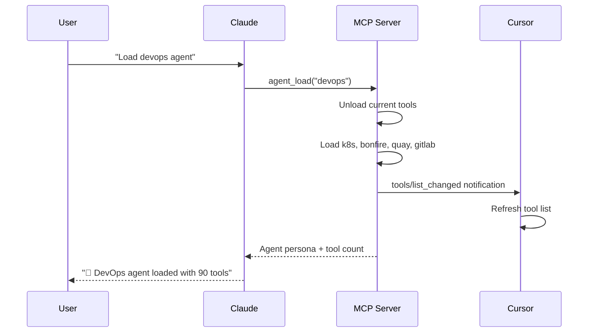
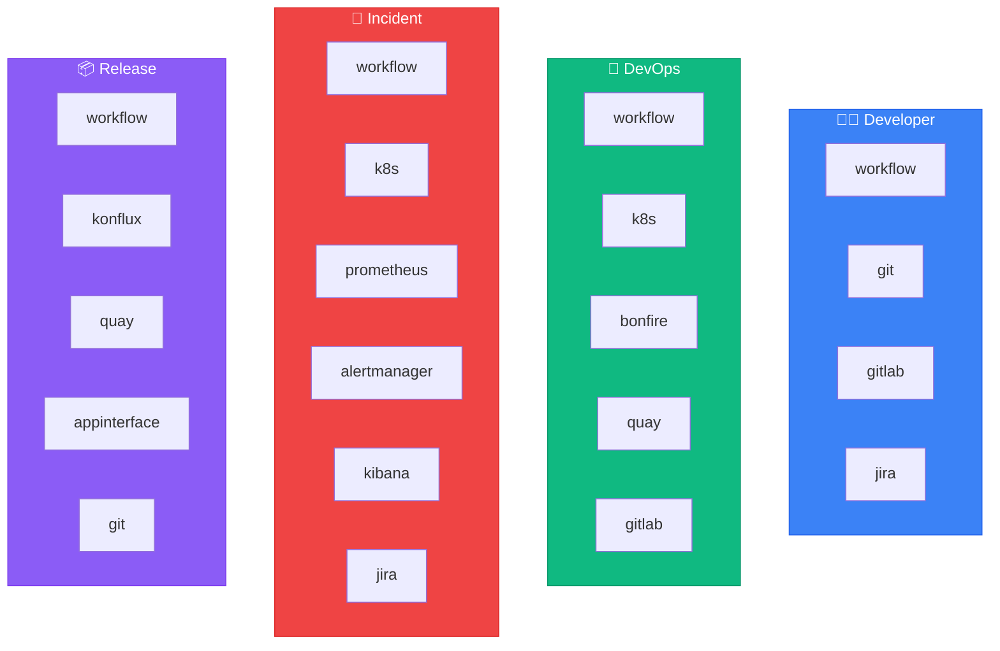

# 🎭 Agents Reference

Agents are **specialized personas** with curated tool sets. Switch agents to get different capabilities.

## Quick Reference

| Agent | Command | Tools | Focus |
|-------|---------|-------|-------|
| [👨‍💻 developer](./developer.md) | `Load developer agent` | ~102 | Daily coding, PRs |
| [🔧 devops](./devops.md) | `Load devops agent` | ~118 | Deployments, K8s |
| [🚨 incident](./incident.md) | `Load incident agent` | ~106 | Production debugging |
| [📦 release](./release.md) | `Load release agent` | ~98 | Shipping releases |
| [💬 slack](./slack.md) | `Load slack agent` | ~103 | Slack automation |
| [🌐 universal](./universal.md) | `Load universal agent` | ~123 | All-in-one |

## How Agents Work



## Switching Agents

You can switch agents at any time:

```
You: Load the developer agent
Claude: 👨‍💻 Developer agent loaded (~80 tools)

You: Actually I need to deploy, load devops
Claude: 🔧 DevOps agent loaded (~90 tools)
        [Tools automatically switch!]
```

## Tool Limit

Each agent is designed to stay under Cursor's 128 tool limit:

| Agent | Tool Count | Headroom |
|-------|------------|----------|
| developer | ~102 | 26 |
| devops | ~118 | 10 |
| incident | ~106 | 22 |
| release | ~98 | 30 |
| slack | ~103 | 25 |
| universal | ~123 | 5 |

## Agent Tool Modules

All agents include `workflow` module (required for skills/memory).



## Core Tools (Always Available)

These tools are available regardless of which agent is loaded:

| Tool | Purpose |
|------|---------|
| `agent_load` | Switch to a different agent |
| `agent_list` | List available agents |
| `session_start` | Initialize session with context |
| `debug_tool` | Self-healing tool debugger |
| `skill_run` | Execute a skill |
| `skill_list` | List available skills |
| `vpn_connect` | Connect to VPN (fixes network errors) |
| `kube_login` | Refresh k8s credentials |

## Agent Variants

Several agents have "slim" variants with fewer tools for combining:

| Variant | Base Agent | Description |
|---------|------------|-------------|
| `developer-slim` | developer | Core dev tools only (~39 tools) |
| `devops-slim` | devops | Essential k8s/deploy (~39 tools) |
| `incident-slim` | incident | Fast incident response (~15 tools) |
| `release-slim` | release | Streamlined release (~48 tools) |

**Special Agents:**

| Agent | Description |
|-------|-------------|
| `core` | Essential shared tools (~106 tools) |
| `universal` | Developer + DevOps combined (~123 tools) |

> All agents now include `workflow` module for skills, memory, and infrastructure tools

## Agent Configuration

Agents are defined in YAML files in the `agents/` directory:

```yaml
name: developer
description: Coding, PRs, and code review
persona: agents/developer.md

tools:
  - workflow        # 30 tools - REQUIRED for skills/memory
  - git             # 15 tools
  - gitlab          # 35 tools
  - jira            # 24 tools

skills:
  - coffee
  - start_work
  - create_mr
  - mark_mr_ready
  # ...
```

## See Also

- [MCP Servers](../mcp-servers/README.md) - Tool modules
- [Skills](../skills/README.md) - Available workflows


