```mermaid
flowchart LR
    A[Tool Fails] --> B[Returns ❌ with hint]
    B --> C[Claude calls debug_tool]
    C --> D[Analyze source code]
    D --> E[Propose fix]
    E --> F{User confirms?}
    F -->|Yes| G[Apply fix & commit]
    G --> H[Retry operation]
```

# 🏗️ Architecture Overview

This document describes the architecture of the AI Workflow MCP server.

## Core Concepts

```mermaid
graph TB
    subgraph IDE["🖥️ Your IDE (Cursor)"]
        YOU[👤 You] --> |natural language| CLAUDE[🤖 Claude AI]
    end

    subgraph CORE["🧠 AI Workflow Core"]
        CLAUDE --> |MCP Protocol| MCP[📡 MCP Server]
        MCP --> AGENTS[🎭 Agents]
        MCP --> SKILLS[⚡ Skills]
        MCP --> MEMORY[💾 Memory]
        MCP --> TOOLS[🔧 Tools]
    end

    subgraph EXTERNAL["🌐 External Services"]
        TOOLS --> JIRA[📋 Jira]
        TOOLS --> GITLAB[🦊 GitLab]
        TOOLS --> K8S[☸️ Kubernetes]
        TOOLS --> GIT[📂 Git]
        TOOLS --> MORE[...]
    end

    style CLAUDE fill:#6366f1,stroke:#4f46e5,color:#fff
    style MCP fill:#10b981,stroke:#059669,color:#fff
```



## The Four Pillars

### 🔧 Tools

Individual MCP tool functions that perform specific actions:

- **150+ tools** across 14 modules
- Each tool is a simple, focused function
- Wrapped with `@debuggable` for self-healing
- Shared utilities in `aa-common/src/utils.py`

### 🎭 Agents

Specialized personas with curated tool sets:

| Agent | Focus | Tools |
|-------|-------|-------|
| developer | Coding, PRs | ~86 tools |
| devops | Deployments, K8s | ~90 tools |
| incident | Production debugging | ~78 tools |
| release | Shipping | ~69 tools |

### ⚡ Skills

Multi-step workflows that chain tools:

- YAML-defined workflows
- Conditional logic and branching
- Template substitution (Jinja2)
- Error handling
- **42 shared parsers** in `scripts/common/parsers.py`

### 💾 Memory

Persistent context across sessions:

- Current work state
- Learned patterns
- Session logs

## Dynamic Agent Loading


## Tool Modules

```
mcp-servers/
├── aa-common/          # Core server, agent loading
├── aa-git/             # Git operations (19 tools)
├── aa-gitlab/          # GitLab MRs, pipelines (35 tools)
├── aa-jira/            # Jira issues (24 tools)
├── aa-k8s/             # Kubernetes ops (26 tools)
├── aa-bonfire/         # Ephemeral environments (21 tools)
├── aa-quay/            # Container registry (8 tools)
├── aa-prometheus/      # Metrics queries (13 tools)
├── aa-alertmanager/    # Alert management (6 tools)
├── aa-kibana/          # Log search (9 tools)
├── aa-google-calendar/ # Calendar & meetings (6 tools)
├── aa-gmail/           # Email processing (6 tools)
├── aa-slack/           # Slack integration (15 tools)
├── aa-konflux/         # Build pipelines (40 tools)
└── aa-appinterface/    # App-interface config (6 tools)
```

## Auto-Debug Infrastructure

All tools support self-healing via the `@debuggable` decorator:



## Shared Utilities

### MCP Tool Utilities (`aa-common/src/utils.py`)

Common utilities shared across all MCP servers:

- `load_config()` - Load config.json with caching
- `get_kubeconfig(env)` - Get kubeconfig for environment (ephemeral/stage/prod)
- `run_cmd()` - Execute shell commands with proper output handling
- `get_token_from_kubeconfig()` - Extract bearer tokens for API calls
- `resolve_repo_path()` - Resolve repository paths from config

### Shared Parsers (`scripts/common/parsers.py`)

**42 reusable parser functions** to avoid regex duplication in skills:

| Category | Examples |
|----------|----------|
| MR Parsing | `parse_mr_list`, `extract_mr_id_from_url`, `analyze_mr_status` |
| Jira | `extract_jira_key`, `parse_jira_issues`, `validate_jira_key` |
| Git | `parse_git_log`, `parse_git_branches`, `extract_conflict_files` |
| Kubernetes | `parse_kubectl_pods`, `parse_namespaces` |
| Alerts | `parse_prometheus_alert`, `parse_alertmanager_output` |

## Configuration

Central configuration via `config.json`:

- Repository paths and GitLab projects
- Kubernetes namespaces
- Jira settings
- Slack channels (team, standup, alerts)
- Google API settings
- User preferences

## See Also

- [MCP Implementation Details](./mcp-implementation.md) - Server code & patterns
- [Skills Reference](../skills/README.md) - All available skills
- [README](../../README.md) - Getting started

