# 🏗️ Architecture Overview

This document describes the architecture of the AI Workflow MCP server.

## Terminology

| Term | Meaning in This Project |
|------|------------------------|
| **Agent / Persona** | A tool configuration profile that determines which MCP tools are loaded (e.g., developer, devops, incident). NOT a separate AI instance. |
| **Tool Module** | A plugin directory containing MCP tool implementations (e.g., `aa-git/`, `aa-jira/`). |
| **Skill** | A YAML-defined multi-step workflow that chains tools together. |
| **Memory** | Persistent YAML files that maintain context across Claude sessions. |
| **Auto-Heal** | Automatic detection and remediation of VPN/auth failures in skills. |

> **Important:** This is a **single-agent system** with dynamic tool loading. When you "load an agent," you're changing which tools Claude has access to, not spawning a separate AI. The term "agent" refers to adopting a persona/role.

## Core Concepts

```mermaid
graph TB
    subgraph IDE["🖥️ Your IDE (Cursor)"]
        YOU[👤 You] --> |natural language| CLAUDE[🤖 Claude AI]
    end

    subgraph CORE["🧠 AI Workflow Core"]
        CLAUDE --> |MCP Protocol| MCP[📡 MCP Server]
        MCP --> AGENTS[🎭 Agents]
        MCP --> SKILLS[⚡ Skills]
        MCP --> MEMORY[💾 Memory]
        MCP --> TOOLS[🔧 Tools]
    end

    subgraph EXTERNAL["🌐 External Services"]
        TOOLS --> JIRA[📋 Jira]
        TOOLS --> GITLAB[🦊 GitLab]
        TOOLS --> K8S[☸️ Kubernetes]
        TOOLS --> GIT[📂 Git]
        TOOLS --> MORE[...]
    end

    style CLAUDE fill:#6366f1,stroke:#4f46e5,color:#fff
    style MCP fill:#10b981,stroke:#059669,color:#fff
```



## The Five Pillars

### 🔧 Tools

Individual MCP tool functions that perform specific actions:

- **270 tools** across 17 modules
- Each tool is a simple, focused function
- Wrapped with `@auto_heal` decorators for self-healing
- Shared utilities in `server/utils.py`

### 🎭 Agents

Specialized personas with curated tool sets:

| Agent | Focus | Modules |
|-------|-------|---------|
| developer | Coding, PRs | 6 modules (~106 tools) |
| devops | Deployments, K8s | 5 modules (~106 tools) |
| incident | Production debugging | 8 modules (~100 tools) |
| release | Shipping | 6 modules (~100 tools) |
| slack | Slack bot daemon | 6 modules (~100 tools) |

### ⚡ Skills

Multi-step workflows that chain tools:

- YAML-defined workflows (53 skills)
- Conditional logic and branching
- Template substitution (Jinja2)
- Error handling
- **Auto-heal via decorators** for VPN/auth issues
- **45+ shared parsers** in `scripts/common/parsers.py`
- **Config helpers** in `scripts/common/config_loader.py`

### 💾 Memory

Persistent context across sessions:

- Current work state
- Learned patterns
- Session logs
- Tool failure tracking

### 🔄 Auto-Heal

Two levels of automatic remediation:

| Level | Mechanism | Scope |
|-------|-----------|-------|
| **Tool-Level** | `@auto_heal` decorators + `debug_tool()` | Fix VPN/auth + source code |
| **Skill-Level** | Auto-heal YAML patterns | Fix VPN/auth at runtime |

## Dynamic Agent Loading


## Tool Modules

```
tool_modules/
├── aa-workflow/        # Core workflow tools (16 tools)
├── aa-git/             # Git operations (30 tools)
├── aa-gitlab/          # GitLab MRs, pipelines (30 tools)
├── aa-jira/            # Jira issues (28 tools)
├── aa-k8s/             # Kubernetes ops (28 tools)
├── aa-bonfire/         # Ephemeral environments (20 tools)
├── aa-quay/            # Container registry (8 tools)
├── aa-prometheus/      # Metrics queries (13 tools)
├── aa-alertmanager/    # Alert management (7 tools)
├── aa-kibana/          # Log search (9 tools)
├── aa-google-calendar/ # Calendar & meetings (6 tools)
├── aa-gmail/           # Email processing (6 tools)
├── aa-slack/           # Slack integration (10 tools)
├── aa-konflux/         # Build pipelines (35 tools)
├── aa-appinterface/    # App-interface config (7 tools)
├── aa-lint/            # Linting tools (7 tools)
└── aa-dev-workflow/    # Dev workflow helpers (9 tools)
```

## Auto-Heal Architecture

### Tool-Level Auto-Debug

All tools support self-healing via the `@auto_heal` decorators:

```mermaid
flowchart LR
    A[Tool Fails] --> B[Returns ❌ with hint]
    B --> C[Claude calls debug_tool]
    C --> D[Analyze source code]
    D --> E[Propose fix]
    E --> F{User confirms?}
    F -->|Yes| G[Apply fix & commit]
    G --> H[Retry operation]
```



### Tool-Level Auto-Heal (Python Decorator)

Auto-healing is now implemented at the **tool level** using Python decorators in `server/auto_heal_decorator.py`. This eliminates duplicated YAML blocks in skills.

```mermaid
flowchart LR
    A[Tool Call] --> B{Success?}
    B -->|Yes| C[Return Result]
    B -->|No| D[@auto_heal Decorator]
    D --> E{VPN Issue?}
    E -->|Yes| F[vpn_connect]
    E -->|No| G{Auth Issue?}
    G -->|Yes| H[kube_login]
    G -->|No| I[Return Error]
    F --> J[Retry Tool]
    H --> J
    J --> C
```

### Auto-Heal Decorators

| Decorator | Environment | Use Case |
|-----------|-------------|----------|
| `@auto_heal_ephemeral()` | Ephemeral | Bonfire namespace tools |
| `@auto_heal_konflux()` | Konflux | Tekton pipeline tools |
| `@auto_heal_k8s()` | Stage/Prod | Kubectl tools |
| `@auto_heal_stage()` | Stage | Prometheus, Alertmanager, Kibana |
| `@auto_heal_jira()` | - | Jira tools (auth only) |
| `@auto_heal_git()` | - | Git/GitLab tools (VPN only) |

### Example Usage

```python
from server.auto_heal_decorator import auto_heal_k8s

@registry.tool()
@auto_heal_k8s()
async def kubectl_get_pods(namespace: str, environment: str = "stage") -> str:
    """Get pods in a namespace with auto-healing."""
    # If this fails with auth/VPN issues, the decorator
    # automatically runs kube_login or vpn_connect and retries
    ...
```

## Shared Utilities

### MCP Tool Utilities (`server/utils.py`)

Common utilities shared across all MCP servers:

- `load_config()` - Load config.json with caching
- `get_kubeconfig(env)` - Get kubeconfig for environment (ephemeral/stage/prod)
- `run_cmd()` - Execute shell commands with proper output handling
- `get_token_from_kubeconfig()` - Extract bearer tokens for API calls
- `resolve_repo_path()` - Resolve repository paths from config

### Shared Parsers (`scripts/common/parsers.py`)

**45+ reusable parser functions** to avoid regex duplication in skills:

| Category | Examples |
|----------|----------|
| MR Parsing | `parse_mr_list`, `extract_mr_id_from_url`, `analyze_mr_status` |
| Jira | `extract_jira_key`, `parse_jira_issues`, `validate_jira_key` |
| Git | `parse_git_log`, `parse_git_branches`, `extract_conflict_files` |
| Kubernetes | `parse_kubectl_pods`, `parse_namespaces` |
| Alerts | `parse_prometheus_alert`, `parse_alertmanager_output` |

### Auto-Heal Utilities (`scripts/common/auto_heal.py`)

Shared auto-heal functions for skills:

- `detect_vpn_error(text)` - Check for VPN-related errors
- `detect_auth_error(text)` - Check for auth-related errors
- `log_failure(tool, error, skill)` - Log failure to memory

## Configuration

Central configuration via `config.json`:

- Repository paths and GitLab projects
- Kubernetes namespaces
- Jira settings
- Slack channels (team, standup, alerts)
- Google API settings
- User preferences (including email aliases)
- **Commit format** - pattern and valid types for commit messages
- **MR title format** - follows commit format conventions

## See Also

- [MCP Implementation Details](./mcp-implementation.md) - Server code & patterns
- [Workflow Module Architecture](./workflow-modules.md) - aa-workflow internal structure
- [Skills Reference](../skills/README.md) - All 50 available skills
- [Learning Loop](../learning-loop.md) - Auto-remediation and memory integration
- [Skill Auto-Heal Plan](../plans/skill-auto-heal.md) - Auto-heal implementation details
- [README](../../README.md) - Getting started
