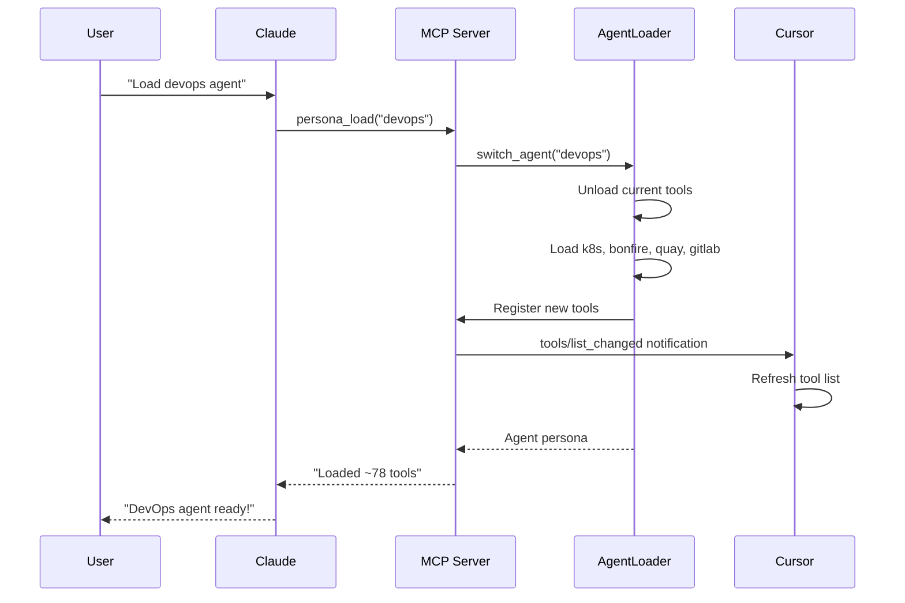

# 🔧 MCP Server Architecture

> **Terminology:** "Personas" are tool configuration profiles, not separate AI instances. The `persona_load` tool switches which tools are available.

## Design Principles

1. **Single MCP Server**: One server loads/unloads tools dynamically based on active persona
2. **Dynamic Persona Loading**: Switch personas mid-session with tools updating automatically
3. **Tool Modules**: Each domain has tools in a `tools.py` with `register_tools(server)` function
4. **Auto-Heal**: Tools wrapped with `@auto_heal` decorators for VPN/auth recovery
5. **Dual Mode**: Each module can run standalone OR be loaded as a plugin

## Quick Start

Add to your project's `.cursor/mcp.json`:

```json
{
  "mcpServers": {
    "aa_workflow": {
      "command": "bash",
      "args": [
        "-c",
        "cd ~/src/redhat-ai-workflow/server && source ~/src/redhat-ai-workflow/.venv/bin/activate && python3 -m src.server"
      ]
    }
  }
}
```

## Directory Structure

```text
server/                           # Core infrastructure
├── main.py                       # Main server entry point
├── persona_loader.py             # Dynamic persona/tool loading
├── auto_heal_decorator.py        # Auto-heal decorators
└── utils.py                      # Shared utilities

tool_modules/                     # Tool plugins
│
├── aa_git/                       # Git operations (30 tools)
│   ├── src/
│   │   ├── tools.py              # register_tools(server) function
│   │   └── server.py             # Standalone wrapper
│   └── pyproject.toml
│
├── aa_gitlab/                    # GitLab MRs & pipelines (30 tools)
├── aa_jira/                      # Jira issues (28 tools)
├── aa_k8s/                       # Kubernetes operations (28 tools)
├── aa_bonfire/                   # Ephemeral environments (20 tools)
├── aa_quay/                      # Container registry (8 tools)
├── aa_prometheus/                # Metrics queries (13 tools)
├── aa_alertmanager/              # Alert management (7 tools)
├── aa_kibana/                    # Log search (9 tools)
├── aa_google_calendar/           # Calendar & meetings (6 tools)
├── aa-gmail/                     # Email processing (6 tools)
├── aa_slack/                     # Slack integration (10 tools)
├── aa_konflux/                   # Build pipelines (35 tools)
├── aa_appinterface/              # App-interface config (7 tools)
├── aa_lint/                      # Linting tools (7 tools)
└── aa_dev_workflow/              # Dev workflow helpers (9 tools)
```

## Tool Module Pattern

### tools.py - Tool Definitions

```python
"""Git tool definitions."""

from mcp.server.fastmcp import FastMCP

def register_tools(server: FastMCP) -> int:
    """Register tools with the server.

    Args:
        server: FastMCP server instance

    Returns:
        Number of tools registered
    """

    @server.tool()
    async def git_status(repo: str) -> str:
        """Get git status."""
        # Implementation
        return "..."

    @server.tool()
    async def git_log(repo: str, limit: int = 10) -> str:
        """Get git log."""
        # Implementation
        return "..."

    return 2  # Number of tools
```

### server.py - Standalone Wrapper

```python
"""Standalone entry point for aa_git."""

import asyncio
from mcp.server.fastmcp import FastMCP
from .tools import register_tools

def main():
    server = FastMCP("aa_git")
    register_tools(server)
    asyncio.run(server.run_stdio_async())

if __name__ == "__main__":
    main()
```

## Dynamic Agent Loading

### How It Works



### PersonaLoader Implementation

The `PersonaLoader` class (`server/persona_loader.py`) manages dynamic tool switching:

```python
class PersonaLoader:
    CORE_TOOLS = {"persona_load", "persona_list", "session_start", "debug_tool"}

    async def switch_persona(self, persona_name: str, ctx: Context) -> dict:
        """Switch to a different persona, loading its tools dynamically."""

        # 1. Read persona config (personas/devops.yaml)
        config = self.load_agent_config(agent_name)

        # 2. Unload current tools (keep core)
        for tool_name in list(self.server._tool_manager._tools.keys()):
            if tool_name not in self.CORE_TOOLS:
                self.server._tool_manager._tools.pop(tool_name)

        # 3. Load new tool modules
        for module in config["tools"]:
            mod = importlib.import_module(f"aa_{module}.tools")
            mod.register_tools(self.server)

        # 4. Notify Cursor
        await ctx.session.send_tool_list_changed()

        return {"persona": config["persona"], "tools": len(self.server._tools)}
```

### Core Tools (Always Available)

These tools are never unloaded:

| Tool | Purpose |
|------|---------|
| `persona_load` | Switch personas |
| `persona_list` | List available personas |
| `session_start` | Initialize session |
| `debug_tool` | Self-healing tool debugger |

## Available Agents

| Agent | Modules | Tool Count | Focus |
|-------|---------|------------|-------|
| developer | workflow, lint, dev_workflow, git, gitlab, jira | ~106 | Daily coding |
| devops | workflow, k8s, bonfire, quay, gitlab | ~106 | Deployments |
| incident | workflow, k8s, prometheus, alertmanager, kibana, jira, gitlab, slack | ~100 | Production debugging |
| release | workflow, konflux, quay, appinterface, git, gitlab | ~100 | Shipping |

## Auto-Heal Infrastructure

Tools are wrapped with `@auto_heal` decorators for automatic VPN/auth recovery.

### Flow

```mermaid
flowchart LR
    A[Tool Call] --> B{Success?}
    B -->|Yes| C[Return Result]
    B -->|No| D[@auto_heal Decorator]
    D --> E{VPN Issue?}
    E -->|Yes| F[vpn_connect]
    E -->|No| G{Auth Issue?}
    G -->|Yes| H[kube_login]
    G -->|No| I[Return Error]
    F --> J[Retry Tool]
    H --> J
    J --> C
```

### The @auto_heal Decorators

```python
# server/auto_heal_decorator.py

from server.auto_heal_decorator import auto_heal_k8s

@registry.tool()
@auto_heal_k8s()
async def kubectl_get_pods(namespace: str, environment: str = "stage") -> str:
    """Get pods with auto-healing."""
    ...
```

Available decorators:
- `@auto_heal_ephemeral()` - Bonfire namespace tools
- `@auto_heal_konflux()` - Tekton pipeline tools
- `@auto_heal_k8s()` - Kubectl tools
- `@auto_heal_stage()` - Prometheus, Alertmanager, Kibana
- `@auto_heal_jira()` - Jira tools
- `@auto_heal_git()` - Git/GitLab tools

### Common Auto-Fixable Bugs

| Error Pattern | Likely Cause |
|---------------|--------------|
| "Output is not a TTY" | Missing --force/--yes flag |
| "Unknown flag: --state" | CLI syntax changed |
| "Unauthorized" | Auth not passed correctly |
| "manifest unknown" | Wrong image tag format |

## Usage Patterns

### 1. Dynamic Mode (Recommended)

Start with minimal tools, switch agents dynamically:

```bash
python -m src.server  # Starts with developer persona (~78 tools)
```text

Then in chat:
```text
You: Load the devops agent
Claude: [calls persona_load("devops")]
        DevOps agent loaded! Now have k8s, bonfire, quay, gitlab (~74 tools)
```

### 2. Static Agent Mode

Start with a specific agent's tools pre-loaded:

```bash
python -m src.server --agent developer  # ~78 tools
python -m src.server --agent devops     # ~74 tools
```

### 3. Single Tool Module (Standalone)

Run just one module:

```bash
cd tool_modules/aa_git
python -m src.server
```

## Adding a New Tool Module

1. **Create directory**: `aa-{name}/src/`

2. **Create `tools.py`**:
```python
from mcp.server.fastmcp import FastMCP

def register_tools(server: FastMCP) -> int:
    @server.tool()
    async def my_tool(arg: str) -> str:
        """Tool description."""
        return f"Result: {arg}"

    return 1
```

3. **Create `__init__.py`**:
```python
from .tools import register_tools
__all__ = ["register_tools"]
```

4. **Add to TOOL_MODULES** in `persona_loader.py`:
```python
TOOL_MODULES = {
    # ...
    "{name}": 5,  # estimated tool count
}
```

5. **Add to persona config** in `personas/{persona}.yaml`:
```yaml
tools:
  - {name}
```

## Special Modules

### aa_slack: Event-Driven Architecture

The `aa_slack` module implements a **long-running listener** pattern:

```text
┌─────────────────────────────────────────────────────────────────┐
│  aa_slack MCP Server                                            │
│                                                                 │
│  ┌──────────────────┐     ┌──────────────────┐                 │
│  │  Background      │     │  SQLite State    │                 │
│  │  Polling Loop    │────▶│  - Last TS       │                 │
│  │  (asyncio task)  │     │  - Pending Queue │                 │
│  └────────┬─────────┘     │  - User Cache    │                 │
│           │               └────────┬─────────┘                 │
│           ▼                        │                           │
│  ┌──────────────────┐              │                           │
│  │  Slack Web API   │              │                           │
│  │  (httpx client)  │              ▼                           │
│  │  - Auth spoof    │     ┌──────────────────┐                 │
│  │  - Rate limiting │     │  MCP Tools       │                 │
│  └──────────────────┘     │  - get_pending   │◀─── LLM Calls   │
│                           │  - send_message  │                 │
│                           │  - respond_mark  │                 │
│                           └──────────────────┘                 │
└─────────────────────────────────────────────────────────────────┘
```

## Environment Variables

| Variable | Module | Description |
|----------|--------|-------------|
| `JIRA_URL` | aa_jira | Jira instance URL |
| `JIRA_JPAT` | aa_jira | Jira Personal Access Token |
| `GITLAB_TOKEN` | aa_gitlab | GitLab API token |
| `KUBECONFIG` | aa_k8s | Default kubeconfig path |

> **Note:** Quay tools use `skopeo` which leverages your existing `podman login` or `docker login` credentials - no separate token needed!

## See Also

- [Skills Reference](../skills/README.md) - Available skills
- [Architecture Overview](./README.md) - High-level architecture
- [README](../../README.md) - Getting started
