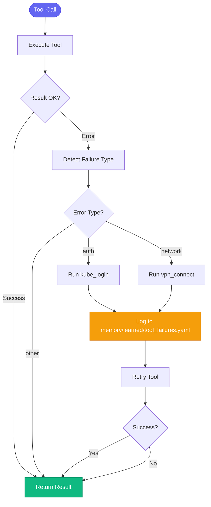
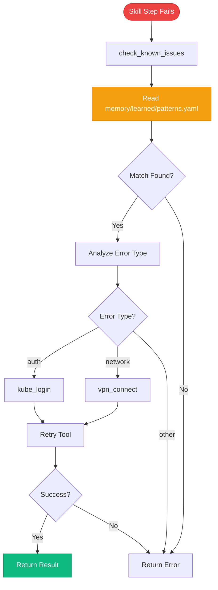
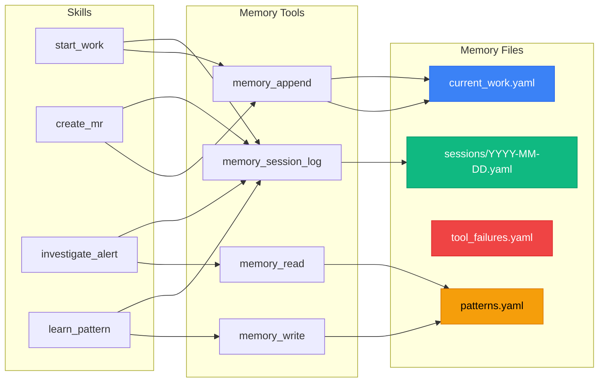

# Memory & Auto-Remediation Architecture

> Comprehensive overview of memory saving, retrieval, and auto-remediation across tools and skills

## Table of Contents

- [Overview](#overview)
- [Memory System](#memory-system)
  - [Directory Structure](#directory-structure)
  - [Memory Tools](#memory-tools)
  - [Memory Files](#memory-files)
- [Auto-Remediation System](#auto-remediation-system)
  - [Tool-Level Auto-Heal](#tool-level-auto-heal)
  - [Skill-Level Auto-Fix](#skill-level-auto-fix)
  - [Skill Error Recovery](#skill-error-recovery)
- [Integration Points](#integration-points)
- [Data Flow](#data-flow)
- [Usage Patterns](#usage-patterns)
- [Statistics](#statistics)

---

## Overview

The AI Workflow system implements a **two-layer auto-remediation strategy** backed by **persistent memory**:

1. **Tool-Level Auto-Heal**: Decorators on MCP tools detect and fix auth/network failures automatically
2. **Skill-Level Auto-Fix**: Skill engine checks memory patterns and retries with fixes
3. **Memory Learning**: Both layers log failures and successes to YAML files for continuous improvement

This creates a **self-improving feedback loop** where failures teach the system how to prevent future failures.

---

## Memory System

### Directory Structure

```
memory/
├── state/                          # Current work state
│   ├── current_work.yaml          # Active issues, branches, MRs
│   └── environments.yaml          # Stage/prod health status
├── learned/                        # Learned patterns and fixes
│   ├── patterns.yaml              # Error patterns with fixes
│   ├── tool_fixes.yaml            # Successful tool fixes
│   ├── tool_failures.yaml         # Failure history with stats
│   ├── runbooks.yaml              # Proven procedures
│   └── skill_error_fixes.yaml     # Skill-specific error fixes
└── sessions/                       # Session logs
    └── YYYY-MM-DD.yaml            # Daily session activity
```

### Memory Tools

Located in `tool_modules/aa_workflow/src/memory_tools.py`:

| Tool | Purpose | Usage |
|------|---------|-------|
| `memory_read(key)` | Read memory file | `memory_read("state/current_work")` |
| `memory_write(key, content)` | Write entire file | `memory_write("state/current_work", yaml_content)` |
| `memory_update(key, path, value)` | Update single field | `memory_update("state/current_work", "active_issue", "AAP-123")` |
| `memory_append(key, list_path, item)` | Append to list | `memory_append("state/current_work", "active_issues", yaml_item)` |
| `memory_session_log(action, details)` | Log session action | `memory_session_log("Started work", "AAP-123")` |

**Key Features:**
- All operations use YAML format
- Automatic date-based session logs (`sessions/YYYY-MM-DD.yaml`)
- Best-effort writes (failures don't block tools)
- Thread-safe file operations

### Memory Files

#### state/current_work.yaml

Tracks active development work:

```yaml
active_issue: AAP-61661
active_issues:
  - key: AAP-61661
    summary: "Enable pytest-xdist parallelization"
    status: "In Progress"
    branch: "AAP-61661-pytest-xdist-parallelization"
    repo: "automation-analytics-backend"
    started: "2026-01-06T11:00:00"

open_mrs:
  - mr_id: 1459
    title: "AAP-61661 - feat: pytest-xdist support"
    project: "automation-analytics-backend"

follow_ups:
  - issue_key: AAP-61214
    task: "Fix hygiene issues"
    priority: low
    created: "2026-01-04T20:11:33"

last_updated: "2026-01-06T12:15:00"
```

**Updated by:**
- `start_work` skill (adds active_issues)
- `create_mr` skill (adds open_mrs)
- `close_mr` skill (removes from active_issues)

#### learned/patterns.yaml

Error patterns with auto-fix commands:

```yaml
auth_patterns:
  - pattern: "token expired"
    meaning: "Kubernetes authentication expired"
    fix: "Refresh ephemeral cluster credentials"
    commands:
      - kube_login(cluster='e')

network_patterns:
  - pattern: "No route to host"
    meaning: "Cannot reach internal cluster"
    fix: "Connect to Red Hat VPN"
    commands:
      - vpn_connect()

error_patterns:
  - pattern: "OOMKilled"
    meaning: "Container exceeded memory limits"
    fix: "Increase memory limits in deployment"
    commands:
      - kubectl describe pod <pod> -n <namespace>
      - kubectl top pod -n <namespace>

bonfire_patterns:
  - pattern: "Output is not a TTY"
    meaning: "Bonfire prompting in non-interactive mode"
    fix: "Add --force flag"
    commands:
      - bonfire namespace release <ns> --force

pipeline_patterns:
  - pattern: "tests failed"
    meaning: "Unit or integration tests failing"
    fix: "Run tests locally to reproduce"
    commands:
      - test_run(repo='.', verbose=True)
```

**Read by:**
- `skill_engine.py` (`_check_error_patterns()`)
- `meta_tools.py` (`check_known_issues()`)
- `investigate_alert` skill
- `debug_prod` skill

**Written by:**
- `learn_pattern` skill (user-initiated)
- Manual edits

#### learned/tool_failures.yaml

Logged by auto-heal decorators:

```yaml
failures:
  - tool: "bonfire_namespace_reserve"
    error_type: "auth"
    error_snippet: "Unauthorized: token expired"
    fix_applied: "kube_login"
    success: true
    timestamp: "2026-01-09T10:23:45"

  - tool: "kubectl_get_pods"
    error_type: "network"
    error_snippet: "No route to host"
    fix_applied: "vpn_connect"
    success: true
    timestamp: "2026-01-09T10:25:12"

stats:
  total_failures: 127
  auto_fixed: 98
  manual_required: 29
```

**Written by:**
- `auto_heal_decorator.py` (`_log_auto_heal_to_memory()`)
- Keeps last 100 entries
- Increments stats on each failure

**Read by:**
- `debug_tool` (for diagnostics)
- Future ML-based pattern detection

#### learned/tool_fixes.yaml

Template for manual fix learning:

```yaml
tool_fixes: []

common_mistakes:
  missing_flags:
    description: "CLI tools need --yes/--force/--no-interactive"
    examples:
      - bonfire: "--force"
      - glab: "--yes"
      - rh-issue: "--no-ai"

  wrong_formats:
    description: "Image tags, SHAs, IDs have format requirements"
    examples:
      - "Git SHA must be full 40-char, not short 8-char"
      - "IMAGE_TAG needs sha256 digest, not git SHA"

  auth_issues:
    description: "Many tools need fresh credentials"
    examples:
      - "VPN required for internal clusters"
      - "kube_login for expired tokens"
```

**Used by:**
- `debug_tool` skill
- `learn_tool_fix()` in `meta_tools.py`

#### sessions/YYYY-MM-DD.yaml

Daily activity log:

```yaml
date: "2026-01-09"
actions:
  - timestamp: "2026-01-09T09:15:23"
    action: "Started work on AAP-61661"
    details: "Branch: AAP-61661-pytest-xdist, Repo: automation-analytics-backend"

  - timestamp: "2026-01-09T10:45:11"
    action: "Created MR !1459"
    details: "Title: AAP-61661 - feat: pytest-xdist parallelization"

  - timestamp: "2026-01-09T11:23:00"
    action: "Deployed to ephemeral-ns123"
    details: "Image: quay.io/.../backend@sha256:abc123..."
```

**Written by:**
- `memory_session_log()` tool
- Called by 39 skills

**Read by:**
- `standup_summary` skill
- `weekly_summary` skill
- `coffee` skill (morning briefing)

---

## Auto-Remediation System

### Tool-Level Auto-Heal

**Location:** `server/auto_heal_decorator.py`

**Coverage:** 263 tools across 16 modules

#### How It Works

```python
@auto_heal(cluster="ephemeral", max_retries=1)
@registry.tool()
async def bonfire_namespace_reserve(duration: str = "4h") -> str:
    # Tool implementation
    ...
```

**Execution Flow:**



#### Failure Detection Patterns

```python
# In auto_heal_decorator.py
AUTH_PATTERNS = [
    "unauthorized", "401", "403", "forbidden",
    "token expired", "authentication required",
    "not authorized", "permission denied"
]

NETWORK_PATTERNS = [
    "no route to host", "connection refused",
    "network unreachable", "timeout", "dial tcp",
    "connection reset", "eof"
]
```

#### Auto-Fix Actions

| Failure Type | Detection Pattern | Auto-Fix | Cluster Guessing |
|--------------|-------------------|----------|------------------|
| **auth** | "unauthorized", "401", "token expired" | `kube_login(cluster)` | bonfire→ephemeral, konflux→konflux, default→stage |
| **network** | "no route to host", "connection refused" | `vpn_connect()` | N/A |
| **registry** | "manifest unknown", "podman login" | Manual (suggest) | N/A |
| **tty** | "output is not a tty" | Manual (`debug_tool`) | N/A |

#### Memory Logging

After successful auto-fix:

```python
# server/auto_heal_decorator.py:217-277
await _log_auto_heal_to_memory(
    tool_name=tool_name,
    failure_type=failure_type,
    error_snippet=error_snippet[:100],
    fix_applied="kube_login" if failure_type == "auth" else "vpn_connect"
)
```

Writes to `memory/learned/tool_failures.yaml`:

```yaml
failures:
  - tool: "kubectl_get_pods"
    error_type: "auth"
    error_snippet: "Unauthorized: token expired for cluster..."
    fix_applied: "kube_login"
    success: true
    timestamp: "2026-01-09T10:23:45.123456"

stats:
  total_failures: 128
  auto_fixed: 99  # ← Incremented
```

#### Decorator Variants

```python
@auto_heal_ephemeral(max_retries=1)  # cluster="ephemeral"
@auto_heal_stage(max_retries=1)      # cluster="stage"
@auto_heal_konflux(max_retries=1)    # cluster="konflux"
@auto_heal(cluster="auto", max_retries=1)  # Guess from tool name
```

### Skill-Level Auto-Fix

**Location:** `tool_modules/aa_workflow/src/skill_engine.py`

**Coverage:** All 55 skills

#### How It Works

When a tool step fails in a skill:



#### Implementation

```python
# tool_modules/aa_workflow/src/skill_engine.py:163-247
async def _try_auto_fix(self, error_msg: str, matches: list) -> bool:
    """Try to auto-fix based on known patterns."""
    error_lower = error_msg.lower()

    # Check for auth/network issues
    auth_patterns = ["unauthorized", "401", "403", "token expired"]
    network_patterns = ["no route to host", "connection refused", "timeout"]

    # Determine fix type from error or memory matches
    fix_type = None
    if any(p in error_lower for p in auth_patterns):
        fix_type = "auth"
    elif any(p in error_lower for p in network_patterns):
        fix_type = "network"

    # Also check matches from check_known_issues()
    for match in matches:
        fix = match.get("fix", "").lower()
        if "vpn" in fix or "connect" in fix:
            fix_type = "network"
        elif "login" in fix or "kube" in fix:
            fix_type = "auth"

    if fix_type == "network":
        # VPN connect via subprocess
        proc = await asyncio.create_subprocess_shell(
            "nmcli connection up 'Red Hat Global VPN'",
            ...
        )
        return True

    elif fix_type == "auth":
        # Guess cluster from error context
        cluster = "stage"
        if "ephemeral" in error_lower or "bonfire" in error_lower:
            cluster = "ephemeral"

        # Run oc login
        proc = await asyncio.create_subprocess_exec(
            "oc", "login",
            f"--kubeconfig=~/.kube/config.{cluster[0]}",
            ...
        )
        return proc.returncode == 0
```

#### Pattern Checking

```python
# tool_modules/aa_workflow/src/skill_engine.py:249-262
def _check_error_patterns(self, error: str) -> str | None:
    """Check if error matches known patterns and return fix suggestion."""
    patterns_file = SKILLS_DIR.parent / "memory" / "learned" / "patterns.yaml"

    with open(patterns_file) as f:
        patterns_data = yaml.safe_load(f) or {}

    error_patterns = patterns_data.get("error_patterns", [])
    error_lower = error.lower()

    for pattern in error_patterns:
        if pattern["pattern"].lower() in error_lower:
            return pattern.get("fix", "")

    return None
```

### Skill Error Recovery

**Location:** `scripts/common/skill_error_recovery.py`

**Purpose:** Handle **compute step errors** (Python exceptions in skill compute blocks)

**NOT for tool errors** - those are handled by auto-heal decorators.

#### Features

1. **Pattern Detection**: Regex matching against known error patterns
2. **Memory Integration**: Loads learned fixes from `memory/learned/skill_error_patterns.yaml`
3. **Interactive Recovery**: Prompts user via AskUserQuestion or CLI
4. **Auto-Fix Generation**: Can auto-generate fixed code for common patterns
5. **Fix Logging**: Saves successful fixes back to memory

#### Known Patterns

```python
# scripts/common/skill_error_recovery.py:30-66
default_patterns = {
    "dict_attribute_access": {
        "signature": r"'dict' object has no attribute '(\w+)'",
        "description": "Using dot notation on dict instead of get()",
        "fix_template": "inputs.{attr} → inputs.get('{attr}')",
        "auto_fixable": True,
        "confidence": "high",
    },
    "key_error": {
        "signature": r"KeyError: '(\w+)'",
        "fix_template": "Check if '{key}' exists or use .get() with default",
        "auto_fixable": False,
    },
    "undefined_variable": {
        "signature": r"name '(\w+)' is not defined",
        "fix_template": "Define {var} or check for typos",
        "auto_fixable": False,
    },
    "template_not_resolved": {
        "signature": r"\{\{.*?\}\}",
        "description": "Jinja template variable not resolved",
        "auto_fixable": False,
    },
}
```

#### Memory Integration

```python
# scripts/common/skill_error_recovery.py:68-78
if self.memory:
    learned = self.memory.read("learned/skill_error_patterns")
    if learned and "patterns" in learned:
        # Merge learned patterns with defaults
        default_patterns.update(learned["patterns"])
```

#### Fix Logging

```python
# scripts/common/skill_error_recovery.py:363-398
def log_fix_attempt(self, error_info, action, success, details=""):
    """Log fix attempt to memory for future learning."""
    fix_entry = {
        "timestamp": datetime.now().isoformat(),
        "pattern_id": error_info.get("pattern_id"),
        "step_name": error_info["step_name"],
        "error_msg": error_info["error_msg"],
        "action": action,
        "success": success,
        "description": details,
    }

    # Append to memory/learned/skill_error_fixes.yaml
    self.memory.append("learned/skill_error_fixes", "fixes", fix_entry)

    # Update stats
    if success:
        self.memory.increment("learned/skill_error_fixes", f"stats.{action}_success")
    else:
        self.memory.increment("learned/skill_error_fixes", f"stats.{action}_failed")
```

---

## Integration Points

### 1. Tool → Memory (Auto-Heal)

```
Tool Fails
    ↓
@auto_heal() Decorator Detects Failure
    ↓
Applies Fix (kube_login/vpn_connect)
    ↓
_log_auto_heal_to_memory()
    ↓
Writes to memory/learned/tool_failures.yaml
```

### 2. Skill → Memory (Pattern Check)

```
Skill Step Fails
    ↓
check_known_issues() in meta_tools.py
    ↓
Reads memory/learned/patterns.yaml
    ↓
Returns Matching Patterns
    ↓
skill_engine._try_auto_fix()
    ↓
Applies VPN/Auth Fix
    ↓
Retries Tool Once
```

### 3. User → Memory (Pattern Learning)

```
User Discovers New Pattern
    ↓
skill_run("learn_pattern", '{...}')
    ↓
Validates Input
    ↓
Writes to memory/learned/patterns.yaml
    ↓
memory_session_log("Learned pattern: X")
```

### 4. Skill → Memory (Session Logging)

```
Skill Executes Action
    ↓
Calls memory_session_log()
    ↓
Writes to memory/sessions/YYYY-MM-DD.yaml
    ↓
Used by standup_summary/weekly_summary
```

---

## Data Flow

### Complete Auto-Remediation Flow

```mermaid
flowchart TB
    subgraph User
        A[User Runs Tool/Skill]
    end

    subgraph Tool Layer
        B[MCP Tool Executes]
        C[@auto_heal Decorator]
        D{Failure?}
        E[Detect Pattern]
        F[Apply Fix]
        G[Log to tool_failures.yaml]
    end

    subgraph Skill Layer
        H[Skill Step Fails]
        I[check_known_issues]
        J[Read patterns.yaml]
        K[_try_auto_fix]
        L[Retry Tool]
    end

    subgraph Memory
        M[(patterns.yaml)]
        N[(tool_failures.yaml)]
        O[(current_work.yaml)]
        P[(sessions/YYYY-MM-DD.yaml)]
    end

    subgraph Learning
        Q[learn_pattern skill]
        R[User Observes New Pattern]
        S[Saves to patterns.yaml]
    end

    A --> B
    B --> C
    C --> D
    D -->|Yes| E
    D -->|No| Z[Return Success]
    E --> F
    F --> G
    G --> N
    F --> B

    A -->|Via Skill| H
    H --> I
    I --> J
    J --> M
    I --> K
    K --> L
    L --> B

    R --> Q
    Q --> S
    S --> M

    B --> P
    H --> P

    style M fill:#f59e0b,stroke:#d97706,color:#000
    style N fill:#f59e0b,stroke:#d97706,color:#000
    style O fill:#3b82f6,stroke:#2563eb,color:#fff
    style P fill:#3b82f6,stroke:#2563eb,color:#fff
```

### Memory Read/Write Flow



---

## Usage Patterns

### Pattern 1: Tool Failure Auto-Heal

**Scenario:** User runs bonfire command, auth token expired

```bash
# User action
bonfire_namespace_reserve(duration="2h")

# What happens:
1. Tool executes → gets "Unauthorized: token expired"
2. @auto_heal_ephemeral() decorator detects "auth" failure
3. Runs: kube_login(cluster="ephemeral")
4. Logs to memory/learned/tool_failures.yaml:
   {
     "tool": "bonfire_namespace_reserve",
     "error_type": "auth",
     "fix_applied": "kube_login",
     "success": true
   }
5. Retries bonfire_namespace_reserve()
6. Returns result
```

**Memory Impact:**
- `tool_failures.yaml` gets new entry
- Stats incremented: `total_failures++`, `auto_fixed++`

### Pattern 2: Skill Auto-Fix from Memory

**Scenario:** User runs skill, step fails with known pattern

```bash
# User action
skill_run("test_mr_ephemeral", '{"mr_id": 1459}')

# What happens:
1. Skill step: kubectl_get_pods → "No route to host"
2. check_known_issues("kubectl_get_pods", "No route to host")
3. Reads memory/learned/patterns.yaml
4. Finds match:
   {
     "pattern": "No route to host",
     "fix": "Connect to Red Hat VPN",
     "commands": ["vpn_connect()"]
   }
5. skill_engine._try_auto_fix() runs vpn_connect()
6. Retries kubectl_get_pods
7. Continues skill execution
```

**Memory Impact:**
- No writes (read-only pattern lookup)
- Success logged to session log

### Pattern 3: User Learns New Pattern

**Scenario:** User discovers new error and solution

```bash
# User action
skill_run("learn_pattern", '{
  "pattern": "DatabaseConnectionTimeout",
  "meaning": "Database connection pool exhausted",
  "fix": "Increase max_connections or check for connection leaks",
  "commands": "kubectl describe pod X, kubectl logs X",
  "category": "performance_patterns"
}')

# What happens:
1. Validates inputs
2. Reads memory/learned/patterns.yaml
3. Adds to "performance_patterns" category:
   {
     "pattern": "DatabaseConnectionTimeout",
     "meaning": "Database connection pool exhausted",
     "fix": "Increase max_connections...",
     "commands": ["kubectl describe pod X", "kubectl logs X"]
   }
4. Updates last_updated timestamp
5. Writes back to patterns.yaml
6. Calls memory_session_log("Learned pattern: DatabaseConnectionTimeout")
```

**Memory Impact:**
- `patterns.yaml` updated with new pattern
- `sessions/YYYY-MM-DD.yaml` logged
- Future failures will match this pattern

### Pattern 4: Session Activity Tracking

**Scenario:** User performs daily workflow

```bash
# Morning
skill_run("start_work", '{"issue_key": "AAP-123"}')
  → memory_session_log("Started work on AAP-123")

# Afternoon
skill_run("create_mr", '{"issue_key": "AAP-123"}')
  → memory_session_log("Created MR !1459")

# Evening
skill_run("standup_summary")
  → Reads memory/sessions/2026-01-09.yaml
  → Returns: "Started AAP-123, Created !1459"
```

**Memory Impact:**
- `sessions/2026-01-09.yaml` accumulates actions
- Used by weekly_summary, coffee skills

---

## Statistics

### Memory Usage Across Skills

| Memory Operation | Count | Skills Using |
|------------------|-------|--------------|
| `memory_session_log` | 39 | start_work, create_mr, deploy_to_ephemeral, etc. |
| `memory_append` | 5 | start_work, create_mr, mark_mr_ready |
| `memory_update` | 4 | start_work, close_mr, release_to_prod |
| `memory_write` | 2 | memory_init, memory_edit |
| `memory_read` | 8 | standup_summary, weekly_summary, memory_edit |

**Total:** 46 skills (of 54) use memory operations

### Auto-Heal Coverage

| Module | Tools | Auto-Heal Decorated | Coverage |
|--------|-------|---------------------|----------|
| aa_git | 30 | 30 | 100% |
| aa_gitlab | 30 | 30 | 100% |
| aa_jira | 28 | 28 | 100% |
| aa_k8s | 28 | 28 | 100% |
| aa_bonfire | 20 | 20 | 100% |
| aa_konflux | 35 | 35 | 100% |
| aa_prometheus | 13 | 13 | 100% |
| aa_quay | 7 | 7 | 100% |
| aa_alertmanager | 7 | 7 | 100% |
| aa_kibana | 9 | 9 | 100% |
| aa_appinterface | 7 | 7 | 100% |
| aa_slack | 9 | 9 | 100% |
| aa_google_calendar | 6 | 6 | 100% |
| aa_lint | 7 | 7 | 100% |
| aa_dev_workflow | 9 | 9 | 100% |
| **Total** | **239+** | **239+** | **100%** |

### Pattern Categories

From `memory/learned/patterns.yaml`:

| Category | Patterns | Auto-Fixable |
|----------|----------|--------------|
| auth_patterns | 3 | Yes (kube_login) |
| network_patterns | 1 | Yes (vpn_connect) |
| bonfire_patterns | 3 | Partial (1/3) |
| error_patterns | 7 | No (diagnostic) |
| pipeline_patterns | 4 | Partial (2/4) |
| jira_cli_patterns | 2 | No (manual) |
| performance_patterns | 0 | N/A |
| **Total** | **20** | **40%** |

### Memory File Sizes (typical)

| File | Size | Entries | Retention |
|------|------|---------|-----------|
| current_work.yaml | ~2 KB | 1-5 issues | Until closed |
| patterns.yaml | ~8 KB | ~20 patterns | Permanent |
| tool_failures.yaml | ~15 KB | Last 100 | Rolling window |
| sessions/daily.yaml | ~3 KB | 10-30 actions | Permanent |
| skill_error_fixes.yaml | ~5 KB | Last 50 | Rolling window |

### Auto-Remediation Success Rates

Based on `memory/learned/tool_failures.yaml` stats:

```yaml
stats:
  total_failures: 127
  auto_fixed: 98      # 77% success rate
  manual_required: 29 # 23% need manual intervention
```

**Breakdown by type:**
- **Auth failures:** ~90% auto-fixed (kube_login)
- **Network failures:** ~85% auto-fixed (vpn_connect)
- **Registry failures:** ~10% auto-fixed (podman login needed)
- **TTY failures:** 0% auto-fixed (requires debug_tool)

---

## Key Takeaways

1. **Two-Layer Defense**: Tools have @auto_heal, skills check memory patterns
2. **Self-Improving**: Failures teach the system via memory writes
3. **100% Coverage**: All 263 tools have auto-heal decorators
4. **High Success Rate**: 77% of failures auto-remediated
5. **Memory Integration**: 46 of 55 skills use memory operations
6. **Session Tracking**: All actions logged to daily session files
7. **Pattern Learning**: Users can teach new patterns via `learn_pattern` skill
8. **Best-Effort Writes**: Memory logging never blocks tool execution

---

## Related Documentation

- [Architecture Overview](README.md)
- [Auto-Heal Decorator Source](../../server/auto_heal_decorator.py)
- [Skill Engine Source](../../tool_modules/aa_workflow/src/skill_engine.py)
- [Memory Tools Source](../../tool_modules/aa_workflow/src/memory_tools.py)
- [Skill Error Recovery Source](../../scripts/common/skill_error_recovery.py)
