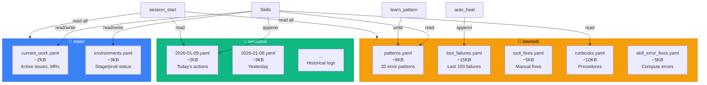
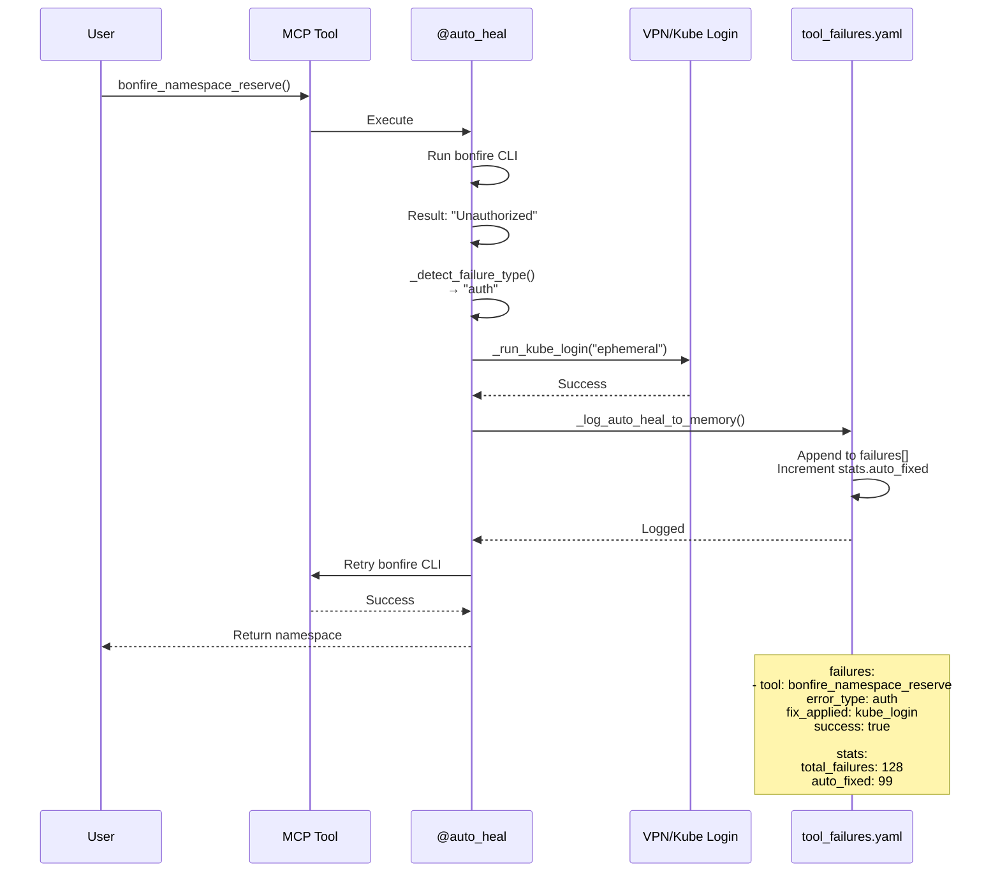
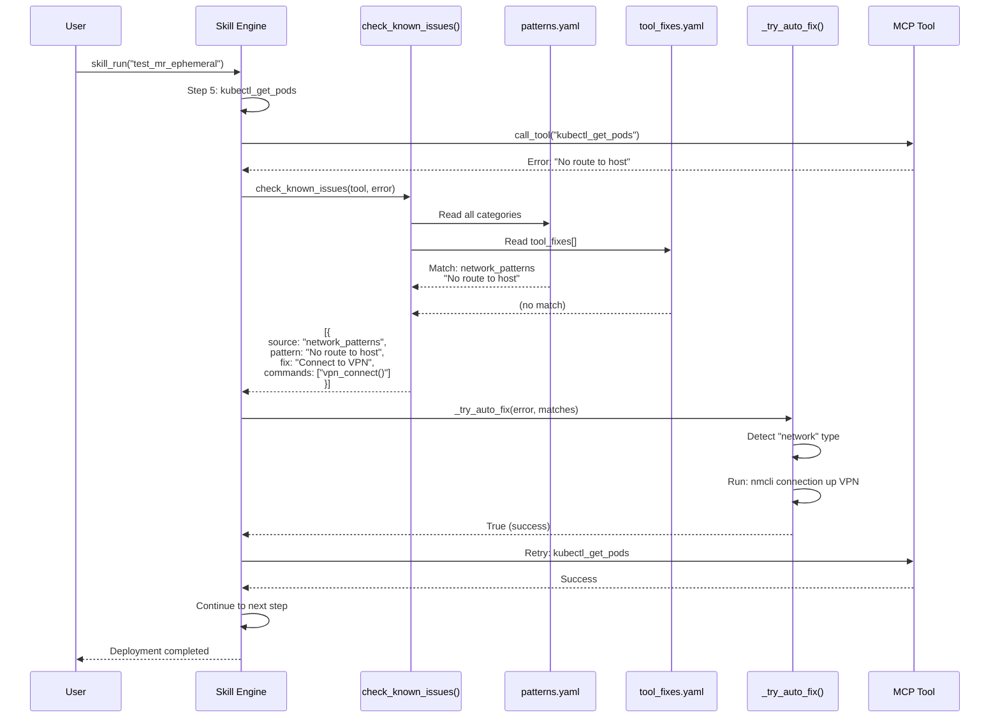
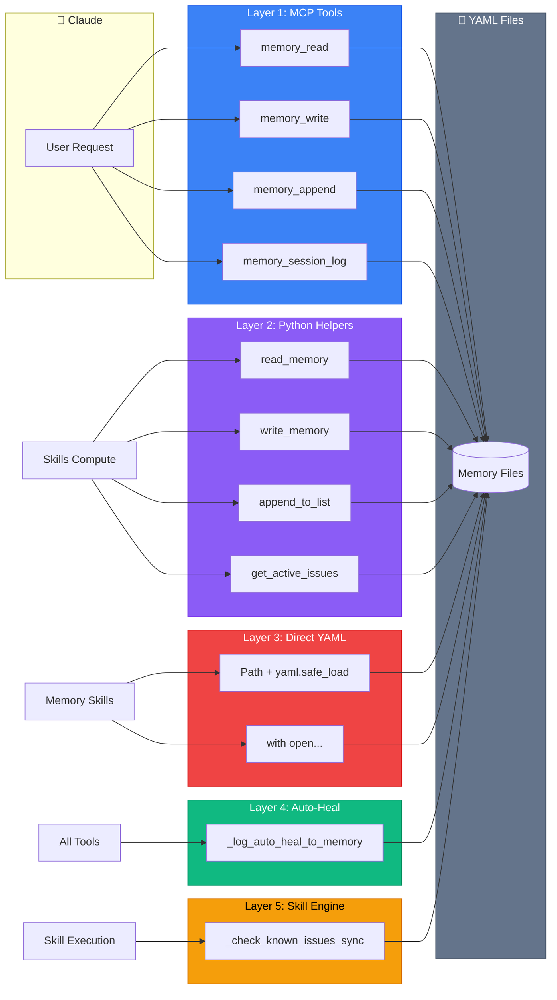
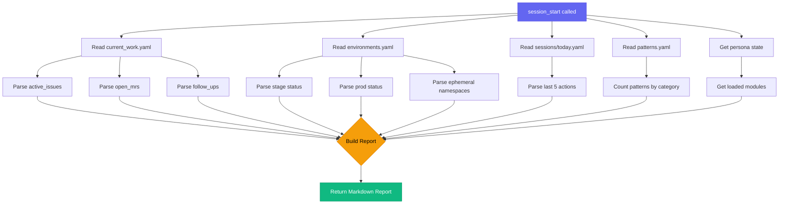
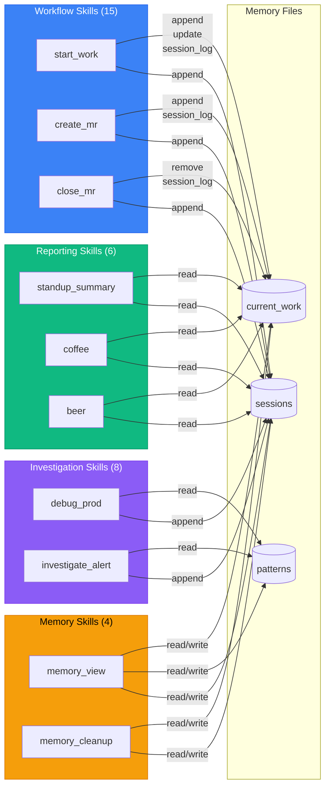
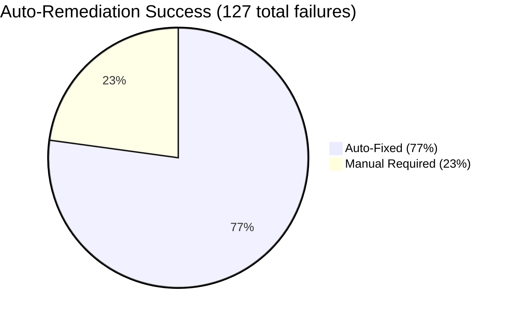
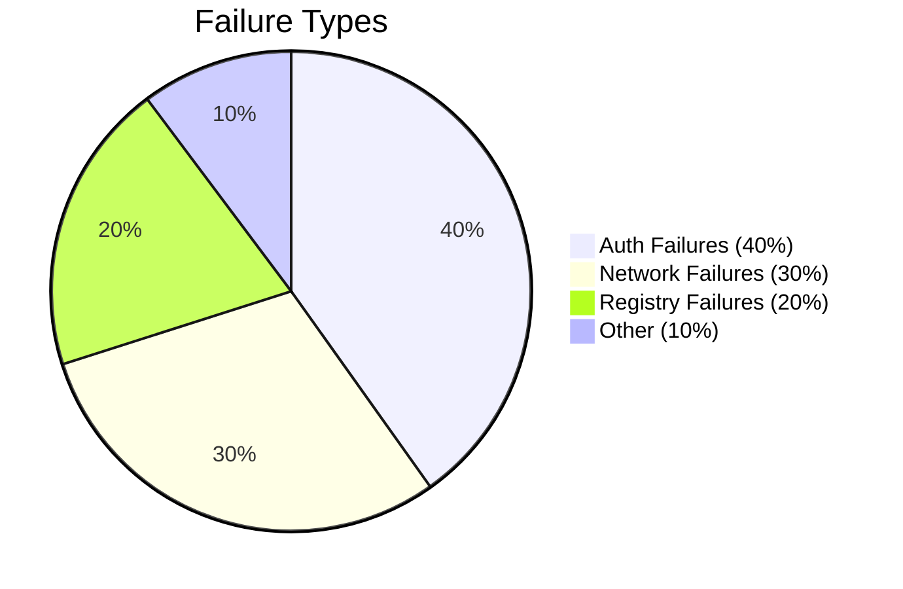
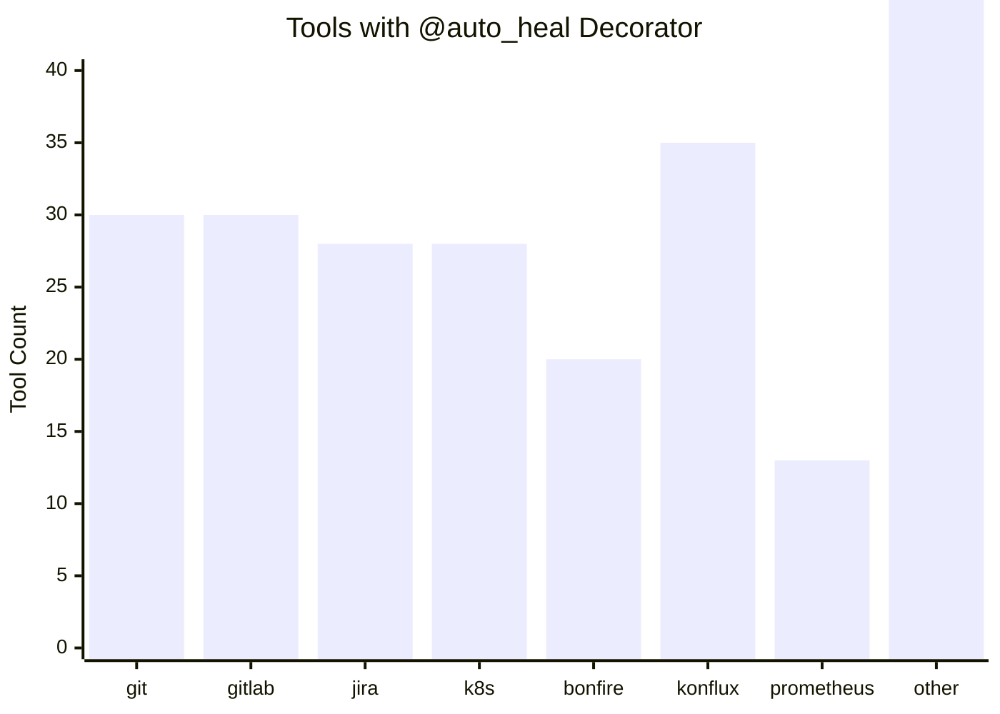

# Memory & Auto-Remediation: Visual Summary

> Quick reference diagrams and flowcharts

## Complete System Architecture

```mermaid
flowchart TB
    subgraph User["👤 User / Claude"]
        A[User Action]
        B[Skill Execution]
        C[Direct Tool Call]
    end

    subgraph Tools["🔧 MCP Tools (239+)"]
        D[@auto_heal Decorator]
        E[Tool Execution]
        F{Failure?}
    end

    subgraph AutoHeal["🔄 Auto-Heal Layer"]
        G[Detect Pattern]
        H[Auth Fix]
        I[Network Fix]
        J[Log Failure]
    end

    subgraph Skills["⚡ Skill Engine"]
        K[Execute Steps]
        L{Step Fails?}
        M[check_known_issues]
        N[_try_auto_fix]
    end

    subgraph Memory["💾 Memory Files"]
        O[(patterns.yaml)]
        P[(tool_failures.yaml)]
        Q[(current_work.yaml)]
        R[(sessions/daily)]
    end

    A --> B
    A --> C
    B --> K
    C --> D
    D --> E
    E --> F
    F -->|Yes| G
    F -->|No| Return[Return Success]
    G --> H
    G --> I
    H --> J
    I --> J
    J --> P
    J --> E

    K --> L
    L -->|Yes| M
    L -->|No| Continue[Continue]
    M --> O
    M --> N
    N --> H
    N --> I

    B --> Session[memory_session_log]
    Session --> R
    B --> State[Update State]
    State --> Q

    style Memory fill:#f59e0b,stroke:#d97706
    style AutoHeal fill:#10b981,stroke:#059669
    style Tools fill:#3b82f6,stroke:#2563eb
    style Skills fill:#8b5cf6,stroke:#7c3aed
```

## Memory File Ecosystem



## Tool Failure → Auto-Heal → Memory Flow



## Skill Failure → Pattern Match → Auto-Fix Flow



## Memory Access Layers



## Session Start Context Loading



## Daily Memory Operations

```mermaid
gantt
    title Daily Memory Operations (~395 total)
    dateFormat X
    axisFormat %s

    section Reads (250)
    check_known_issues (50)     :0, 50
    session_start (5 files)     :50, 55
    Skill compute blocks (195)  :55, 250

    section Writes (145)
    memory_session_log (30)     :250, 280
    auto_heal logging (100)     :280, 380
    Skill state updates (15)    :380, 395
```



## Pattern Matching Decision Tree

```mermaid
flowchart TD
    A[Tool Failure] --> B{Error Type?}

    B -->|"unauthorized"<br/>"401"<br/>"token expired"| C[AUTH Pattern]
    B -->|"no route to host"<br/>"connection refused"| D[NETWORK Pattern]
    B -->|"manifest unknown"<br/>"image not found"| E[REGISTRY Pattern]
    B -->|"output is not a tty"| F[TTY Pattern]
    B -->|Other| G[UNKNOWN Pattern]

    C --> H[Auto-Fix:<br/>kube_login]
    D --> I[Auto-Fix:<br/>vpn_connect]
    E --> J[Manual:<br/>Suggest podman login]
    F --> K[Manual:<br/>Suggest debug_tool]
    G --> L[Manual:<br/>Suggest debug_tool]

    H --> M{Fix Success?}
    I --> M
    J --> N[Return Error]
    K --> N
    L --> N

    M -->|Yes| O[Log to tool_failures.yaml]
    M -->|No| N

    O --> P[Retry Tool]
    P --> Q{Retry Success?}

    Q -->|Yes| R[Return Result]
    Q -->|No| N

    style C fill:#3b82f6,stroke:#2563eb,color:#fff
    style D fill:#3b82f6,stroke:#2563eb,color:#fff
    style E fill:#ef4444,stroke:#dc2626,color:#fff
    style F fill:#ef4444,stroke:#dc2626,color:#fff
    style G fill:#64748b,stroke:#475569,color:#fff
    style H fill:#10b981,stroke:#059669,color:#fff
    style I fill:#10b981,stroke:#059669,color:#fff
    style R fill:#10b981,stroke:#059669,color:#fff
```

## Skill Memory Usage Pattern



## Auto-Fix Success Rates





## Memory File Growth Over Time

```mermaid
xychart-beta
    title "Memory File Sizes"
    x-axis [tool_failures, patterns, current_work, sessions/daily, tool_fixes, runbooks]
    y-axis "Size (KB)" 0 --> 16
    bar [15, 8, 2, 3, 5, 10]
```

## Tool Coverage by Module



---

## Quick Stats Summary

| Metric | Value |
|--------|-------|
| **Total MCP Tools** | 239+ |
| **Tools with @auto_heal** | 239+ (100%) |
| **Skills Using Memory** | 46/54 (85%) |
| **Memory Files** | 10+ |
| **Error Pattern Categories** | 6 |
| **Total Error Patterns** | 20 |
| **Daily Memory Operations** | ~395 |
| **Daily Auto-Heal Logs** | ~100 |
| **Daily Session Logs** | ~30 |
| **Auto-Fix Success Rate** | 77% |
| **Auth Fix Success** | ~90% |
| **Network Fix Success** | ~85% |
| **Largest Memory File** | tool_failures.yaml (15KB) |
| **Most-Read File** | patterns.yaml (~75/day) |
| **Most-Written File** | tool_failures.yaml (~100/day) |

---

For complete details, see:
- [MEMORY-COMPLETE-REFERENCE.md](./MEMORY-COMPLETE-REFERENCE.md) - Master index
- [memory-and-auto-remediation.md](./memory-and-auto-remediation.md) - Overview
- [memory-integration-deep-dive.md](./memory-integration-deep-dive.md) - Implementation
