# Billing Namespace Availability Analysis: 4, 5, and 6 Nines

## Executive Summary

This document defines what 99.99% (4 nines), 99.999% (5 nines), and 99.9999% (6 nines) availability would look like for the **Automation Analytics Billing** infrastructure — the system responsible for processing AAP billing controller data, sending vCPU usage to Subscription Watch, and exporting billing data to S3.

**Billing is revenue-critical.** Downtime directly impacts Red Hat's ability to meter and bill AAP usage. Accuracy and timeliness are as important as uptime.

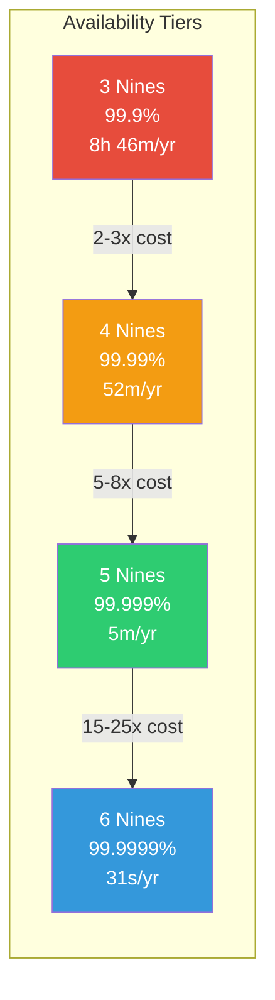

---

## Current State Baseline

### Architecture

| Component | Purpose | Prod Replicas | Resource (CPU/Mem) |
|-----------|---------|:---:|---|
| `processor-aap-billing-controller` | DB-polling processor; reads tarballs from S3, writes billing data, sends to SubsWatch via Kafka | 2 | 1000m / 2Gi |
| `processor-aap-billing-ingress` | Kafka consumer on `platform.upload.announce`; records messages, copies to RECOVERY bucket | 2 | 1000m / 2Gi |
| `data-aap-billing-exporter` | DB-queue worker; exports billing tables as Parquet to S3 | 2 | 1000m / 2Gi |
| `integration` | FastAPI healthcheck endpoint | 0 (prod) | 2000m / 2Gi |

### Current Architecture Diagram

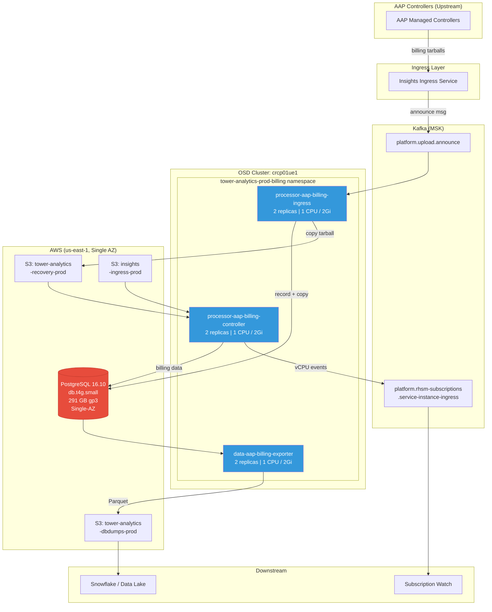

### Dependencies

| Dependency | Type | Current Config |
|------------|------|----------------|
| **PostgreSQL (RDS)** | `db.t4g.small`, 291 GB gp3, PostgreSQL 16.10 | Single-AZ, 7-day backup retention, encrypted |
| **Kafka** | MSK (managed) | Topics: `platform.upload.announce`, `platform.rhsm-subscriptions.service-instance-ingress` |
| **S3** | 3 buckets | `insights-ingress-prod`, `tower-analytics-recovery-prod`, `tower-analytics-dbdumps-prod` |
| **Kubernetes** | OSD (crcp01ue1) | Single cluster, no PDB, no HPA |

### Current Failure Domains

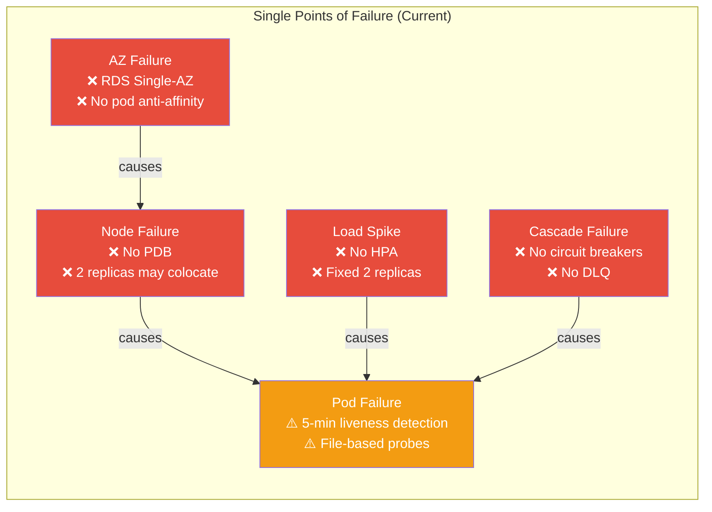

### Current Gaps

- **RDS:** Single-AZ (`multi_az: false`) — single point of failure
- **No HPA:** Fixed replica counts; no autoscaling under load spikes
- **No PDB:** Pod disruptions during node maintenance can take all replicas offline simultaneously
- **Liveness probes:** File-based (5-min staleness window) — slow failure detection
- **No circuit breakers:** Kafka/S3 failures can cascade
- **No cross-region:** All infrastructure in a single AWS region (us-east-1)
- **No read replicas:** All queries hit the primary RDS instance
- **Alert thresholds (prod):** Some alerts fire only after 15+ errors, allowing data loss before detection

### Estimated Current Availability

Based on single-AZ RDS, no PDB, no HPA, and 2-replica deployments:

**~99.9% (3 nines) — approximately 8.7 hours of downtime per year**

---

## Allowable Downtime Per Tier

| Availability | Uptime % | Downtime / Year | Downtime / Month | Downtime / Week |
|:---:|:---:|:---:|:---:|:---:|
| **3 nines** | 99.9% | 8h 45m 36s | 43m 28s | 10m 4.8s |
| **4 nines** | 99.99% | 52m 33.6s | 4m 21s | 1m 0.5s |
| **5 nines** | 99.999% | 5m 15.4s | 26.3s | 6.05s |
| **6 nines** | 99.9999% | 31.5s | 2.63s | 0.6s |

---

## Tier 1: Four Nines (99.99%) — 52 minutes downtime / year

### Goal
Survive single-component failures with automated recovery in under 5 minutes. No manual intervention for common failure modes.

### 4-Nines Architecture

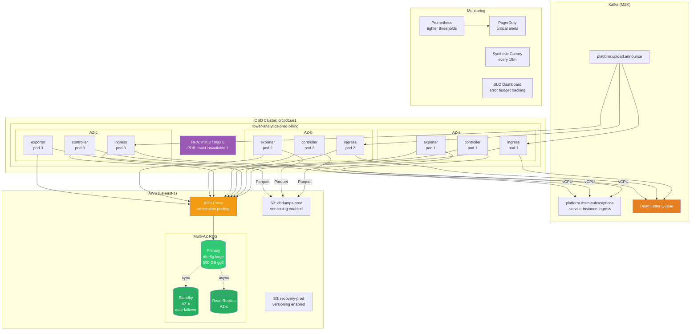

### Compute (Kubernetes)

| Change | Current | Target | Rationale |
|--------|---------|--------|-----------|
| **Min replicas** | 2 | 3 (all billing deployments) | Survive 1 pod loss + 1 rolling update simultaneously |
| **PodDisruptionBudget** | None | `maxUnavailable: 1` per deployment | Prevent node drains from killing all replicas |
| **HPA** | None | Min 3 / Max 6, target 70% CPU | Auto-scale during ingestion spikes |
| **Pod anti-affinity** | None | `preferredDuringSchedulingIgnoredDuringExecution` across nodes | Spread replicas across failure domains |
| **Topology spread** | None | `maxSkew: 1` across availability zones | Distribute across AZs within the cluster |
| **Readiness probes** | File check (cat /tmp/readiness_check-started) | HTTP `/healthz` with DB connectivity check | Faster failure detection; stop routing to unhealthy pods |
| **Liveness probes** | 5-min file staleness | 90-second file staleness + HTTP check | Detect stuck processors in < 2 minutes |
| **Resource requests** | 1000m CPU / 1Gi mem | Tuned per component based on P95 usage | Right-size to avoid OOMKill and throttling |

### Database (RDS)

| Change | Current | Target | Rationale |
|--------|---------|--------|-----------|
| **Multi-AZ** | `false` | `true` | Automated failover (~60s) for AZ or instance failure |
| **Instance class** | `db.t4g.small` (2 vCPU, 2 GiB) | `db.r6g.large` (2 vCPU, 16 GiB) | Burstable T-class risks CPU credit exhaustion under sustained load |
| **Read replica** | None | 1 read replica (same region) | Offload data exporter reads; failover candidate |
| **Backup retention** | 7 days | 14 days | Longer recovery window for data issues |
| **Storage** | gp3, 291 GB | gp3, 500 GB (provisioned IOPS: 3000) | Headroom for growth; consistent I/O |
| **Enhanced monitoring** | 60s | 15s | Faster anomaly detection |
| **Connection pooling** | None | PgBouncer sidecar or RDS Proxy | Prevent connection storms during failover |

### Kafka

| Change | Current | Target | Rationale |
|--------|---------|--------|-----------|
| **Consumer group lag alerting** | Not configured | Alert if lag > 1000 messages for 5m | Detect processing slowdowns before they compound |
| **Dead letter queue** | None | DLQ topic for failed messages | Prevent poison messages from blocking the pipeline |
| **Retry with backoff** | Basic retry | Exponential backoff (1s, 2s, 4s, 8s, max 60s) | Graceful handling of transient Kafka failures |
| **Idempotent processing** | Advisory locks | Advisory locks + message dedup table | Prevent duplicate billing records on reprocessing |

### S3

| Change | Current | Target | Rationale |
|--------|---------|--------|-----------|
| **Versioning** | Not specified | Enable on RECOVERY and DATA_EXPORTER buckets | Recover from accidental overwrites |
| **Cross-region replication** | None | Not required at 4 nines | S3 already provides 99.999999999% durability |
| **Retry logic** | Standard | Retry with jitter on 503/throttle | Handle S3 rate limiting gracefully |

### Monitoring & Alerting

| Change | Current | Target | Rationale |
|--------|---------|--------|-----------|
| **Error thresholds** | > 15 errors (prod) | > 5 errors in 15m | Faster detection of processing failures |
| **PagerDuty integration** | Slack only | PagerDuty for critical alerts, Slack for info/warning | Guarantee human response within SLA |
| **Synthetic monitoring** | None | Canary billing message every 15m | Verify end-to-end pipeline health |
| **SLO dashboards** | Grafana billing dashboard exists | Add SLI/SLO tracking (error budget burn rate) | Quantify availability against target |
| **Runbook automation** | Manual runbooks | Semi-automated (restart, scale, failover scripts) | Reduce MTTR from minutes to seconds |

### Estimated Cost Increase
- RDS Multi-AZ + class upgrade: **~2.5x** current RDS cost
- Extra replicas + HPA headroom: **~1.5x** current compute cost
- Read replica: **~1x** additional RDS instance cost
- **Total: ~2-3x** current billing infrastructure cost

---

## Tier 2: Five Nines (99.999%) — 5 minutes downtime / year

### Goal
Survive full availability-zone failures automatically. Zero-downtime deployments. No single point of failure anywhere in the pipeline. Human intervention only for novel/unprecedented failures.

### 5-Nines Architecture

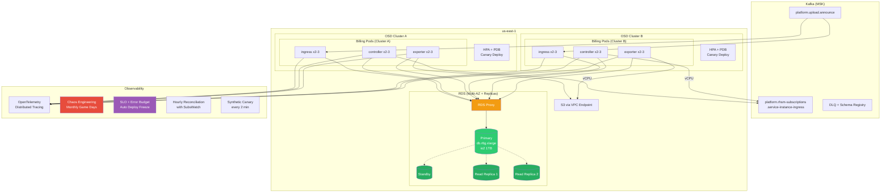

### Compute (Kubernetes)

| Change | 4-Nines Baseline | Target | Rationale |
|--------|------------------|--------|-----------|
| **Min replicas** | 3 | 5 (all billing deployments) | Survive full AZ loss (⅓ of pods) + rolling update |
| **Multi-cluster** | Single cluster | Active-active across 2 OSD clusters in same region | Cluster-level fault tolerance |
| **Pod anti-affinity** | Preferred | **Required** across AZs | Guarantee cross-AZ distribution |
| **Rolling update strategy** | Default | `maxSurge: 1`, `maxUnavailable: 0` | Zero-downtime deploys |
| **Canary deployments** | None | Canary with automated rollback on error rate spike | Prevent bad deploys from causing outages |
| **Init container timeout** | Default | 120s timeout with retry | Prevent migration hangs from blocking deploys |
| **Graceful shutdown** | Default | `terminationGracePeriodSeconds: 120` + SIGTERM handling | Complete in-flight billing processing before shutdown |

### Database (RDS)

| Change | 4-Nines Baseline | Target | Rationale |
|--------|------------------|--------|-----------|
| **Instance class** | `db.r6g.large` | `db.r6g.xlarge` (4 vCPU, 32 GiB) | Handle peak loads without performance degradation |
| **Read replicas** | 1 | 2 (cross-AZ) with automated promotion | Sub-minute failover if primary and standby fail |
| **RDS Proxy** | Optional | Required | Connection pooling, failover transparency, query-level routing |
| **Point-in-time recovery** | 14-day backup | 35-day backup + continuous WAL archiving to S3 | Fine-grained recovery for billing data integrity |
| **Storage** | gp3, 500 GB | io2, 1 TB, 10000 IOPS | Consistent low-latency I/O for billing writes |
| **Parameter tuning** | Default+ | `max_connections: 200`, `idle_in_transaction_session_timeout: 30s` | Prevent connection leaks from impacting availability |
| **Blue-green DB upgrades** | Apply immediately | Blue-green RDS deployment for version upgrades | Zero-downtime database version upgrades |

### Kafka

| Change | 4-Nines Baseline | Target | Rationale |
|--------|------------------|--------|-----------|
| **Consumer isolation** | Shared consumer group | Dedicated consumer group per deployment with partition assignment | Isolate blast radius of consumer failures |
| **Exactly-once semantics** | Idempotent + dedup | Kafka transactions + idempotent writes | Guarantee no duplicate/missed billing records |
| **Topic replication** | Platform default (3) | Verify `min.insync.replicas: 2` | Survive broker failure without data loss |
| **Consumer health** | Lag alerting | Lag alerting + auto-restart on sustained lag > 5m | Self-healing consumer groups |
| **Schema registry** | None | Avro/Protobuf schema with compatibility checks | Prevent schema evolution from breaking processing |

### S3

| Change | 4-Nines Baseline | Target | Rationale |
|--------|------------------|--------|-----------|
| **Access pattern** | Direct SDK calls | S3 access via VPC endpoint | Eliminate internet gateway as failure point |
| **Write verification** | None | Read-after-write verification for billing exports | Detect silent corruption |
| **Lifecycle policies** | None | Move old Parquet exports to Glacier after 90 days | Cost optimization without availability impact |

### Monitoring & Alerting

| Change | 4-Nines Baseline | Target | Rationale |
|--------|------------------|--------|-----------|
| **Alert response** | PagerDuty critical | PagerDuty critical + automated remediation for known patterns | Machine-speed response for common failures |
| **Error thresholds** | > 5 errors in 15m | > 1 error in 5m (critical), anomaly detection on error rates | Near-instant detection |
| **Synthetic monitoring** | Canary every 15m | Canary every 2m + end-to-end latency tracking | Sub-minute failure detection |
| **SLO error budgets** | Dashboard | Automated deployment freezes when error budget < 20% | Protect availability during instability |
| **Chaos engineering** | None | Monthly game days (pod kill, AZ failure simulation) | Validate resilience assumptions |
| **Distributed tracing** | None | OpenTelemetry traces across ingress → processor → exporter | Pinpoint latency and failure sources |
| **Billing reconciliation** | Manual | Automated hourly reconciliation with SubsWatch | Detect data drift before it compounds |

### Operational

| Change | Current | Target | Rationale |
|--------|---------|--------|-----------|
| **Change management** | Standard deploy | Deploy windows with automated rollback triggers | Prevent change-induced outages |
| **On-call runbooks** | Manual | Automated runbooks via Ansible/RHACM | Reduce MTTR to < 30 seconds |
| **Incident response** | Ad-hoc | Formal IRT with billing-specific escalation path | Structured response within SLO |
| **Capacity planning** | Reactive | Quarterly capacity review with 6-month projections | Prevent capacity-induced outages |

### Estimated Cost Increase (from 4 nines)
- Multi-cluster compute: **~2x** compute cost
- RDS upgrades (io2 + replicas + proxy): **~3x** RDS cost
- Observability tooling: **~1.5x** monitoring cost
- Engineering time for chaos engineering, SLO frameworks: **significant**
- **Total: ~4-6x** current billing infrastructure cost

---

## Tier 3: Six Nines (99.9999%) — 31.5 seconds downtime / year

### Goal
Survive regional failures. Processing continues within seconds of any infrastructure failure, including full AWS region outage. Every component has an active-active counterpart. This tier is typically reserved for financial trading, life-safety, or defense systems.

> **Reality check:** Six nines for a billing pipeline is almost certainly overkill. The upstream dependencies (Kafka/MSK, ingress, AAP controllers reporting data) likely don't achieve 6 nines themselves, making it impossible for the billing pipeline to exceed its weakest dependency. This section is included for completeness.

### 6-Nines Architecture

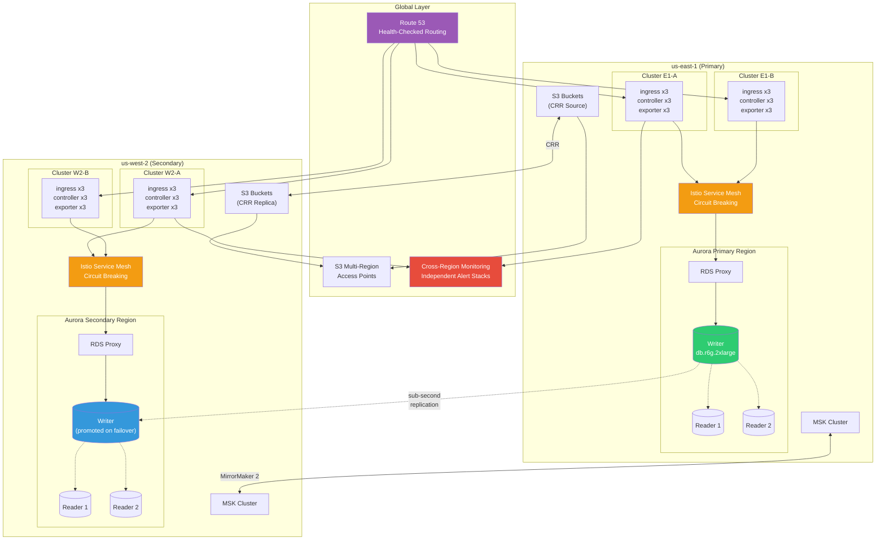

### Compute (Kubernetes)

| Change | 5-Nines Baseline | Target | Rationale |
|--------|------------------|--------|-----------|
| **Min replicas** | 5 | 7+ per region, 2 regions | Survive entire region loss |
| **Multi-region** | Single region, multi-cluster | Active-active across 2 AWS regions (us-east-1 + us-west-2) | Region-level fault tolerance |
| **Global load balancing** | None | Route 53 health-checked routing across regions | Automatic region failover |
| **Service mesh** | None | Istio/OSSM with circuit breaking, retries, timeouts | Application-layer resilience |
| **Pod priority** | Default | `PriorityClass: system-cluster-critical` | Billing pods never preempted |
| **Node pools** | Shared | Dedicated node pool for billing workloads | Noisy-neighbor isolation |
| **Deployment strategy** | Canary | Blue-green with instant rollback | < 1 second rollback on failures |

### Database (RDS)

| Change | 5-Nines Baseline | Target | Rationale |
|--------|------------------|--------|-----------|
| **Architecture** | Multi-AZ + read replicas | **Aurora PostgreSQL Global Database** | Sub-second cross-region replication, ~1 minute regional failover |
| **Instance class** | `db.r6g.xlarge` | `db.r6g.2xlarge` (8 vCPU, 64 GiB) per region | Headroom for cross-region traffic |
| **Read replicas** | 2 (same region) | 2 per region (4 total) with Aurora auto-scaling | Region-independent read capacity |
| **Storage** | io2, 1 TB | Aurora auto-scaling (10 GB increments, up to 128 TB) | Eliminate storage capacity as failure mode |
| **Failover time** | ~60s (Multi-AZ) | < 30s (Aurora), < 60s cross-region (Global DB) | Within 6-nines downtime budget |
| **Backup** | 35-day PITR | Continuous + cross-region backup replication | Recover from any regional disaster |
| **Write forwarding** | N/A | Aurora Global DB write forwarding | Secondary region can accept writes during failover |
| **Connection management** | RDS Proxy | RDS Proxy per region + application-level connection retry | Transparent failover to applications |

### Kafka

| Change | 5-Nines Baseline | Target | Rationale |
|--------|------------------|--------|-----------|
| **Architecture** | Single MSK cluster | **Multi-region MSK** or **MirrorMaker 2** replication | Cross-region topic replication |
| **Consumer strategy** | Per-deployment groups | Per-region consumer groups with global offset sync | Region-independent consumption |
| **Exactly-once** | Transactions | Transactions + cross-region idempotency keys | Prevent duplicate billing across regions |
| **Topic configuration** | Default replication | `replication.factor: 5`, `min.insync.replicas: 3` | Survive 2 simultaneous broker failures |

### S3

| Change | 5-Nines Baseline | Target | Rationale |
|--------|------------------|--------|-----------|
| **Replication** | None | Cross-Region Replication (CRR) on all billing buckets | Region-independent data access |
| **Access** | VPC endpoint | VPC endpoints in both regions + S3 Multi-Region Access Points | Automatic routing to nearest/healthy region |
| **Consistency** | S3 strong consistency | S3 strong consistency + application-level checksums | Detect cross-region replication lag |

### Monitoring & Alerting

| Change | 5-Nines Baseline | Target | Rationale |
|--------|------------------|--------|-----------|
| **Monitoring** | Single region | Cross-region monitoring with independent alerting stacks | Monitor can't be in the same blast radius |
| **Alert latency** | ~30s detection | < 5s detection with streaming metrics | Within downtime budget |
| **Auto-remediation** | Known patterns | Full auto-remediation including regional failover | Human response too slow for 6-nines SLO |
| **Synthetic monitoring** | Every 2m | Every 15 seconds from multiple regions | Sub-minute global health visibility |
| **Reconciliation** | Hourly | Real-time streaming reconciliation across regions | Detect cross-region data divergence instantly |

### Operational

| Change | 5-Nines Baseline | Target | Rationale |
|--------|------------------|--------|-----------|
| **Deployment** | Canary + rollback | Multi-region progressive rollout (region 1 → observe → region 2) | Contain blast radius of bad deploys to one region |
| **Change freeze** | Error budget driven | Automated change freeze + approval gates per region | Zero unplanned changes |
| **Testing** | Monthly chaos | Continuous chaos engineering (Litmus/Gremlin) | Constant validation of resilience |
| **DR drills** | None | Quarterly regional failover drills | Validate cross-region recovery actually works |
| **Team** | Shared on-call | Dedicated billing SRE rotation (24/7) | Specialized rapid response |

### Estimated Cost Increase (from 5 nines)
- Multi-region compute (2x everything): **~2x** compute cost
- Aurora Global Database: **~3-4x** RDS cost
- Cross-region networking: **~$500-1000/month** data transfer
- Multi-region Kafka: **~2x** Kafka cost
- S3 CRR: **~1.5x** S3 cost
- Dedicated SRE staffing: **~$200-400K/year**
- **Total: ~10-20x** current billing infrastructure cost

---

## Comparison Matrix

### Blast Radius by Tier

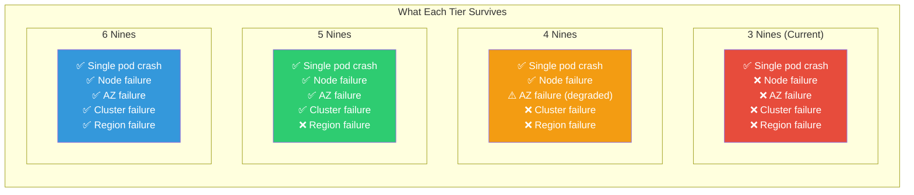

### Infrastructure Summary

| Component | Current (3 nines) | 4 Nines | 5 Nines | 6 Nines |
|-----------|-------------------|---------|---------|---------|
| **Pod replicas** | 2 | 3 + HPA (max 6) | 5 + HPA (max 10) | 7+ per region, 2 regions |
| **Clusters** | 1 | 1 | 2 (same region) | 2+ per region, 2 regions |
| **PDB** | None | maxUnavailable: 1 | maxUnavailable: 1 | maxUnavailable: 1 + priority class |
| **Anti-affinity** | None | Preferred (cross-node) | Required (cross-AZ) | Required (cross-AZ, cross-region) |
| **RDS instance** | db.t4g.small | db.r6g.large | db.r6g.xlarge | db.r6g.2xlarge (Aurora Global) |
| **RDS Multi-AZ** | No | Yes | Yes | Yes + cross-region |
| **Read replicas** | 0 | 1 | 2 | 2 per region |
| **RDS Proxy** | No | Optional | Required | Required (per region) |
| **RDS storage** | gp3, 291 GB | gp3, 500 GB | io2, 1 TB | Aurora auto-scaling |
| **Kafka DLQ** | No | Yes | Yes | Yes + cross-region |
| **Kafka exactly-once** | No | Idempotent | Transactions | Transactions + cross-region dedup |
| **S3 cross-region** | No | No | No | CRR on all buckets |
| **Deploy strategy** | Rolling | Rolling + PDB | Canary + auto-rollback | Blue-green multi-region progressive |
| **Monitoring** | Prometheus + Slack | + PagerDuty + SLO | + Tracing + Chaos | + Cross-region + streaming |
| **Synthetic checks** | None | Every 15m | Every 2m | Every 15s multi-region |
| **Failure detection** | Minutes | < 2 minutes | < 30 seconds | < 5 seconds |
| **MTTR target** | ~30 minutes | < 5 minutes | < 30 seconds | < 5 seconds (automated) |
| **Reconciliation** | Manual | Automated hourly | Automated hourly | Real-time streaming |

### Cost Multiplier (Relative to Current)

| Tier | Compute | Database | Kafka | Monitoring | People | Total |
|------|:-------:|:--------:|:-----:|:----------:|:------:|:-----:|
| Current (3 nines) | 1x | 1x | 1x | 1x | 1x | **1x** |
| 4 Nines | 1.5x | 2.5x | 1.2x | 1.5x | 1x | **~2-3x** |
| 5 Nines | 3x | 5x | 1.5x | 2.5x | 1.5x | **~5-8x** |
| 6 Nines | 6x | 15x | 3x | 4x | 3x | **~15-25x** |

### Cost vs. Downtime Tradeoff

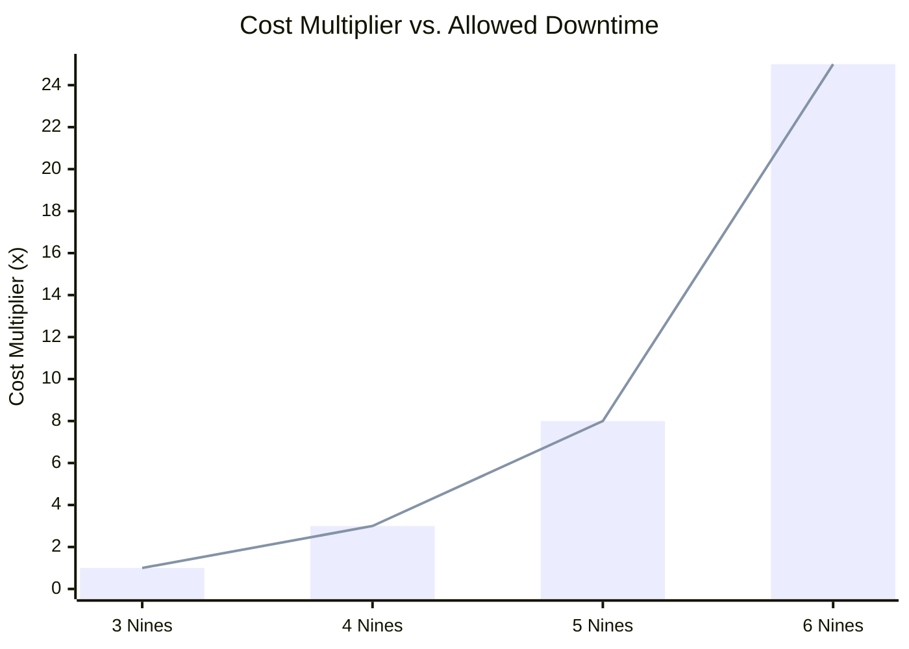

### Database Evolution Across Tiers

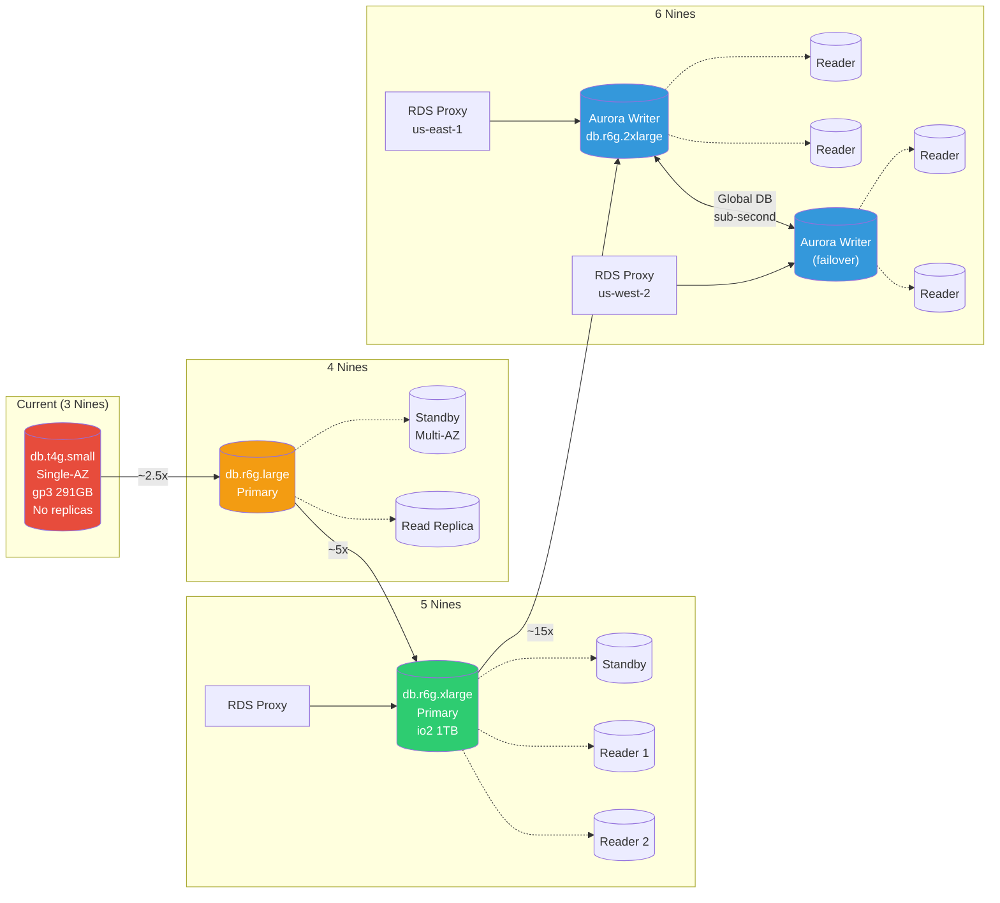

---

## Recommended Path

### Implementation Roadmap

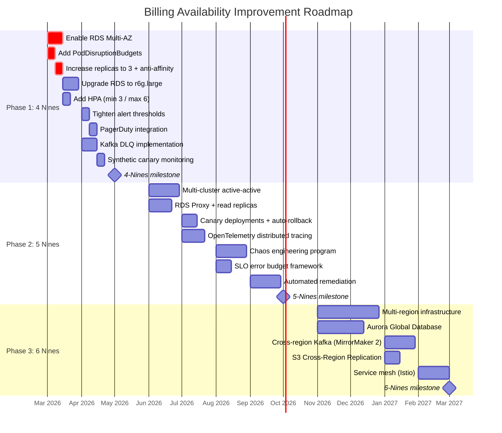

### Phase 1 Priority Order (Risk vs. Effort)

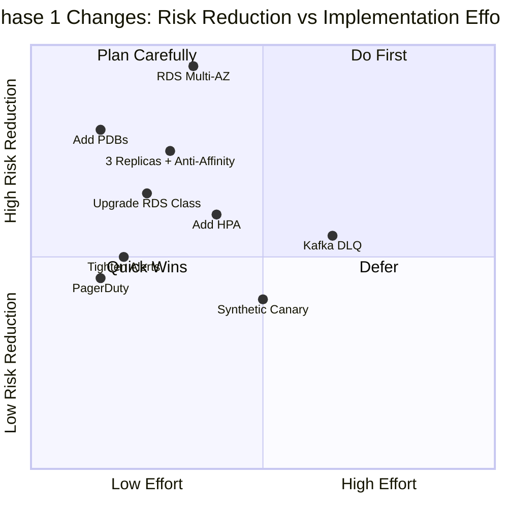

### Phase 1: Achieve 4 Nines (High Impact, Moderate Cost)

**Priority order by risk reduction:**

1. **Enable RDS Multi-AZ** — eliminates the single largest SPOF
2. **Add PodDisruptionBudgets** — prevents maintenance-induced outages
3. **Increase to 3 replicas with pod anti-affinity** — survive node failures
4. **Upgrade RDS from t4g.small to r6g.large** — eliminate CPU credit risk
5. **Add HPA** — handle load spikes without manual intervention
6. **Tighten alert thresholds** — detect issues in minutes, not hours
7. **Add PagerDuty integration** — guarantee human response
8. **Implement DLQ for Kafka** — prevent poison messages from blocking pipeline
9. **Add synthetic canary** — proactive failure detection

### Phase 2: Path to 5 Nines (If Business Justifies)

Only pursue 5 nines if billing SLA requirements demand it. The jump from 4 to 5 nines is primarily:
- Multi-cluster deployment
- Aurora-class database
- Automated remediation
- Chaos engineering practice

### Phase 3: Six Nines (Likely Unnecessary)

Six nines requires multi-region active-active, which is constrained by upstream dependencies (MSK, ingress service, AAP controllers) that don't achieve this level. The cost-benefit ratio is poor for a billing data pipeline where delayed processing (with catch-up) is acceptable.

---

## Billing Data Flow

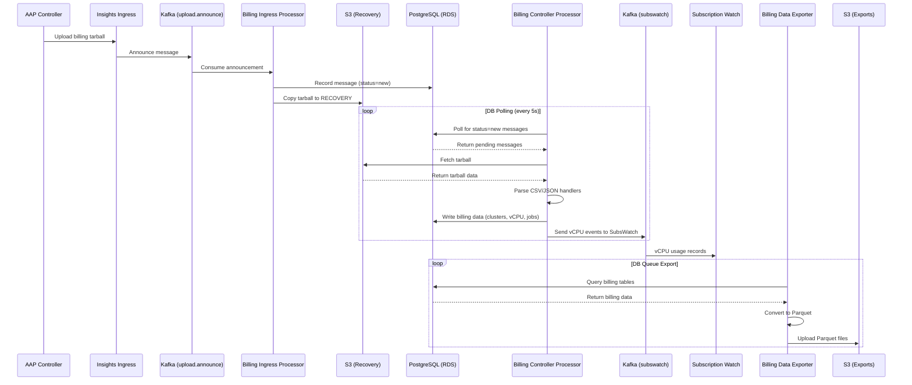

### Incident Detection & Response by Tier

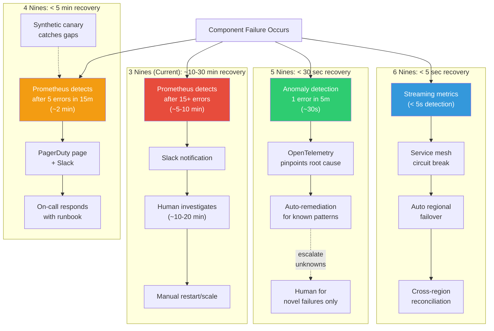

---

## Key Metrics to Track

| SLI (Service Level Indicator) | Current | 4 Nines Target | 5 Nines Target |
|-------------------------------|---------|----------------|----------------|
| Billing message processing success rate | ~99% | 99.99% | 99.999% |
| SubsWatch delivery success rate | Unknown | 99.99% | 99.999% |
| End-to-end processing latency (P95) | ~30s | < 30s | < 15s |
| Data export success rate | Unknown | 99.99% | 99.999% |
| vCPU accuracy rate | ~99.5% | > 99.9% | > 99.99% |
| Mean time to detect (MTTD) | ~10 minutes | < 2 minutes | < 30 seconds |
| Mean time to recover (MTTR) | ~30 minutes | < 5 minutes | < 30 seconds |
| Billing reconciliation gap | Manual check | < 1 hour lag | < 5 minute lag |

---

## Appendix: Current Infrastructure Files

| Resource | Location |
|----------|----------|
| Billing ClowdApp template | `automation-analytics-backend/saas-templates/clowderapp-billing.yaml` |
| SaaSFile (deploy config) | `app-interface/data/services/insights/tower-analytics/cicd/deploy-clowder.yml` |
| Stage namespace | `app-interface/data/services/insights/tower-analytics/namespaces/stage-tower-analytics-stage-billing.yml` |
| Prod namespace | `app-interface/data/services/insights/tower-analytics/namespaces/tower-analytics-prod-billing.yml` |
| Stage RDS | `app-interface/resources/terraform/resources/insights/stage/rds/rds-tower-analytics-stage-billing.yml` |
| Prod RDS | `app-interface/resources/terraform/resources/insights/production/rds/rds-tower-analytics-prod-billing.yml` |
| Stage alerts | `app-interface/resources/insights-stage/tower-analytics-stage-billing/automation-analytics.prometheusrules.yaml` |
| Prod alerts | `app-interface/resources/insights-prod/tower-analytics-prod-billing/automation-analytics.prometheusrules.yaml` |
| Grafana dashboard | `automation-analytics-backend/saas-templates/grafana/dashboards/grafana-dashboard-aap-billing-controller.configmap.yaml` |
| GABI DB access | `app-interface/data/services/gabi/gabi-instances/gabi-tower-analytics-billing.yml` |
