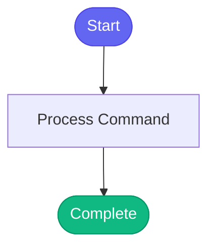

# /check-namespaces

> List and manage your ephemeral namespaces.

## Overview

List and manage your ephemeral namespaces.

## Arguments

No arguments required.

## Usage

### Examples

```bash
KUBECONFIG=~/.kube/config.e bonfire namespace list --mine
```

```bash
KUBECONFIG=~/.kube/config.e bonfire namespace release <namespace-name> --force
```

## Process Flow



## Details


## Related Commands

*(To be determined based on command relationships)*
