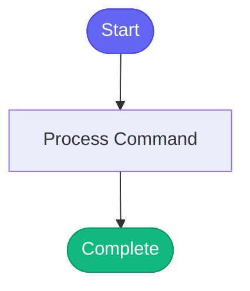

# /deploy-ephemeral

> Deploy an MR or branch to an ephemeral environment.

## Overview

Deploy an MR or branch to an ephemeral environment.

## Arguments

No arguments required.

## Usage

## Process Flow

## Details

## Prerequisites
1. Load DevOps persona: `persona_load("devops")`
2. Be logged into ephemeral cluster
3. Have the MR ID or branch name

## Usage

Tell me:
- "Deploy MR 1459 to ephemeral"
- "Test AAP-61214 in ephemeral"
- "Deploy my branch to ephemeral"

I will:
1. Get the full commit SHA from GitLab
2. Verify image exists in Quay (Konflux build)
3. Reserve an ephemeral namespace
4. Deploy using bonfire with correct ClowdApp (main or billing)
5. Wait for pods to be ready
6. Report deployment status

## Important
- Uses `KUBECONFIG=~/.kube/config.e` (never copies kubeconfig!)
- Image tag must be 64-char SHA256 digest
- Template ref must be 40-char git SHA

## Related Commands

*(To be determined based on command relationships)*
