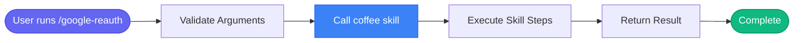

# /google-reauth

> Refresh your Google OAuth token to get new permissions (e.g., after adding Gmail scopes).

## Overview

Refresh your Google OAuth token to get new permissions (e.g., after adding Gmail scopes).

**Underlying Skill:** `coffee`

This command is a wrapper that calls the `coffee` skill. For detailed process information, see [skills/coffee.md](../skills/coffee.md).

## Arguments

No arguments required.

## Usage

### Examples

```bash
rm -f ~/.config/google-calendar/token.json && echo "Token deleted. Run any Google tool to re-authenticate."
```

```bash
This will open your browser for OAuth login with the new scopes.

## When to Use

- After adding Gmail scopes to your Google Cloud project
- If you get "insufficient scope" errors
- If your token expires or becomes invalid
- After enabling new Google APIs

## Verify Gmail Access

After re-authenticating, test email access:
```

## Process Flow

This command invokes the `coffee` skill. The process flow is:



For detailed step-by-step process, see the [coffee skill documentation](../skills/coffee.md).

## Details

## Quick Re-auth

Run this to delete token and re-authenticate:

```bash
rm -f ~/.config/google-calendar/token.json && echo "Token deleted. Run any Google tool to re-authenticate."
```

Then trigger authentication by running:

```python
google_calendar_status()
```

This will open your browser for OAuth login with the new scopes.

## When to Use

- After adding Gmail scopes to your Google Cloud project
- If you get "insufficient scope" errors
- If your token expires or becomes invalid
- After enabling new Google APIs

## Verify Gmail Access

After re-authenticating, test email access:

```
skill_run("coffee")
```

If email shows in the briefing, you're all set! ☕


## Related Commands

_(To be determined based on command relationships)_
