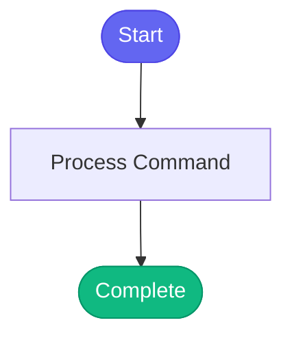

# /learn-fix

> Save a tool fix to memory so it's not repeated.

## Overview

Save a tool fix to memory so it's not repeated.

## Arguments

No arguments required.

## Usage

### Examples

```bash
/learn-fix

Tool: bonfire_deploy
Error: manifest unknown
Cause: Short SHA doesn't exist in Quay
Fix: Use full 40-char SHA
```

```bash
Tool fails → check_known_issues() → debug_tool() → fix → learn_tool_fix() → ✓
                    ↑                                            |
                    └────────── remembered for next time ←───────┘
```

## Process Flow



## Details

## Usage

After successfully fixing a tool, run this command to save the learning.

## What You'll Need

1. **Tool name** - The tool that was fixed (e.g., `bonfire_deploy`)
2. **Error pattern** - The error message that triggered the fix
3. **Root cause** - Why it failed
4. **Fix description** - What was changed

## Example

```
/learn-fix

Tool: bonfire_deploy
Error: manifest unknown
Cause: Short SHA doesn't exist in Quay
Fix: Use full 40-char SHA
```

## The Learning Loop

```
Tool fails → check_known_issues() → debug_tool() → fix → learn_tool_fix() → ✓
                    ↑                                            |
                    └────────── remembered for next time ←───────┘
```

## Related Commands

- `/debug-tool` - Analyze and fix a failing tool
- `/memory` - View all memory including learned fixes
- `/memory-edit` - Manually edit memory entries


## Related Commands

_(To be determined based on command relationships)_
