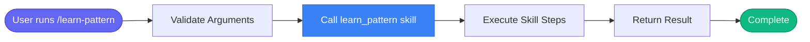

# /learn-pattern

> Save a new error pattern to memory for future recognition.

## Overview

Save a new error pattern to memory for future recognition.

**Underlying Skill:** `learn_pattern`

This command is a wrapper that calls the `learn_pattern` skill. For detailed process information, see [skills/learn_pattern.md](../skills/learn_pattern.md).

## Arguments

| Argument | Required | Description |
|----------|----------|-------------|
| `pattern` | No | - |
| `meaning` | No | - |
| `fix` | No | - |

## Usage

### Examples

```bash
skill_run("learn_pattern", '{"pattern": "OOMKilled", "meaning": "Container exceeded memory limit", "fix": "Increase memory limits"}')
```

```bash
/learn-pattern
Pattern: ImagePullBackOff
Meaning: Kubernetes cannot pull the container image
Fix: Check image name, tag, and registry credentials
Commands: kubectl describe pod X, kubectl get events
Category: pod_errors
```

## Process Flow

This command invokes the `learn_pattern` skill. The process flow is:



For detailed step-by-step process, see the [learn_pattern skill documentation](../skills/learn_pattern.md).

## Details

## Usage

When you discover an error pattern and its fix, teach the AI to remember it:

```
skill_run("learn_pattern", '{"pattern": "OOMKilled", "meaning": "Container exceeded memory limit", "fix": "Increase memory limits"}')
```

## Categories

- **pod_errors**: Kubernetes pod issues (CrashLoopBackOff, ImagePullBackOff, etc.)
- **log_patterns**: Error messages found in logs
- **network**: Network-related issues
- **general**: Default category

## Example

```
/learn-pattern
Pattern: ImagePullBackOff
Meaning: Kubernetes cannot pull the container image
Fix: Check image name, tag, and registry credentials
Commands: kubectl describe pod X, kubectl get events
Category: pod_errors
```

The pattern will be saved and automatically matched during `investigate_alert` and `debug_prod` skills.


## Related Commands

_(To be determined based on command relationships)_
