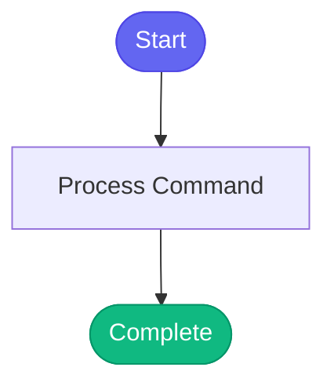

# /list-skills

> Show all available skills and their status.

## Overview

Show all available skills and their status.

## Arguments

No arguments required.

## Usage

### Examples

```bash
cd /home/daoneill/src/redhat-ai-workflow && source ~/bonfire_venv/bin/activate && python scripts/skill_test_runner.py --list
```

## Process Flow



## Details


## Related Commands

_(To be determined based on command relationships)_
