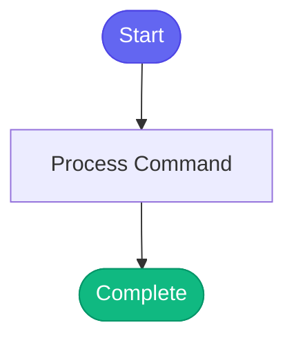

# /load-devops

> Switch to DevOps persona for deployment and infrastructure tasks.

## Overview

Switch to DevOps persona for deployment and infrastructure tasks.

## Arguments

No arguments required.

## Usage

## Process Flow

## Details

## Related Commands

_(To be determined based on command relationships)_
