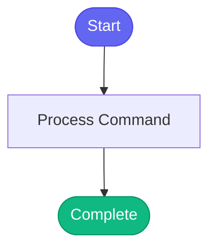

# /my-calendar

> View upcoming calendar events.

## Overview

View upcoming calendar events.

## Arguments

No arguments required.

## Usage

### Examples

```bash
## Options
```

```bash
## Check Status

Verify Google Calendar is connected:
```

```bash
## Check Availability

See your free slots for a specific date:
```

## Process Flow



## Details

## Instructions

List your upcoming events:

```python
google_calendar_list_events(days=7)
```

## Options

```python
# Next 7 days (default)
google_calendar_list_events()

# Next 14 days
google_calendar_list_events(days=14)

# More results
google_calendar_list_events(days=7, max_results=20)
```

## Check Status

Verify Google Calendar is connected:

```python
google_calendar_status()
```

## Check Availability

See your free slots for a specific date:

```python
google_calendar_check_mutual_availability(
    attendee_email="bthomass@redhat.com",
    date="2026-01-06"
)
```


## Related Commands

*(To be determined based on command relationships)*
