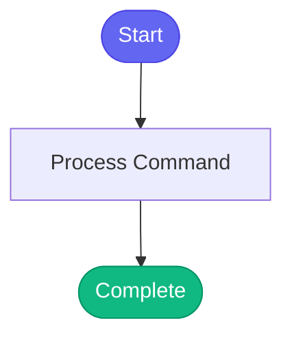

# /personas

> Switch to a specialized persona with relevant tools.

## Overview

Switch to a specialized persona with relevant tools.

## Arguments

No arguments required.

## Usage

### Examples

```bash
persona_load("developer")
```

```bash
# Starting development work
persona_load("developer")

# Deploying to ephemeral
persona_load("devops")

# Investigating an alert
persona_load("incident")

# Releasing to production
persona_load("release")
```

```bash
session_start(agent="devops")
```

## Process Flow



## Details

## Instructions

```
persona_load("developer")
```

## Available Personas

| Persona | Focus | Tools Loaded |
|---------|-------|--------------|
| `developer` | Coding, PRs, reviews | git, gitlab, jira, lint, dev-workflow (~106 tools) |
| `devops` | Deployments, k8s, ephemeral | k8s, bonfire, quay, gitlab (~106 tools) |
| `incident` | Production issues, logs | k8s, kibana, prometheus, jira (~100 tools) |
| `release` | Shipping to production | konflux, quay, appinterface, git (~100 tools) |

## Examples

```bash
# Starting development work
persona_load("developer")

# Deploying to ephemeral
persona_load("devops")

# Investigating an alert
persona_load("incident")

# Releasing to production
persona_load("release")
```

## What Happens

When you load a persona:

1. Current tools are unloaded (except core)
2. Persona's tool modules are loaded
3. Cursor receives notification of tool change
4. Persona's expertise context is activated

## Personas

#

## 👨‍💻 Developer
Expert in code review, git workflows, Jira management.
Focuses on code quality and PR best practices.

#

## 🔧 DevOps
Expert in Kubernetes, ephemeral environments, deployments.
Knows bonfire, cluster management, image tags.

#

## 🚨 Incident
Expert in production investigation, log analysis, metrics.
Focuses on quick triage and root cause analysis.

#

## 📦 Release
Expert in Konflux builds, Quay images, app-interface.
Guides stage → prod promotions.

## Session Start

You can also load a persona when starting a session:

```
session_start(agent="devops")
```

## See Also

- `/tools` - See what tools are available
- `/list-skills` - See available skills


## Related Commands

_(To be determined based on command relationships)_
