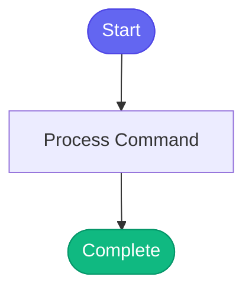

# /schedule-meeting

> Schedule a meeting with automatic availability checking and Google Meet link.

## Overview

Schedule a meeting with automatic availability checking and Google Meet link.

## Arguments

No arguments required.

## Usage

### Examples

```bash
## Constraints

- **Timezone:** Irish time (Europe/Dublin) - not your laptop time
- **Window:** 15:00-19:00 only (3pm-7pm Irish time)
- **Weekends:** Not allowed
- **Duplicates:** Automatically checks for existing meetings

## Additional Examples
```

```bash
## Check Availability First
```

```bash
## Check for Existing Meeting
```

## Process Flow



## Details

## Instructions

Schedule a meeting about an MR or topic:

```python
google_calendar_quick_meeting(
    title="$MEETING_TITLE",
    attendee_email="$ATTENDEE@redhat.com",
    when="auto"  # or "tomorrow 15:00", "friday 16:00"
)
```

## Additional Constraints

- **Timezone:** Irish time (Europe/Dublin) - not your laptop time
- **Window:** 15:00-19:00 only (3pm-7pm Irish time)
- **Weekends:** Not allowed
- **Duplicates:** Automatically checks for existing meetings

## Basic Examples

```python
# Auto-find next mutual free slot
google_calendar_quick_meeting(
    title="MR !1445 - Race Condition Discussion",
    attendee_email="bthomass@redhat.com",
    when="auto"
)

# Specific day/time (must be 15:00-19:00)
google_calendar_quick_meeting(
    title="Sprint Planning",
    attendee_email="akarve@redhat.com",
    when="monday 15:30"
)
```

## Check Availability Example

```python
# See all free slots for both calendars
google_calendar_check_mutual_availability(
    attendee_email="bthomass@redhat.com"
)
```

## Existing Meeting Check Example

```python
# Before scheduling, check if meeting exists
google_calendar_find_meeting(
    mr_id="1445",
    attendee_email="bthomass@redhat.com"
)
```


## Related Commands

*(To be determined based on command relationships)*
