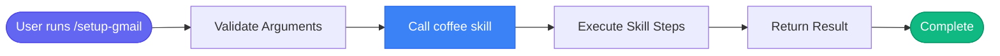

# /setup-gmail

> Enable Gmail access for the /coffee command and email features.

## Overview

Enable Gmail access for the /coffee command and email features.

**Underlying Skill:** `coffee`

This command is a wrapper that calls the `coffee` skill. For detailed process information, see [skills/coffee.md](../skills/coffee.md).

## Arguments

No arguments required.

## Usage

### Examples

```bash
## Setup Steps

Gmail uses the same Google OAuth as Calendar, but needs additional scopes.

### Step 1: Enable Gmail API in Google Cloud

1. Go to [Google Cloud Console](https://console.cloud.google.com)
2. Select your project (same one used for Calendar)
3. Navigate to **APIs & Services** → **Library**
4. Search for **Gmail API**
5. Click **Enable**

### Step 2: Update OAuth Scopes

Your existing OAuth app needs to request Gmail permissions:

1. Go to **APIs & Services** → **OAuth consent screen**
2. Click **Edit App**
3. In **Scopes**, add:
   - `https://www.googleapis.com/auth/gmail.readonly`
   - `https://www.googleapis.com/auth/gmail.modify`
4. Save

### Step 3: Re-authenticate

Delete the existing token and re-authenticate to get Gmail access:
```

```bash
Then run:
```

```bash
Sign in and grant the new Gmail permissions.

### Step 4: Verify

Test email access:
```

## Process Flow

This command invokes the `coffee` skill. The process flow is:



For detailed step-by-step process, see the [coffee skill documentation](../skills/coffee.md).

## Details

## Current Status

First, check if Gmail is already working:

```python
google_calendar_status()
```

## Setup Steps

Gmail uses the same Google OAuth as Calendar, but needs additional scopes.

### Step 1: Enable Gmail API in Google Cloud

1. Go to [Google Cloud Console](https://console.cloud.google.com)
2. Select your project (same one used for Calendar)
3. Navigate to **APIs & Services** → **Library**
4. Search for **Gmail API**
5. Click **Enable**

### Step 2: Update OAuth Scopes

Your existing OAuth app needs to request Gmail permissions:

1. Go to **APIs & Services** → **OAuth consent screen**
2. Click **Edit App**
3. In **Scopes**, add:
   - `https://www.googleapis.com/auth/gmail.readonly`
   - `https://www.googleapis.com/auth/gmail.modify`
4. Save

### Step 3: Re-authenticate

Delete the existing token and re-authenticate to get Gmail access:

```bash
rm ~/.config/google-calendar/token.json
```

Then run:

```python
# This will open browser for OAuth
google_calendar_status()
```bash

Sign in and grant the new Gmail permissions.

### Step 4: Verify

Test email access:

```text
skill_run("coffee")
```

You should see your email summary in the briefing.

## Troubleshooting

**"Gmail API not enabled"** - Complete Step 1 above

**"Insufficient scope"** - Complete Steps 2-3 above

**"Unauthorized"** - Your token may be expired. Delete and re-auth:
```bash
rm ~/.config/google-calendar/token.json
```


## Related Commands

_(To be determined based on command relationships)_
