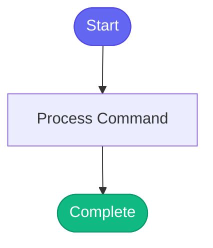

# /smoke-tools

> Run comprehensive smoke tests on ALL MCP tools by discovering and testing each module.

## Overview

Run comprehensive smoke tests on ALL MCP tools by discovering and testing each module.

## Arguments

No arguments required.

## Usage

### Examples

```bash
## Expected Results

| Module | Test Tool | Expected |
|--------|-----------|----------|
| git | `git_status` | ✅ Shows branch and status |
| jira | `jira_search` | ✅ Returns issues |
| gitlab | `gitlab_mr_list` | ✅ Lists merge requests |
| bonfire | `bonfire_namespace_list` | ✅ Lists namespaces (may be empty) |
| quay | `quay_list_tags` | ✅ or ⚠️ needs container login |
| appinterface | `appinterface_search` | ✅ Finds files in app-interface |
| k8s | `kubectl_get_pods` | ✅ After kube_login("s") |
| prometheus | `prometheus_alerts` | ✅ After kube_login("s") |
| alertmanager | `alertmanager_alerts` | ✅ After kube_login("s") |
| kibana | `kibana_search_logs` | ✅ After kube_login("s") |
| konflux | `konflux_list_components` | ✅ After kube_login("k") |

## Output Format

Present results as a summary table:
```

## Process Flow



## Details

## Instructions

1. **Discover all modules** using `tool_list()`
2. **Authenticate to required clusters** using `kube_login()`
3. **Test one tool from each module** using `tool_exec()`
4. **Report results** in a summary table

## Execution Steps

```python
# Step 1: Discover all modules
tool_list()

# Step 2: Authenticate to clusters FIRST (before testing)
# Run these to ensure auth is fresh:
kube_login("s")  # stage - for k8s, prometheus, alertmanager, kibana
kube_login("k")  # konflux

# Step 3: Test one representative tool from each module
# Run these in parallel for speed:

tool_exec("git_status", '{"repo": "redhat-ai-workflow"}')
tool_exec("jira_search", '{"jql": "project=AAP ORDER BY created DESC", "max_results": 2}')
tool_exec("gitlab_mr_list", '{"project": "automation-analytics/automation-analytics-backend", "per_page": 2}')
tool_exec("bonfire_namespace_list", '{"mine_only": true}')
tool_exec("quay_list_tags", '{"repository": "redhat-user-workloads/aap-aa-tenant/aap-aa-main/automation-analytics-backend-main", "limit": 3}')
tool_exec("appinterface_search", '{"query": "tower-analytics"}')

# Cluster-dependent tools (auth should now be valid):
tool_exec("kubectl_get_pods", '{"namespace": "tower-analytics-stage", "environment": "stage"}')
tool_exec("prometheus_alerts", '{"environment": "stage"}')
tool_exec("alertmanager_alerts", '{"environment": "stage"}')
tool_exec("kibana_search_logs", '{"query": "error", "environment": "stage", "limit": 2}')
tool_exec("konflux_list_components", '{"application": "aap-aa-main", "namespace": "aap-aa-tenant"}')
```text

## Expected Results

| Module | Test Tool | Expected |
|--------|-----------|----------|
| git | `git_status` | ✅ Shows branch and status |
| jira | `jira_search` | ✅ Returns issues |
| gitlab | `gitlab_mr_list` | ✅ Lists merge requests |
| bonfire | `bonfire_namespace_list` | ✅ Lists namespaces (may be empty) |
| quay | `quay_list_tags` | ✅ or ⚠️ needs container login |
| appinterface | `appinterface_search` | ✅ Finds files in app-interface |
| k8s | `kubectl_get_pods` | ✅ After kube_login("s") |
| prometheus | `prometheus_alerts` | ✅ After kube_login("s") |
| alertmanager | `alertmanager_alerts` | ✅ After kube_login("s") |
| kibana | `kibana_search_logs` | ✅ After kube_login("s") |
| konflux | `konflux_list_components` | ✅ After kube_login("k") |

## Output Format

Present results as a summary table:

```text

## 🧪 MCP Tool Smoke Test Results

| Module (N tools) | Status | Notes |
|------------------|--------|-------|
| git (15) | ✅ | Working |
| jira (21) | ✅ | Working |
| ... | ... | ... |

Summary: X/11 modules working
```


## Related Commands

_(To be determined based on command relationships)_
