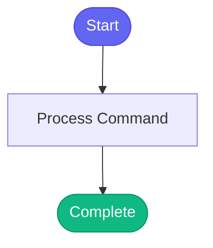

# /vpn

> Connect to Red Hat VPN for internal resources.

## Overview

Connect to Red Hat VPN for internal resources.

## Arguments

No arguments required.

## Usage

### Examples

```bash
vpn_connect()
```

```bash
❌ dial tcp: lookup gitlab.cee.redhat.com: no such host
❌ No route to host
❌ Connection refused
❌ i/o timeout
```

```bash
# Check VPN status manually
nmcli connection show --active | grep -i vpn

# Try connecting manually
/usr/bin/redhat-vpn-connect

# Check network
ping -c 1 gitlab.cee.redhat.com
```

## Process Flow



## Details

## Instructions

```
vpn_connect()
```

## When You Need VPN

The VPN is required for:

| Resource | Example |
|----------|---------|
| GitLab | `gitlab.cee.redhat.com` |
| Ephemeral clusters | `ephemeral.eng.redhat.com` |
| Stage cluster | `stage.eng.redhat.com` |
| Konflux | `konflux.ci` |
| Internal APIs | Various |

## Error Signs

You need VPN if you see:

```
❌ dial tcp: lookup gitlab.cee.redhat.com: no such host
❌ No route to host
❌ Connection refused
❌ i/o timeout
```

## What It Does

1. Checks if VPN is already connected
2. Launches the VPN connection script
3. Waits for connection to establish
4. Verifies connectivity

## Troubleshooting

If VPN connect fails:

```bash
# Check VPN status manually
nmcli connection show --active | grep -i vpn

# Try connecting manually
/usr/bin/redhat-vpn-connect

# Check network
ping -c 1 gitlab.cee.redhat.com
```

## After Connecting

After VPN is connected, you may also need to authenticate:

```bash
# Kubernetes clusters
kube_login("s")  # Stage
kube_login("e")  # Ephemeral
kube_login("k")  # Konflux

# Container registry
podman login quay.io
docker login quay.io
```

## See Also

- `/smoke-tools` - Test all tools including connectivity
- `/coffee` - Morning briefing (needs VPN)


## Related Commands

_(To be determined based on command relationships)_
