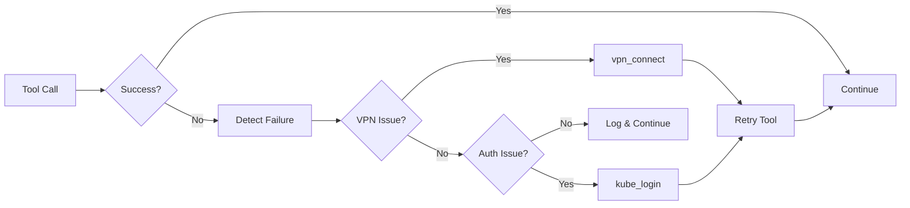

# Learning Loop: Auto-Remediation + Memory

The Learning Loop ensures that when Claude fixes a tool error, the fix is remembered forever - preventing the same mistake from happening again.

## Two Levels of Auto-Heal

AI Workflow implements auto-healing at two levels:

| Level | Mechanism | Scope |
|-------|-----------|-------|
| **Tool-Level** | `@auto_heal` decorators + `debug_tool()` | Fixes VPN/auth issues & source code |
| **Memory-Level** | `check_known_issues()` + `learn_tool_fix()` | Remember and apply known fixes |

## Tool-Level: The Learning Loop

```
┌─────────────────────────────────────────────────────────────────┐
│                       Tool Execution                            │
├─────────────────────────────────────────────────────────────────┤
│                                                                 │
│  Tool executes...                                               │
│      ↓                                                          │
│  ❌ FAILS                                                        │
│      ↓                                                          │
│  check_known_issues(tool_name, error_text)                      │
│      ↓                                                          │
│  ┌──────────────────────────────────────────┐                   │
│  │ Checks:                                  │                   │
│  │  - memory/learned/tool_fixes.yaml        │                   │
│  │  - memory/learned/patterns.yaml          │                   │
│  └──────────────────────────────────────────┘                   │
│      ↓                                                          │
│  ┌─────────────────────────────────────┐                        │
│  │ If matches found:                   │                        │
│  │   Show: "💡 Known Issues Found!"    │                        │
│  │   - Previous fix for tool_name      │                        │
│  │   - Root cause                      │                        │
│  │   - How to fix                      │                        │
│  └─────────────────────────────────────┘                        │
│      ↓                                                          │
│  Apply fix immediately OR debug_tool() for new issues           │
│      ↓                                                          │
│  After fix works: learn_tool_fix() → Saved to memory            │
│                                                                 │
└─────────────────────────────────────────────────────────────────┘
```

## Auto-Heal via Python Decorators

All tools can include automatic remediation for VPN and auth issues via decorators in `server/auto_heal_decorator.py`:



### Error Detection Patterns

| Error Pattern | Detection | Auto-Fix |
|---------------|-----------|----------|
| "No route to host" | VPN disconnected | `vpn_connect()` |
| "Connection refused" | Network issue | `vpn_connect()` |
| "Connection timed out" | Network issue | `vpn_connect()` |
| "Unauthorized" / "401" | Auth expired | `kube_login(cluster)` |
| "Forbidden" / "403" | Auth issue | `kube_login(cluster)` |
| "Token expired" | Auth expired | `kube_login(cluster)` |

### Example: Tool with Auto-Heal Decorator

```python
from server.auto_heal_decorator import auto_heal_k8s

@registry.tool()
@auto_heal_k8s()
async def kubectl_get_pods(namespace: str, environment: str = "stage") -> str:
    """Get pods - auto-heals VPN/auth failures."""
    # If this fails with auth/VPN issues, the decorator
    # automatically runs kube_login or vpn_connect and retries
    ...
```

### Available Decorators

| Decorator | Environment | Use Case |
|-----------|-------------|----------|
| `@auto_heal_ephemeral()` | Ephemeral | Bonfire namespace tools |
| `@auto_heal_konflux()` | Konflux | Tekton pipeline tools |
| `@auto_heal_k8s()` | Stage/Prod | Kubectl tools |
| `@auto_heal_stage()` | Stage | Prometheus, Alertmanager, Kibana |
| `@auto_heal_jira()` | - | Jira tools (auth only) |
| `@auto_heal_git()` | - | Git/GitLab tools (VPN only) |

## Tools

### check_known_issues

Check memory for known fixes before or after an error:

```python
# Check by tool name
check_known_issues(tool_name="bonfire_deploy")

# Check by error text
check_known_issues(error_text="manifest unknown")

# Check both
check_known_issues(tool_name="bonfire_deploy", error_text="manifest unknown")
```

**Output:**
```
## 💡 Known Issues Found!

**Previous fix for `bonfire_deploy`:**
- Pattern: `manifest unknown`
- Root cause: Short SHA doesn't exist in Quay
- **Fix:** Use full 40-char SHA instead of 8-char
```

### debug_tool

Analyze a failing tool's source code:

```python
debug_tool("bonfire_deploy", "manifest unknown: image not found")
```

**Output:**
- Source file location
- Function code
- Step-by-step fix instructions
- Reminder to save the learning

### learn_tool_fix

Save a fix to memory after it works:

```python
learn_tool_fix(
    tool_name="bonfire_deploy",
    error_pattern="manifest unknown",
    root_cause="Short SHA doesn't exist in Quay",
    fix_description="Use full 40-char SHA instead of 8-char"
)
```

**Output:**
```
✅ Saved tool fix to memory!

Tool: `bonfire_deploy`
Pattern: `manifest unknown`
Root cause: Short SHA doesn't exist in Quay
Fix: Use full 40-char SHA instead of 8-char

Next time this pattern appears, you'll be reminded of the fix.
```

## Memory Files

### memory/learned/tool_fixes.yaml

Stores tool-specific fixes from auto-remediation:

```yaml
tool_fixes:
  - tool_name: bonfire_deploy
    error_pattern: "manifest unknown"
    root_cause: "Short SHA doesn't exist in Quay"
    fix_applied: "Use full 40-char SHA instead of 8-char"
    date_learned: "2026-01-03"
    times_prevented: 3  # Incremented each time we skip this mistake

common_mistakes:
  missing_flags:
    description: "CLI tools often need --yes/--force for automation"
    examples:
      - bonfire: "--force"
      - glab: "--yes"
      - rh-issue: "--no-ai"

  wrong_formats:
    description: "Image tags, SHAs, and IDs have specific format requirements"
    examples:
      - "Git SHA must be full 40-char, not short 8-char"
      - "IMAGE_TAG for ITS deploy needs sha256 digest"
```

### memory/learned/patterns.yaml

General error patterns and solutions:

```yaml
error_patterns:
  - pattern: "ImagePullBackOff"
    meaning: "Cannot pull container image"
    fix: "Check image name, tag exists in Quay"
    commands:
      - quay_check_image_exists(...)

auth_patterns:
  - pattern: "No route to host"
    meaning: "VPN not connected"
    fix: "Connect to Red Hat VPN"
    commands:
      - vpn_connect()
```

### memory/learned/tool_failures.yaml

Tracks skill auto-heal attempts:

```yaml
failures:
  - tool: kubectl_get_pods
    error: "No route to host"
    fix_attempted: "vpn_connect"
    success: true
    timestamp: "2026-01-04T10:30:00"
    skill: "investigate_alert"

  - tool: gitlab_mr_list
    error: "401 Unauthorized"
    fix_attempted: "N/A - GitLab uses tokens"
    success: false
    timestamp: "2026-01-04T11:00:00"
    skill: "review_all_prs"
```

## Integration Points

The learning loop is integrated into all tool execution paths:

| Path | Auto-Check | Auto-Suggest Learn | Skill Auto-Heal |
|------|------------|-------------------|-----------------|
| `@auto_heal` decorator | ✅ On failure | ✅ In error output | - |
| `SkillExecutor._exec_tool` | ✅ On failure | ✅ In error message | ✅ VPN/Auth |
| `tool_exec` meta tool | ✅ On failure | ✅ In error output | - |
| Claude Agent (Slack bot) | ✅ On failure | ✅ In error output | - |

## Example Workflow

### Tool-Level Fix (Code Change)

1. **Tool fails:**
   ```
   ❌ bonfire_deploy failed: manifest unknown

   💡 Known Issues Found!
   Previous fix for `bonfire_deploy`: Use full 40-char SHA
   ```

2. **Apply the known fix immediately**

3. **If it's a new error:**
   ```python
   debug_tool("bonfire_deploy", "new error message")
   # Follow instructions to fix
   ```

4. **After fix works:**
   ```python
   learn_tool_fix(
       "bonfire_deploy",
       "new error pattern",
       "why it failed",
       "what fixed it"
   )
   ```

5. **Next time:** The fix appears automatically!

### Skill-Level Fix (Runtime)

1. **Skill calls kubectl, fails with "No route to host"**

2. **Auto-detect:** `detect_failure_pods` identifies VPN issue

3. **Auto-fix:** `quick_fix_vpn_pods` calls `vpn_connect()`

4. **Auto-retry:** `retry_get_pods` retries the original call

5. **Skill continues:** No user intervention needed

## Commands

- `/debug-tool` - Debug and fix a failing tool
- `/learn-fix` - Save a tool fix to memory
- `/memory` - View all memory including learned fixes

## Agent Personas

All agents include both levels of auto-healing:

- [Developer Persona](personas/developer.md#-learning-loop-auto-remediation--memory)
- [DevOps Persona](personas/devops.md#-learning-loop-auto-remediation--memory)
- [Incident Persona](personas/incident.md#-learning-loop-auto-remediation--memory)
- [Release Persona](personas/release.md#-learning-loop-auto-remediation--memory)

## See Also

- [Skills Reference](skills/README.md) - All 55 skills with auto-heal
- [Skill Auto-Heal Plan](plans/skill-auto-heal.md) - Implementation details
- [Architecture Overview](architecture/README.md)
