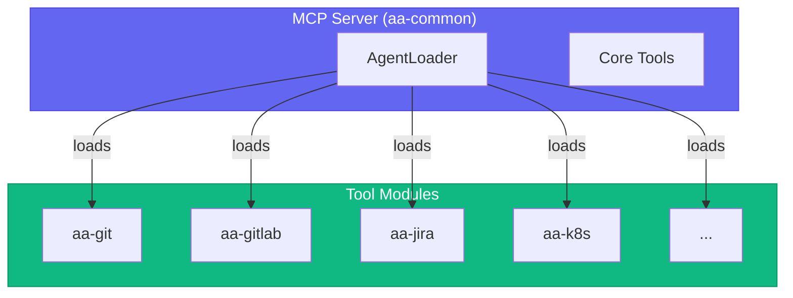

# 🔧 MCP Servers Reference

MCP servers are **tool modules** that provide specific capabilities. Each server contains related tools that are loaded by agents.

## Quick Reference

| Server | Tools | Description |
|--------|-------|-------------|
| [git](./git.md) | 15 | Git operations |
| [gitlab](./gitlab.md) | 36 | MRs, pipelines, code review |
| [jira](./jira.md) | 25 | Issue tracking |
| [k8s](./k8s.md) | 26 | Kubernetes operations |
| [bonfire](./bonfire.md) | 21 | Ephemeral namespaces |
| [quay](./quay.md) | 8 | Container registry |
| [prometheus](./prometheus.md) | 13 | Metrics queries |
| [alertmanager](./alertmanager.md) | 7 | Alert management |
| [kibana](./kibana.md) | 9 | Log search |
| [google-calendar](./google-calendar.md) | 6 | Calendar & meetings |
| [gmail](./gmail.md) | 6 | Email processing |
| [slack](./slack.md) | 15 | Slack integration |
| [konflux](./konflux.md) | 40 | Build pipelines |
| [appinterface](./appinterface.md) | 6 | GitOps config |
| [workflow](./workflow.md) | 28 | Core workflow tools |

**Total:** ~250+ tools across all modules

## Architecture



## Module Categories

### 💻 Development

| Module | Purpose |
|--------|---------|
| [git](./git.md) | Git repository operations |
| [gitlab](./gitlab.md) | GitLab MRs, pipelines, comments |
| [jira](./jira.md) | Jira issue management |

### ☸️ Infrastructure

| Module | Purpose |
|--------|---------|
| [k8s](./k8s.md) | Kubernetes pods, deployments, logs |
| [bonfire](./bonfire.md) | Ephemeral namespace management |
| [quay](./quay.md) | Container image verification |

### 📊 Monitoring

| Module | Purpose |
|--------|---------|
| [prometheus](./prometheus.md) | Metrics and alert queries |
| [alertmanager](./alertmanager.md) | Alert and silence management |
| [kibana](./kibana.md) | Log search and analysis |

### 💬 Communication

| Module | Purpose |
|--------|---------|
| [slack](./slack.md) | Slack message handling |
| [google-calendar](./google-calendar.md) | Calendar and meetings |
| [gmail](./gmail.md) | Email processing and summarization |

### 📦 Release

| Module | Purpose |
|--------|---------|
| [konflux](./konflux.md) | Build pipelines |
| [appinterface](./appinterface.md) | GitOps configuration |

## Module Loading

Modules are loaded dynamically when you switch agents:

```
You: Load devops agent

Claude: [AgentLoader]
        → Unloading: git, gitlab, jira, google-calendar
        → Loading: k8s, bonfire, quay, gitlab
        → Notifying Cursor of tool change
        
        🔧 DevOps agent ready with 90 tools
```

## Environment Variables

| Variable | Module | Description |
|----------|--------|-------------|
| `JIRA_URL` | jira | Jira instance URL |
| `JIRA_JPAT` | jira | Jira Personal Access Token |
| `GITLAB_TOKEN` | gitlab | GitLab API token |
| `KUBECONFIG` | k8s | Default kubeconfig path |

> **Note:** Quay uses `skopeo` which leverages your existing `podman login` credentials - no separate token needed!

## Adding a New Module

1. Create directory: `mcp-servers/aa-{name}/src/`

2. Create `tools.py`:
```python
from mcp.server.fastmcp import FastMCP

def register_tools(server: FastMCP) -> int:
    @server.tool()
    async def my_tool(arg: str) -> str:
        """Tool description."""
        return f"Result: {arg}"
    
    return 1  # tool count
```

3. Add to `agent_loader.py`:
```python
TOOL_MODULES = {
    "{name}": 5,  # estimated tool count
}
```

4. Add to agent config:
```yaml
tools:
  - {name}
```

## See Also

- [Architecture Overview](../architecture/README.md)
- [Agents](../agents/README.md)
- [MCP Implementation Details](../architecture/mcp-implementation.md)

