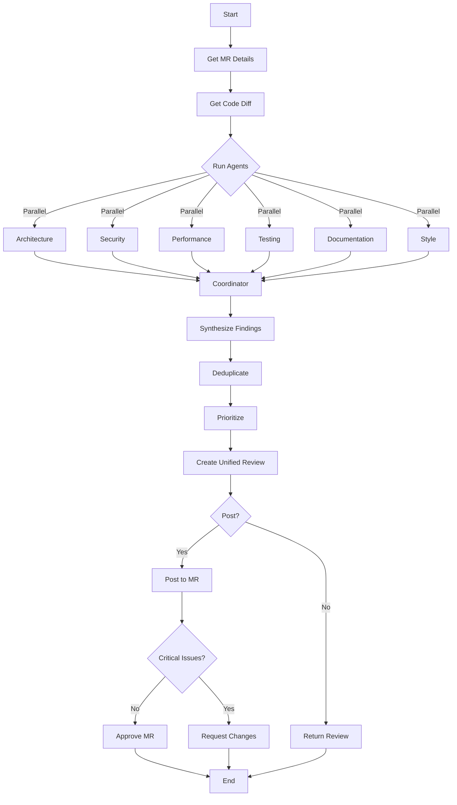

# 🤖 Multi-Agent Code Review System

A sophisticated code review system that uses specialized AI agents to perform comprehensive, multi-perspective code reviews.

## Overview

The multi-agent review system coordinates **6 specialized review agents** plus a **coordinator agent** to provide thorough, high-quality code reviews:

```text
┌─────────────────────────────────────────────────────────────┐
│                    Coordinator Agent                         │
│        Synthesizes, deduplicates, and prioritizes           │
└─────────────────────────────────────────────────────────────┘
                              ▲
                              │
        ┌─────────────────────┴─────────────────────┐
        │                                           │
┌───────┴────────┐  ┌─────────────┐  ┌────────────┴────────┐
│ 🏗️ Architecture │  │ 🔒 Security │  │ ⚡ Performance     │
│     Agent       │  │    Agent    │  │      Agent         │
└─────────────────┘  └─────────────┘  └────────────────────┘
┌─────────────────┐  ┌─────────────┐  ┌────────────────────┐
│ 🧪 Testing      │  │ 📝 Docs     │  │ 🎨 Style           │
│     Agent       │  │    Agent    │  │      Agent         │
└─────────────────┘  └─────────────┘  └────────────────────┘
```

## Specialized Agents

### 🏗️ Architecture Agent
**Focus:**
- Design patterns and architectural decisions
- SOLID principles adherence
- Separation of concerns
- Code organization and modularity
- Dependency management
- API design and contracts

**Example Findings:**
- "Service layer logic leaking into controller"
- "Circular dependency between modules X and Y"
- "Missing abstraction for external API calls"

### 🔒 Security Agent
**Focus:**
- Input validation and sanitization
- Authentication and authorization
- SQL injection, XSS, CSRF vulnerabilities
- Secrets and credential management
- Data exposure and privacy
- OWASP Top 10 vulnerabilities

**Example Findings:**
- "SQL query vulnerable to injection (line 45)"
- "API endpoint missing authentication check"
- "Hardcoded API key in source code"

### ⚡ Performance Agent
**Focus:**
- Algorithm efficiency and complexity
- Database query optimization
- Caching opportunities
- Resource leaks (memory, connections, files)
- Unnecessary computations
- Scalability concerns

**Example Findings:**
- "N+1 query in user listing (line 123)"
- "O(n²) algorithm where O(n log n) possible"
- "Missing database index on frequently queried column"

### 🧪 Testing Agent
**Focus:**
- Test coverage completeness
- Edge cases and error handling
- Test quality and maintainability
- Integration vs unit test balance
- Mock usage appropriateness
- Test data and fixtures

**Example Findings:**
- "New function `calculate_total()` has no tests"
- "Error handling path not tested (line 89)"
- "Integration test missing for API endpoint"

### 📝 Documentation Agent
**Focus:**
- Code comments clarity
- API documentation completeness
- README updates for new features
- Migration guides if needed
- Inline explanations for complex logic
- Type hints and docstrings

**Example Findings:**
- "Public API function missing docstring"
- "Complex algorithm needs explanation (line 156)"
- "README not updated with new configuration option"

### 🎨 Style Agent
**Focus:**
- Naming conventions consistency
- Code formatting standards
- Function length and complexity
- Import organization
- Dead code removal
- Consistent patterns with codebase

**Example Findings:**
- "Function exceeds 50 lines - consider splitting"
- "Inconsistent naming: `getUserData` vs `get_user_profile`"
- "Unused import on line 12"

## Coordinator Agent

The coordinator synthesizes all agent reviews by:
1. **Collecting** findings from all agents
2. **Deduplicating** overlapping issues
3. **Prioritizing** by severity and impact
4. **Grouping** related findings
5. **Creating** a unified, actionable review
6. **Recommending** APPROVE / NEEDS_WORK / NEEDS_MAJOR_CHANGES

## Usage

### Basic Review

```bash
skill_run("review_pr_multiagent", '{"mr_id": 1482}')
```

This runs all 6 agents in parallel and posts a combined review.

### Selective Agents

Run only specific agents:

```bash
# Only security and performance
skill_run("review_pr_multiagent", '{
  "mr_id": 1482,
  "agents": "security,performance"
}')

# Only architecture, testing, and documentation
skill_run("review_pr_multiagent", '{
  "mr_id": 1482,
  "agents": "architecture,testing,documentation"
}')
```

### Sequential Execution

For debugging or API rate limiting:

```bash
skill_run("review_pr_multiagent", '{
  "mr_id": 1482,
  "parallel": false
}')
```

### Preview Only (No Posting)

Generate review without posting to MR:

```bash
skill_run("review_pr_multiagent", '{
  "mr_id": 1482,
  "post_combined": false
}')
```

## Review Workflow



## Output Format

```markdown
## 🤖 Multi-Agent Code Review

### 🔴 Critical Issues
**[CRITICAL]** security/auth.py:45 - SQL injection vulnerability
  - User input directly concatenated into query
  - Fix: Use parameterized queries

**[CRITICAL]** api/users.py:123 - N+1 query problem
  - Loading related data in loop
  - Fix: Use select_related() or prefetch_related()

### 🟡 Warnings
**[WARNING]** services/billing.py:89 - Missing error handling test
  - Error path not covered in tests
  - Consider: Add test for ValueError case

**[WARNING]** README.md - Missing feature documentation
  - New billing feature not documented
  - Add: Usage examples and configuration

### 💡 Suggestions
**[SUGGESTION]** utils/helpers.py:156 - Function too long
  - 78 lines, consider splitting
  - Extract: Validation logic into separate function

**[SUGGESTION]** models/user.py:23 - Missing docstring
  - Public API method lacks documentation
  - Add: Docstring with parameters and return value

### 📊 Summary
- **Critical Issues:** 2 (must fix before merge)
- **Warnings:** 2 (should address)
- **Suggestions:** 2 (nice to have)

**Overall Assessment:**
Code introduces security vulnerability and performance issue that must be addressed.
However, architecture is sound and testing approach is good. After fixing critical
issues, this will be a solid contribution.

**Recommendation:** NEEDS_WORK
```

## Integration with Existing Workflows

### Replace Single-Agent Review

In `review_all_prs.yaml`, replace the single review step:

```yaml
# Old
- name: run_full_review
  tool: skill_run
  args:
    skill_name: "review_pr"
    inputs: '{"mr_id": {{ first_mr_info.iid }}}'

# New - Multi-agent
- name: run_full_review
  tool: skill_run
  args:
    skill_name: "review_pr_multiagent"
    inputs: '{"mr_id": {{ first_mr_info.iid }}}'
```

### Customize Agent Selection by MR Type

```python
# In review_all_prs.yaml
- name: determine_agents
  compute: |
    # Choose agents based on MR labels or files changed
    agents = "architecture,security,performance,testing,documentation,style"

    if "security" in mr_labels:
        agents = "security,architecture,testing"
    elif "performance" in mr_labels:
        agents = "performance,architecture,testing"
    elif "docs" in mr_labels:
        agents = "documentation,style"

    result = agents
  output: selected_agents

- name: run_multiagent_review
  tool: skill_run
  args:
    skill_name: "review_pr_multiagent"
    inputs: '{"mr_id": {{ mr_id }}, "agents": "{{ selected_agents }}"}'
```

## Performance Considerations

### API Costs
- Each agent makes 1 API call (~2000 tokens output)
- 6 agents + 1 coordinator = 7 API calls per review
- Estimated cost: ~$0.15 per MR review (using Sonnet 4.5)

### Execution Time
- **Parallel mode** (default): ~30-45 seconds total
  - All 6 agents run simultaneously
  - Coordinator runs after agents complete

- **Sequential mode**: ~3-4 minutes total
  - Agents run one at a time
  - Use when rate limiting is a concern

### Optimization Tips

**1. Selective Agent Execution**
```bash
# For small changes - skip full review
agents="architecture,security"

# For bug fixes - focus on correctness
agents="testing,security,performance"

# For new features - comprehensive
agents="architecture,security,performance,testing,documentation,style"
```

**2. Rate Limiting**
```bash
# Sequential execution with delays
parallel=false
```

**3. Caching**
The skill could be enhanced to cache agent reviews per commit SHA to avoid re-running on rebases.

## Advanced Features

### Custom Agent Prompts

Create a custom agent by extending the skill:

```yaml
- name: run_database_review
  description: "Database Agent: Review database schema and migrations"
  compute: |
    # Custom agent focused on database changes
    prompt = f"""You are a database expert reviewer...

    Focus areas:
    - Migration safety and reversibility
    - Index strategy
    - Data type choices
    - Constraint definitions
    ...
    """
    # Same pattern as other agents
```

### Agent Weighting

Weight agent findings differently in coordination:

```python
# In coordinator step
weights = {
    "critical": {"security": 3, "performance": 2, "architecture": 2},
    "warning": {"security": 2, "performance": 1.5, "architecture": 1},
}
```

### Learning from Reviews

Track which agent findings get addressed:

```python
# Log to memory/learned/review_patterns.yaml
{
  "mr_1482": {
    "security_critical": 2,
    "security_addressed": 2,  # 100% addressed
    "performance_warnings": 3,
    "performance_addressed": 1,  # 33% addressed
  }
}
```

## Comparison: Single vs Multi-Agent

| Aspect | Single Agent | Multi-Agent |
|--------|-------------|-------------|
| **Coverage** | Broad but shallow | Deep in each domain |
| **Specialization** | Generalist | 6 specialists |
| **Cost** | 1 API call | 7 API calls |
| **Time** | ~10 seconds | ~30-45 seconds (parallel) |
| **Quality** | Good overall | Excellent in focus areas |
| **False Positives** | Moderate | Lower (expert validation) |
| **Actionability** | Good | Excellent (specific fixes) |

## Troubleshooting

### Agent Skipped
**Symptom:** Agent review missing from output

**Cause:** Agent name not in `agents` input or API key missing

**Fix:**
```bash
# Check enabled agents
skill_run("review_pr_multiagent", '{
  "mr_id": 1482,
  "agents": "architecture,security,performance,testing,documentation,style"
}')

# Verify ANTHROPIC_API_KEY env var
echo $ANTHROPIC_API_KEY
```

### Coordinator Failed
**Symptom:** Individual reviews present but no combined review

**Cause:** API error or insufficient tokens

**Fix:**
```yaml
# In skill, increase coordinator max_tokens:
max_tokens=4000  # Instead of 3000
```text

### Duplicate Findings
**Symptom:** Same issue reported by multiple agents

**Expected:** Coordinator should deduplicate

**If not:** Enhance coordinator prompt:
```text
"Carefully remove duplicate findings that describe the same issue,
even if reported by different agents. Keep only the most detailed version."
```

## Future Enhancements

### 1. Agent Consensus
Require multiple agents to agree on critical issues before flagging.

### 2. Historical Learning
Train coordinator on past reviews to improve synthesis.

### 3. Auto-Fix Suggestions
Have agents propose code fixes, not just identify issues.

### 4. Interactive Review
Allow developers to query agents: "Why is this an issue?" or "How would you fix this?"

### 5. Metrics Dashboard
Track agent accuracy, false positive rates, and issue resolution time.

### 6. Custom Agent Registry
Allow teams to define their own specialized agents (e.g., "Accessibility Agent", "i18n Agent").

## Best Practices

1. **Start Selective** - Use all agents for important MRs, subset for small changes
2. **Trust but Verify** - Agents are excellent but not perfect; use judgment
3. **Iterate on Prompts** - Customize agent prompts for your codebase's patterns
4. **Monitor Costs** - Track API usage if reviewing many MRs
5. **Provide Feedback** - If agent misses something, enhance its focus areas
6. **Combine with Tools** - Use static analysis (linters) + agents for best coverage

## Example Workflows

### High-Priority Feature
```bash
# Full review with all agents
skill_run("review_pr_multiagent", '{"mr_id": 1482}')
```

### Hotfix
```bash
# Quick check - security and testing only
skill_run("review_pr_multiagent", '{
  "mr_id": 1483,
  "agents": "security,testing"
}')
```

### Documentation Update
```bash
# Docs and style only
skill_run("review_pr_multiagent", '{
  "mr_id": 1484,
  "agents": "documentation,style"
}')
```

### Security Audit
```bash
# Security + architecture for sensitive changes
skill_run("review_pr_multiagent", '{
  "mr_id": 1485,
  "agents": "security,architecture"
}')
```

## Conclusion

The multi-agent code review system provides **enterprise-grade code review quality** by leveraging specialized AI agents that each bring deep expertise in their domain. The coordinator ensures findings are coherent and actionable, making it easy for developers to address issues and improve code quality.

**Key Benefits:**
- ✅ **Comprehensive coverage** across 6 critical review dimensions
- ✅ **Expert-level insights** from specialized agents
- ✅ **Actionable feedback** with specific fix suggestions
- ✅ **Automated posting** and approval workflow
- ✅ **Flexible execution** (parallel/sequential, selective agents)
- ✅ **Cost-effective** at ~$0.15 per review

Try it on your next MR! 🚀
