# 🎭 Personas Reference

> **Terminology Note:** In this project, "agents" refers to **tool configuration profiles** (personas) that determine which MCP tools are available to Claude. This is NOT a multi-agent AI system - there is always a single Claude instance. The term "agent" is used because you "load an agent" to adopt a specialized role with focused tools.

Personas are **specialized tool configurations** with curated tool sets. Switch personas to get different capabilities.

## Quick Reference

| Persona | Command | Tools | Focus |
|---------|---------|-------|-------|
| [👨‍💻 developer](./developer.md) | `Load developer agent` | ~78 | Daily coding, PRs |
| [🔧 devops](./devops.md) | `Load devops agent` | ~74 | Deployments, K8s |
| [🚨 incident](./incident.md) | `Load incident agent` | ~78 | Production debugging |
| [📦 release](./release.md) | `Load release agent` | ~91 | Shipping releases |
| [💬 slack](./slack.md) | `Load slack agent` | ~85 | Slack automation |
| [🌐 universal](./universal.md) | `Load universal agent` | ~100 | All-in-one |
| [🔹 core](./core.md) | `Load core agent` | ~84 | Essential shared |

## How Persona Loading Works

```mermaid
sequenceDiagram
    participant User
    participant Claude
    participant MCP as MCP Server
    participant Cursor

    User->>Claude: "Load devops agent"
    Claude->>MCP: persona_load("devops")
    MCP->>MCP: Unload current tools
    MCP->>MCP: Load k8s, bonfire, quay, gitlab
    MCP->>Cursor: tools/list_changed notification
    Cursor->>Cursor: Refresh tool list
    MCP-->>Claude: Persona + tool count
    Claude-->>User: "🔧 DevOps persona loaded with ~74 tools"
```



## Switching Personas

You can switch personas at any time:

```
You: Load the developer agent
Claude: 👨‍💻 Developer persona loaded (~78 tools)

You: Actually I need to deploy, load devops
Claude: 🔧 DevOps persona loaded (~74 tools)
        [Tools automatically switch!]
```

## Tool Limit

Each persona is designed to stay under Cursor's 128 tool limit. Tool counts are based on split module composition:

| Persona | Modules | Estimated Tools |
|---------|---------|-----------------|
| developer | workflow (18), git_basic (27), gitlab_basic (16), jira_basic (17) | ~78 |
| devops | workflow (18), k8s_basic (22), bonfire_basic (10), jira_basic (17), quay (7) | ~74 |
| incident | workflow (18), k8s_basic (22), prometheus_basic (5), kibana (9), jira_basic (17), alertmanager (7) | ~78 |
| release | workflow (18), konflux_basic (22), quay (7), jira_basic (17), git_basic (27) | ~91 |
| slack | workflow (18), slack (9), jira (28), gitlab (30) | ~85 |
| universal | workflow (18), git_basic (27), gitlab_basic (16), jira_basic (17), k8s_basic (22) | ~100 |
| core | workflow (18), git_basic (27), jira_basic (17), k8s_basic (22) | ~84 |

> **Note:** `_basic` modules contain essential tools. Use `tool_exec()` for `_extra` tools when needed.

## Persona Tool Modules

All personas include `workflow` module (required for skills/memory).


## Core Tools (Always Available)

These tools are available regardless of which persona is loaded:

| Tool | Purpose |
|------|---------|
| `persona_load` | Switch to a different persona |
| `persona_list` | List available personas |
| `session_start` | Initialize session with context |
| `debug_tool` | Self-healing tool debugger |
| `skill_run` | Execute a skill |
| `skill_list` | List available skills |
| `vpn_connect` | Connect to VPN (fixes network errors) |
| `kube_login` | Refresh k8s credentials |

## Persona Variants

Several personas have "slim" variants with fewer tool modules for combining:

| Variant | Base Persona | Description |
|---------|--------------|-------------|
| `developer-slim` | developer | Core dev tools only (3 modules) |
| `devops-slim` | devops | Essential k8s/deploy (3 modules) |
| `incident-slim` | incident | Fast incident response (4 modules) |
| `release-slim` | release | Streamlined release (4 modules) |

**Special Personas:**

| Persona | Description |
|---------|-------------|
| `core` | Essential shared tools (most modules) |
| `universal` | Developer + DevOps combined (10 modules) |

> All personas include `workflow` module for skills, memory, and infrastructure tools

## Persona Configuration

Personas are defined in YAML files in the `personas/` directory:

```yaml
name: developer
description: Coding, PRs, and code review
persona: personas/developer.md

# Using split modules to stay under 100 tools
tools:
  - workflow        # 18 tools - Core (memory, persona, session, skill, infra, meta)
  - git_basic       # 27 tools - Essential git (status, log, diff, add, commit, push, pull)
  - gitlab_basic    # 16 tools - MRs, CI/CD basics
  - jira_basic      # 17 tools - Issue viewing, search, status updates, comments

# Total: ~78 tools ✅
# Note: git_extra, gitlab_extra, jira_extra available via tool_exec()

skills:
  - coffee
  - start_work
  - create_mr
  - mark_mr_ready
  # ...
```

## See Also

- [MCP Servers](../tool-modules/README.md) - Tool modules
- [Skills](../skills/README.md) - Available workflows
