# 🚨 Incident Persona

> Production incident response and recovery

## Overview

The Incident persona is optimized for responding to production incidents. It provides tools for Kubernetes debugging, log searching, metrics queries, and incident tracking.

## Quick Load

```
Load the incident agent
```

## Tools Loaded

| Module | Tools | Description |
|--------|-------|-------------|
| [k8s](../tool_modules/k8s.md) | 26 | Pod status, logs, events |
| [prometheus](../tool_modules/prometheus.md) | 13 | Metrics and alert queries |
| [alertmanager](../tool_modules/alertmanager.md) | 6 | Alert and silence management |
| [kibana](../tool_modules/kibana.md) | 9 | Log search |
| [jira](../tool_modules/jira.md) | 24 | Incident tracking |

**Total:** ~78 tools (6 modules)

## Skills Available

| Skill | Description |
|-------|-------------|
| [🚨 investigate_alert](../skills/investigate_alert.md) | Quick alert triage |
| [🐛 debug_prod](../skills/debug_prod.md) | Deep production debugging |

## Use Cases

### Investigate an Alert

```
You: Investigate production alerts

Claude: 🚨 Investigating production...

        ## Active Alerts (2)

        | Alert | Severity | Duration |
        |-------|----------|----------|
        | HighMemoryUsage | critical | 15m |
        | SlowResponses | warning | 8m |

        ## Pod Health

        | Pod | Status | Memory |
        |-----|--------|--------|
        | analytics-api-xxx | Running | 95% ⚠️ |

        ## Likely Cause
        Memory exhaustion in analytics-api

        ## Recommended Action
        1. Restart analytics-api pod
        2. Investigate large report query
```

### Search Logs

```
You: Search for errors in analytics-api

Claude: 📜 Log Search Results:

        [10:15:23] ERROR OutOfMemoryError in ReportProcessor
        [10:15:24] WARN Large result set: 1.2M rows
        [10:15:25] ERROR Query timeout, retrying...
```

### Check Metrics

```
You: Query CPU usage for the last hour

Claude: 📊 CPU Usage (Last Hour):

        | Pod | Avg | Max | Current |
        |-----|-----|-----|---------|
        | analytics-api | 45% | 72% | 48% |
        | analytics-worker | 68% | 89% | 71% |
```

## Key Commands

### Alert Management

```
alertmanager_alerts          # List firing alerts
alertmanager_silence         # Create silence
prometheus_query             # PromQL query
prometheus_get_alerts        # Alert rules
```

### Log Search

```
kibana_search                # Search logs
kibana_get_errors            # Recent errors
```

### Kubernetes

```
kubectl_get_pods             # Pod status
kubectl_logs                 # Container logs
kubectl_get_events           # Recent events
kubectl_describe_pod         # Pod details
```

## Incident Response Flow

```mermaid
flowchart TD
    ALERT[🚨 Alert Fires] --> LOAD[Load incident agent]
    LOAD --> INVESTIGATE[investigate_alert skill]
    INVESTIGATE --> PODS[Check pod status]
    PODS --> LOGS[Search logs]
    LOGS --> METRICS[Query metrics]
    METRICS --> DIAGNOSE{Diagnosis}
    DIAGNOSE -->|Known| FIX[Apply known fix]
    DIAGNOSE -->|Unknown| DEBUG[debug_prod skill]
    DEBUG --> FIX
    FIX --> VERIFY[Verify resolution]
    VERIFY --> JIRA[Create/update Jira]

    style ALERT fill:#ef4444,stroke:#dc2626,color:#fff
    style FIX fill:#10b981,stroke:#059669,color:#fff
```



## When to Switch Agents

Switch to **DevOps** agent when you need to:
- Deploy a fix to ephemeral for testing
- Manage Kubernetes deployments

Switch to **Developer** agent when you need to:
- Review the fix code
- Create a PR for the hotfix

## Related

- [🔧 DevOps Persona](./devops.md)
- [investigate_alert Skill](../skills/investigate_alert.md)
- [debug_prod Skill](../skills/debug_prod.md)
