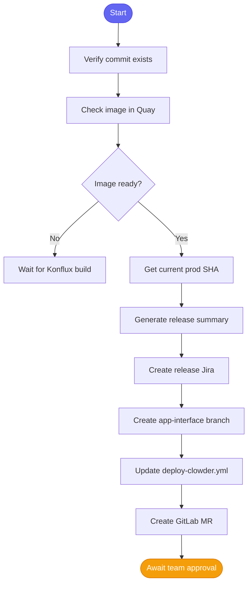

# 📦 Release Persona

> Release management and production deployments

## Overview

The Release persona is focused on shipping software to production. It provides tools for Konflux builds, container registry operations, and app-interface configuration.

## Quick Load

```
Load the release agent
```

## Tools Loaded

| Module | Tools | Description |
|--------|-------|-------------|
| [konflux](../tool_modules/konflux.md) | 40 | Build pipelines |
| [quay](../tool_modules/quay.md) | 8 | Container images |
| [appinterface](../tool_modules/appinterface.md) | 6 | GitOps config |
| [git](../tool_modules/git.md) | 15 | App-interface changes |

**Total:** ~91 tools (5 modules)

## Skills Available

| Skill | Description |
|-------|-------------|
| [📦 release_aa_backend_prod](../skills/release_aa_backend_prod.md) | Release to production |

## Use Cases

### Release to Production

```
You: Release abc123def456 to production

Claude: 📦 Preparing production release...

        ✅ Commit verified
        ✅ Image found in Quay

        ## Release Summary

        From: def789abc123... (current prod)
        To: abc123def456...

        Commits included (5):
        - AAP-61214: feat(api): Add validation
        - AAP-61220: fix(db): Handle nulls

        ✅ Created Jira: AAP-61250
        ✅ Created app-interface MR: !789

        Next: Get team approval on MR !789
```

### Check Konflux Builds

```
You: Check build status for main branch

Claude: 🔄 Konflux Build Status:

        | Pipeline | Status | Duration |
        |----------|--------|----------|
        | aa-backend-main | Succeeded ✅ | 8m |
        | aa-frontend-main | Running ⏳ | 3m |
```

### Verify Image

```
You: Check if abc123 image exists in Quay

Claude: 📦 Image Check:

        Tag: abc123def456789...
        Status: ✅ Found
        Digest: sha256:20a4c976...
        Created: 2h ago
```

## Release Flow



## Key Commands

### Konflux

```
konflux_pipeline_list        # List pipelines
konflux_pipeline_status      # Pipeline details
konflux_build_logs           # Build logs
```

### Quay

```
quay_get_tag                 # Check image tag
quay_list_tags               # List available tags
quay_get_manifest            # Image manifest
```

### App-Interface

```
appinterface_get_config      # Get current config
appinterface_update_ref      # Update image ref
```

## When to Switch Agents

Switch to **Developer** agent when you need to:
- Review the code being released
- Check related Jira issues

Switch to **DevOps** agent when you need to:
- Test in ephemeral before releasing
- Debug post-release issues

## Related

- [🔧 DevOps Persona](./devops.md)
- [release_aa_backend_prod Skill](../skills/release_aa_backend_prod.md)
