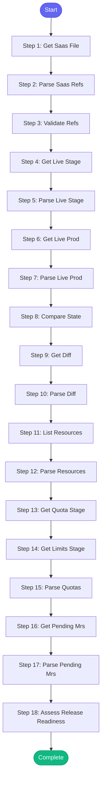

# ⚡ appinterface_check

> Comprehensive app-interface validation and release readiness check

## Overview

Comprehensive app-interface validation and release readiness check.

This skill:
- Validates YAML configuration, $ref paths, and SHA formats
- Compares app-interface refs to live cluster state
- Shows resource quotas and limits
- Lists pending MRs that may affect release
- Assesses overall release readiness with blockers/warnings

Uses: appinterface_get_saas, appinterface_diff, appinterface_resources,
      kubectl_get_deployments, kubectl_get_resourcequotas, gitlab_mr_list

**Version:** 3.1

## Quick Start

```bash
skill_run("appinterface_check", '{"issue_key": "AAP-12345"}')
```

## Inputs

| Input | Type | Required | Default | Description |
|-------|------|----------|---------|-------------|
| `saas_file` | string | No | `tower-analytics` | SaaS file name to check (service name) |
| `namespace_stage` | string | No | `tower-analytics-stage` | Stage namespace |
| `namespace_prod` | string | No | `tower-analytics-prod` | Production namespace |
| `deployment` | string | No | `automation-analytics-api-fastapi-v2` | Deployment to check for live SHA |
| `stale_days` | integer | No | `7` | Alert if deployed SHA is older than this many days |
| `gitlab_project` | string | No | `automation-analytics/automation-analytics-backend` | GitLab project to check for pending MRs |

## Process Flow



## Detailed Steps

### Step 1: Get Saas File

**Description:** Get SaaS file details

**Tool:** `appinterface_get_saas`

### Step 2: Parse Saas Refs

**Description:** Extract stage and prod refs from SaaS file

**Tool:** `compute`

### Step 3: Validate Refs

**Description:** Validate $ref paths and SHA formats

**Tool:** `compute`

### Step 4: Get Live Stage

**Description:** Get live deployment from stage cluster

**Tool:** `kubectl_get_deployments`

### Step 5: Parse Live Stage

**Description:** Extract deployed image SHA from stage

**Tool:** `compute`

### Step 6: Get Live Prod

**Description:** Get live deployment from prod cluster

**Tool:** `kubectl_get_deployments`

### Step 7: Parse Live Prod

**Description:** Extract deployed image SHA from prod

**Tool:** `compute`

### Step 8: Compare State

**Description:** Compare app-interface refs to live state

**Tool:** `compute`

### Step 9: Get Diff

**Description:** Get diff from main branch

**Tool:** `appinterface_diff`

### Step 10: Parse Diff

**Description:** Parse diff for tower-analytics changes

**Tool:** `compute`

### Step 11: List Resources

**Description:** List app-interface resources

**Tool:** `appinterface_resources`

### Step 12: Parse Resources

**Description:** Parse resources

**Tool:** `compute`

### Step 13: Get Quota Stage

**Description:** Get resource quotas from stage namespace

**Tool:** `kubectl_get`

### Step 14: Get Limits Stage

**Description:** Get limit ranges from stage namespace

**Tool:** `kubectl_get`

### Step 15: Parse Quotas

**Description:** Parse quota and limit information

**Tool:** `compute`

### Step 16: Get Pending Mrs

**Description:** Get open MRs that might affect this service

**Tool:** `gitlab_mr_list`

### Step 17: Parse Pending Mrs

**Description:** Parse pending MRs for release-relevant changes

**Tool:** `compute`

### Step 18: Assess Release Readiness

**Description:** Assess overall release readiness

**Tool:** `compute`


## MCP Tools Used (6 total)

- `appinterface_diff`
- `appinterface_get_saas`
- `appinterface_resources`
- `gitlab_mr_list`
- `kubectl_get`
- `kubectl_get_deployments`

## Related Skills

_(To be determined based on skill relationships)_
