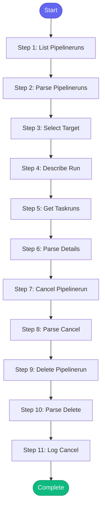

# ⚡ cancel_pipeline

> Cancel a running or stuck Tekton pipeline

## Overview

Cancel a running or stuck Tekton pipeline.

Use when:
- A pipeline is stuck and needs to be killed
- You started a wrong build
- Need to free up cluster resources
- Want to retry with different parameters

The skill will:
1. List running pipelines
2. Get pipeline status
3. Cancel the specified pipeline
4. Optionally delete the run
5. Show how to retry

**Version:** 1.0

## Quick Start

```bash
skill_run("cancel_pipeline", '{"issue_key": "AAP-12345"}')
```

## Inputs

| Input | Type | Required | Default | Description |
|-------|------|----------|---------|-------------|
| `run_name` | string | No | `-` | PipelineRun name to cancel (lists running if not specified) |
| `namespace` | string | No | `aap-aa-tenant` | Konflux/Tekton namespace |
| `delete` | boolean | No | `False` | Delete the PipelineRun after cancelling |
| `list_only` | boolean | No | `False` | Just list running pipelines without cancelling |

## Process Flow



## Detailed Steps

### Step 1: List Pipelineruns

**Description:** List recent pipeline runs

**Tool:** `tkn_pipelinerun_list`

### Step 2: Parse Pipelineruns

**Description:** Parse pipeline runs

**Tool:** `compute`

### Step 3: Select Target

**Description:** Select pipeline to cancel

**Tool:** `compute`

### Step 4: Describe Run

**Description:** Get details of the target run

**Tool:** `tkn_pipelinerun_describe`

**Condition:** `target_run.run_name and not inputs.list_only`

### Step 5: Get Taskruns

**Description:** List task runs for this pipeline

**Tool:** `tkn_taskrun_list`

**Condition:** `target_run.run_name and not inputs.list_only`

### Step 6: Parse Details

**Description:** Parse run details

**Tool:** `compute`

**Condition:** `run_details_raw`

### Step 7: Cancel Pipelinerun

**Description:** Cancel the pipeline run

**Tool:** `tkn_pipelinerun_cancel`

**Condition:** `target_run.run_name and not inputs.list_only and run_status and run_status.can_cancel`

### Step 8: Parse Cancel

**Description:** Parse cancel result

**Tool:** `compute`

**Condition:** `cancel_result`

### Step 9: Delete Pipelinerun

**Description:** Delete the pipeline run

**Tool:** `tkn_pipelinerun_delete`

**Condition:** `inputs.delete and target_run.run_name and cancel_status and cancel_status.success`

### Step 10: Parse Delete

**Description:** Parse delete result

**Tool:** `compute`

**Condition:** `delete_result`

### Step 11: Log Cancel

**Description:** Log cancel action

**Tool:** `memory_session_log`

**Condition:** `cancel_status and cancel_status.success`


## MCP Tools Used (6 total)

- `memory_session_log`
- `tkn_pipelinerun_cancel`
- `tkn_pipelinerun_delete`
- `tkn_pipelinerun_describe`
- `tkn_pipelinerun_list`
- `tkn_taskrun_list`

## Related Skills

_(To be determined based on skill relationships)_
