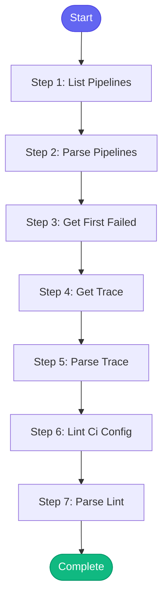

# ⚡ check_ci_health

> Diagnose GitLab CI/CD pipeline issues

## Overview

Diagnose GitLab CI/CD pipeline issues.

This skill:
- Lists recent pipelines
- Shows failing jobs
- Gets trace logs for failures
- Validates .gitlab-ci.yml

Uses: gitlab_ci_list, gitlab_ci_view, gitlab_ci_trace, gitlab_ci_lint

**Version:** 1.1

## Quick Start

```bash
skill_run("check_ci_health", '{"issue_key": "AAP-12345"}')
```

## Inputs

| Input | Type | Required | Default | Description |
|-------|------|----------|---------|-------------|
| `project` | string | No | `automation-analytics/automation-analytics-backend` | GitLab project path |
| `status` | string | No | `failed` | Filter by status (failed, success, running, all) |
| `limit` | integer | No | `5` | Number of pipelines to show |

## Process Flow



## Detailed Steps

### Step 1: List Pipelines

**Description:** List recent pipelines

**Tool:** `gitlab_ci_list`

### Step 2: Parse Pipelines

**Description:** Parse pipeline list

**Tool:** `compute`

### Step 3: Get First Failed

**Description:** Get details of first failed pipeline

**Tool:** `gitlab_ci_view`

**Condition:** `pipelines_info.has_failures`

### Step 4: Get Trace

**Description:** Get trace log of failed pipeline

**Tool:** `gitlab_ci_trace`

**Condition:** `pipelines_info.has_failures and pipelines_info.pipelines`

### Step 5: Parse Trace

**Description:** Parse trace for error messages

**Tool:** `compute`

### Step 6: Lint Ci Config

**Description:** Lint .gitlab-ci.yml

**Tool:** `gitlab_ci_lint`

### Step 7: Parse Lint

**Description:** Parse lint result

**Tool:** `compute`


## MCP Tools Used (4 total)

- `gitlab_ci_lint`
- `gitlab_ci_list`
- `gitlab_ci_trace`
- `gitlab_ci_view`

## Related Skills

_(To be determined based on skill relationships)_
