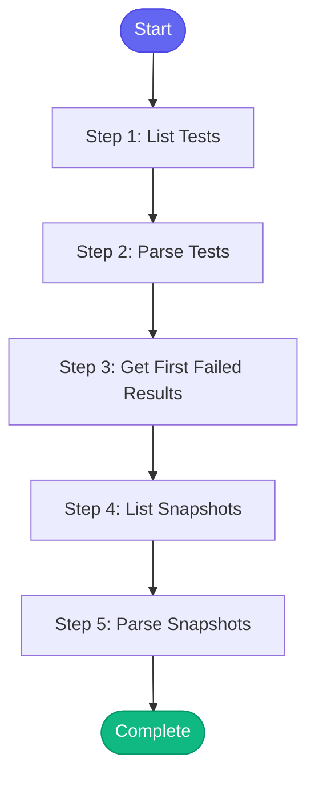

# ⚡ check_integration_tests

> Check Konflux integration test status and results

## Overview

Check Konflux integration test status and results.

This skill:
- Lists integration test runs
- Gets test results
- Shows snapshots

Uses: konflux_list_integration_tests, konflux_get_test_results, konflux_list_snapshots,
      konflux_get_snapshot

**Version:** 1.0

## Quick Start

```bash
skill_run("check_integration_tests", '{"issue_key": "AAP-12345"}')
```

## Inputs

| Input | Type | Required | Default | Description |
|-------|------|----------|---------|-------------|
| `namespace` | string | No | `aap-aa-tenant` | Konflux namespace |
| `limit` | integer | No | `10` | Number of results to show |

## Process Flow



## Detailed Steps

### Step 1: List Tests

**Description:** List integration test runs

**Tool:** `konflux_list_integration_tests`

### Step 2: Parse Tests

**Description:** Parse test list

**Tool:** `compute`

### Step 3: Get First Failed Results

**Description:** Get results of first failed test

**Tool:** `konflux_get_test_results`

**Condition:** `tests_info.failed > 0`

### Step 4: List Snapshots

**Description:** List recent snapshots

**Tool:** `konflux_list_snapshots`

### Step 5: Parse Snapshots

**Description:** Parse snapshot list

**Tool:** `compute`


## MCP Tools Used (3 total)

- `konflux_get_test_results`
- `konflux_list_integration_tests`
- `konflux_list_snapshots`

## Related Skills

_(To be determined based on skill relationships)_
