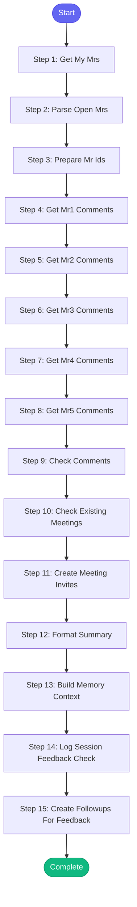

# ⚡ check_mr_feedback

> Check your open Merge Requests for feedback that needs your attention

## Overview

Check your open Merge Requests for feedback that needs your attention.

Scans for:
- Human reviewer comments (filters out bot/CI comments)
- Meeting requests (can trigger Google Calendar invite)
- Code change requests
- Questions requiring answers
- Approval status

Optionally creates Google Meet invitations when meetings are requested.

Uses MCP tools: gitlab_mr_list, gitlab_mr_comments

**Version:** 1.2

## Quick Start

```bash
skill_run("check_mr_feedback", '{"issue_key": "AAP-12345"}')
```

## Inputs

| Input | Type | Required | Default | Description |
|-------|------|----------|---------|-------------|
| `project` | string | No | `automation-analytics/automation-analytics-backend` | GitLab project path |
| `create_meetings` | boolean | No | `False` | Automatically create Google Meet invites for meeting requests |
| `mr_ids` | array | No | `-` | Specific MR IDs to check (optional - defaults to all open MRs) |
| `slack_format` | boolean | No | `False` | Use Slack link format in summary |

## Process Flow



## Detailed Steps

### Step 1: Get My Mrs

**Description:** Fetch all open MRs authored by the current user

**Tool:** `gitlab_mr_list`

### Step 2: Parse Open Mrs

**Description:** Parse MR list output

**Tool:** `compute`

### Step 3: Prepare Mr Ids

**Description:** Prepare MR IDs for individual tool calls

**Tool:** `compute`

### Step 4: Get Mr1 Comments

**Description:** Get comments for first MR

**Tool:** `gitlab_mr_comments`

**Condition:** `{{ mr_data.ids|length > 0 }}`

### Step 5: Get Mr2 Comments

**Description:** Get comments for second MR

**Tool:** `gitlab_mr_comments`

**Condition:** `{{ mr_data.ids|length > 1 }}`

### Step 6: Get Mr3 Comments

**Description:** Get comments for third MR

**Tool:** `gitlab_mr_comments`

**Condition:** `{{ mr_data.ids|length > 2 }}`

### Step 7: Get Mr4 Comments

**Description:** Get comments for fourth MR

**Tool:** `gitlab_mr_comments`

**Condition:** `{{ mr_data.ids|length > 3 }}`

### Step 8: Get Mr5 Comments

**Description:** Get comments for fifth MR

**Tool:** `gitlab_mr_comments`

**Condition:** `{{ mr_data.ids|length > 4 }}`

### Step 9: Check Comments

**Description:** Analyze comments from all MRs using shared parsers

**Tool:** `compute`

### Step 10: Check Existing Meetings

**Description:** Check if meetings already exist for meeting requests

**Tool:** `compute`

**Condition:** `{{ feedback_analysis }}`

### Step 11: Create Meeting Invites

**Description:** Create Google Meet invitations for meeting requests

**Tool:** `compute`

**Condition:** `{{ inputs.create_meetings and feedback_with_calendar_check }}`

### Step 12: Format Summary

**Description:** Create human-readable summary

**Tool:** `compute`

### Step 13: Build Memory Context

**Description:** Build context for memory updates

**Tool:** `compute`

### Step 14: Log Session Feedback Check

**Description:** Log feedback check to session

**Tool:** `memory_session_log`

### Step 15: Create Followups For Feedback

**Description:** Create follow-up tasks for MRs needing response

**Tool:** `compute`

**Condition:** `feedback_analysis`


## MCP Tools Used (3 total)

- `gitlab_mr_comments`
- `gitlab_mr_list`
- `memory_session_log`

## Related Skills

_(To be determined based on skill relationships)_
