# 💬 check_mr_feedback

> Check your MRs for reviewer feedback

## Overview

The `check_mr_feedback` skill scans your open merge requests for human feedback that needs a response. It filters out bot comments and highlights actionable feedback.

## Quick Start

```
skill_run("check_mr_feedback", '{}')
```

## Inputs

| Input | Type | Required | Default | Description |
|-------|------|----------|---------|-------------|
| `project` | string | No | From config | GitLab project path |

## Flow

```mermaid
flowchart TD
    START([Start]) --> CONFIG[Load Configuration]
    CONFIG --> LIST[List My Open MRs]
    LIST --> LOOP[For Each MR]
    
    LOOP --> COMMENTS[Get Comments]
    COMMENTS --> FILTER[Filter Bot Comments]
    
    FILTER --> HUMAN{Human Comments?}
    
    HUMAN -->|No| NEXT[Next MR]
    HUMAN -->|Yes| ANALYZE[Analyze Feedback]
    
    ANALYZE --> MEETING{Meeting Requested?}
    
    MEETING -->|Yes| SCHEDULE[Suggest Meeting Slot]
    MEETING -->|No| RECORD[Record Feedback]
    
    SCHEDULE --> RECORD
    RECORD --> NEXT
    
    NEXT --> MORE{More MRs?}
    MORE -->|Yes| LOOP
    MORE -->|No| SUMMARY[Generate Summary]
    
    SUMMARY --> DONE([📋 Feedback Report])
    
    style START fill:#6366f1,stroke:#4f46e5,color:#fff
    style DONE fill:#10b981,stroke:#059669,color:#fff
    style SCHEDULE fill:#f59e0b,stroke:#d97706,color:#fff
```



## Bot Filtering

The skill automatically filters out comments from:

| Pattern | Example |
|---------|---------|
| `group_*_bot` | group_123_bot |
| `konflux` | konflux-build |
| CI messages | "Starting Pipelinerun..." |
| Commands | `/retest`, `/approve` |

## MCP Tools Used

- `gitlab_mr_list` - Get your MRs
- `gitlab_mr_comments` - Get comments
- `google_calendar_schedule_meeting` - Schedule follow-ups

## Example Output

```
You: Check my MRs for feedback

Claude: 💬 Checking your MRs for feedback...
        
        ## MRs With Human Feedback
        
        ### !456: AAP-12345 - feat(api): Add validation
        
        **From jsmith (2h ago):**
        > Consider adding input sanitization here
        
        **From mwilson (1h ago):**
        > Can we schedule a quick call to discuss the approach?
        
        📅 *Meeting requested* - scheduling for tomorrow 3-4pm Irish time
        
        ### !458: AAP-12348 - fix(db): Handle nulls
        
        **From bthomas (yesterday):**
        > LGTM with minor nit - optional null check on line 45
        
        ────────────────────────────────
        
        ## Summary
        
        | MR | Feedback | Action Needed |
        |----|----------|---------------|
        | !456 | 2 comments | Respond + Meeting |
        | !458 | 1 comment | Minor fix |
```

## Meeting Scheduling

When someone requests a meeting, the skill can automatically:

1. Check your calendar availability
2. Find the reviewer's email
3. Find mutual free slot (Irish time, 3-7pm)
4. Create calendar event with Google Meet

## Related Skills

- [check_my_prs](./check_my_prs.md) - Broader PR status check
- [review_all_prs](./review_all_prs.md) - Review others' PRs
- [coffee](./coffee.md) - Includes feedback check


