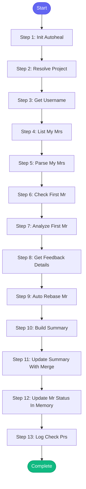

# ⚡ check_my_prs

> Check your open MRs for feedback from reviewers

## Overview

Check your open MRs for feedback from reviewers.

Shows:
- MRs with unaddressed feedback (need your response)
- MRs awaiting review (no feedback yet)
- MRs ready to merge (approved)

Helps you respond to reviewer comments.

Resolves project from repo_name or issue_key if not explicitly provided.

**Version:** 1.2

## Quick Start

```bash
skill_run("check_my_prs", '{"issue_key": "AAP-12345"}')
```

## Inputs

| Input | Type | Required | Default | Description |
|-------|------|----------|---------|-------------|
| `project` | string | No | `""` | GitLab project path (resolved from repo_name if not provided) |
| `repo_name` | string | No | `-` | Repository name from config (e.g., 'automation-analytics-backend') |
| `show_approved` | boolean | No | `True` | Include approved MRs in output |
| `auto_merge` | boolean | No | `False` | Automatically merge approved MRs (asks first if false) |
| `auto_rebase` | boolean | No | `False` | Automatically rebase MRs with merge conflicts |
| `slack_format` | boolean | No | `False` | Use Slack link format in summary |

## Process Flow



## Detailed Steps

### Step 1: Init Autoheal

**Description:** Initialize failure tracking

**Tool:** `compute`

### Step 2: Resolve Project

**Description:** Determine which GitLab project to check

**Tool:** `compute`

### Step 3: Get Username

**Description:** Get current system username

**Tool:** `compute`

### Step 4: List My Mrs

**Description:** Fetch my open MRs from GitLab

**Tool:** `gitlab_mr_list`

### Step 5: Parse My Mrs

**Description:** Parse MR list using shared parser

**Tool:** `compute`

### Step 6: Check First Mr

**Description:** Get details of first MR

**Tool:** `gitlab_mr_view`

**Condition:** `len(my_mrs) > 0`

### Step 7: Analyze First Mr

**Description:** Analyze feedback status of first MR using shared parser

**Tool:** `compute`

**Condition:** `len(my_mrs) > 0 and first_mr_details`

### Step 8: Get Feedback Details

**Description:** Get detailed comments if MR needs response

**Tool:** `gitlab_mr_view`

**Condition:** `first_mr_status and first_mr_status.get('status') == 'needs_response'`

### Step 9: Auto Rebase Mr

**Description:** Automatically rebase MR with conflicts

**Tool:** `skill_run`

**Condition:** `inputs.auto_rebase and first_mr_status and first_mr_status.get('needs_rebase')`

### Step 10: Build Summary

**Description:** Compile status of all my MRs

**Tool:** `compute`

### Step 11: Update Summary With Merge

**Description:** Update summary if MR was merged

**Tool:** `compute`

**Condition:** `merge_result`

### Step 12: Update Mr Status In Memory

**Description:** Update open MRs in memory with current status

**Tool:** `compute`

**Condition:** `mr_statuses`

### Step 13: Log Check Prs

**Description:** Log PR check to session

**Tool:** `memory_session_log`


## MCP Tools Used (4 total)

- `gitlab_mr_list`
- `gitlab_mr_view`
- `memory_session_log`
- `skill_run`

## Related Skills

_(To be determined based on skill relationships)_
