# 📝 check_my_prs

> Check your open PRs for feedback and status

## Overview

The `check_my_prs` skill gives you a quick overview of all your open merge requests, highlighting those that need attention (feedback to address, failed pipelines, conflicts).

## Quick Start

```
skill_run("check_my_prs", '{}')
```

With auto-actions:

```
skill_run("check_my_prs", '{"auto_rebase": true, "auto_merge": true}')
```

## Inputs

| Input | Type | Required | Default | Description |
|-------|------|----------|---------|-------------|
| `project` | string | No | From config | GitLab project |
| `show_approved` | boolean | No | `true` | Include approved MRs |
| `auto_merge` | boolean | No | `false` | Auto-merge approved MRs |
| `auto_rebase` | boolean | No | `false` | Auto-rebase conflicting MRs |

## Flow

```mermaid
flowchart TD
    START([Start]) --> USER[Get My Username]
    USER --> LIST[List My Open MRs]
    LIST --> LOOP[For Each MR]
    
    LOOP --> CONFLICT{Has Conflicts?}
    
    CONFLICT -->|Yes| REBASE_CHECK{Auto-rebase?}
    REBASE_CHECK -->|Yes| REBASE[Call rebase_pr]
    REBASE_CHECK -->|No| SHOW_REBASE[Show Rebase Prompt]
    
    CONFLICT -->|No| FEEDBACK{Has Feedback?}
    
    FEEDBACK -->|Yes| APPROVED{Approved?}
    FEEDBACK -->|No| WAITING[Awaiting Review]
    
    APPROVED -->|Yes| MERGE_CHECK{Auto-merge?}
    APPROVED -->|No| NEEDS_RESPONSE[Needs Response]
    
    MERGE_CHECK -->|Yes| MERGE[Merge MR]
    MERGE_CHECK -->|No| READY[Ready to Merge]
    
    REBASE --> NEXT
    SHOW_REBASE --> NEXT
    WAITING --> NEXT
    NEEDS_RESPONSE --> NEXT
    MERGE --> NEXT
    READY --> NEXT
    
    NEXT{More MRs?}
    NEXT -->|Yes| LOOP
    NEXT -->|No| SUMMARY[Show Summary]
    
    SUMMARY --> DONE([📋 Status Complete])
    
    style START fill:#6366f1,stroke:#4f46e5,color:#fff
    style DONE fill:#10b981,stroke:#059669,color:#fff
    style READY fill:#10b981,stroke:#059669,color:#fff
    style NEEDS_RESPONSE fill:#f59e0b,stroke:#d97706,color:#fff
```



## Status Categories

| Status | Emoji | Meaning |
|--------|-------|---------|
| Needs Rebase | 🔄 | Has merge conflicts |
| Needs Response | 🔴 | Reviewers left feedback |
| Pipeline Failed | 🔴 | CI needs fixing |
| Awaiting Review | 🟡 | No feedback yet |
| Approved | 🟢 | Ready to merge! |

## MCP Tools Used

- `gitlab_mr_list` - Get your MRs
- `gitlab_mr_view` - Get details
- `gitlab_mr_comments` - Get feedback
- `gitlab_pipeline_status` - Check CI
- `gitlab_mr_merge` - Merge MR

## Example Output

```
You: Check my PRs

Claude: 📋 Your Open MRs
        
        **User:** daoneill
        **Open MRs:** 4
        
        ────────────────────────────────
        
        ### 🔄 Needs Rebase (1)
        
        **!456**: AAP-12345 - feat(api): Add validation
        └── ⚠️ Has 3 conflicting files
        └── Run: `/rebase !456`
        
        ### 🔴 Needs Your Response (1)
        
        **!458**: AAP-12348 - fix(db): Handle nulls
        └── Feedback from: jsmith, mwilson
        └── ⚠️ 2 unresolved discussions
        
        ### 🟡 Awaiting Review (1)
        
        **!460**: AAP-12350 - docs: Update README
        └── Requested: bthomas, sjones
        └── Pipeline: Passed ✅
        
        ### 🟢 Approved - Ready to Merge (1)
        
        **!462**: AAP-12352 - test: Add coverage ✅
        └── Approved by: mwilson
        └── Pipeline: Passed ✅
        
        ────────────────────────────────
        
        ## Actions Suggested
        
        1. Rebase !456 to resolve conflicts
        2. Respond to feedback on !458
        3. Merge !462 (already approved)
```

## Related Skills

- [check_mr_feedback](./check_mr_feedback.md) - Detailed feedback check
- [rebase_pr](./rebase_pr.md) - Resolve conflicts
- [create_mr](./create_mr.md) - Create new MR


