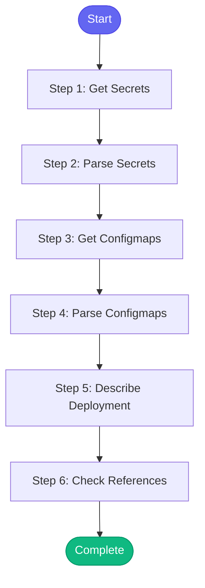

# ⚡ check_secrets

> Check secrets and configmaps in a namespace

## Overview

Check secrets and configmaps in a namespace.

Useful for:
- Verifying deployment configuration
- Debugging missing env vars
- Auditing secret presence

Uses: kubectl_get_secrets, kubectl_get_configmaps, kubectl_describe_deployment

**Version:** 1.0

## Quick Start

```bash
skill_run("check_secrets", '{"issue_key": "AAP-12345"}')
```

## Inputs

| Input | Type | Required | Default | Description |
|-------|------|----------|---------|-------------|
| `namespace` | string | ✅ Yes | `-` | Kubernetes namespace |
| `environment` | string | No | `stage` | Environment (stage, production, ephemeral) |
| `deployment` | string | No | `""` | Optional: specific deployment to check references |

## Process Flow



## Detailed Steps

### Step 1: Get Secrets

**Description:** List secrets in namespace

**Tool:** `kubectl_get_secrets`

### Step 2: Parse Secrets

**Description:** Parse secrets list

**Tool:** `compute`

### Step 3: Get Configmaps

**Description:** List configmaps in namespace

**Tool:** `kubectl_get_configmaps`

### Step 4: Parse Configmaps

**Description:** Parse configmaps list

**Tool:** `compute`

### Step 5: Describe Deployment

**Description:** Get deployment to check secret/configmap references

**Tool:** `kubectl_describe_deployment`

**Condition:** `inputs.deployment`

### Step 6: Check References

**Description:** Check if deployment references existing secrets/configmaps

**Tool:** `compute`

**Condition:** `inputs.deployment and deploy_desc_raw`


## MCP Tools Used (3 total)

- `kubectl_describe_deployment`
- `kubectl_get_configmaps`
- `kubectl_get_secrets`

## Related Skills

_(To be determined based on skill relationships)_
