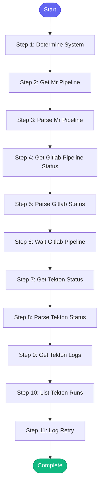

# ⚡ ci_retry

> Retry a failed CI pipeline - works with GitLab CI and Konflux/Tekton

## Overview

Retry a failed CI pipeline - works with GitLab CI and Konflux/Tekton.

Detects the CI system and uses appropriate retry mechanism:
- GitLab CI: Uses gitlab_ci_retry
- Konflux/Tekton: Uses tkn_pipeline_start to re-run

Steps:
1. Determine CI system from context (MR, repo, or explicit)
2. Get current pipeline status
3. Retry failed jobs/pipeline
4. Monitor retry status

**Version:** 1.0

## Quick Start

```bash
skill_run("ci_retry", '{"issue_key": "AAP-12345"}')
```

## Inputs

| Input | Type | Required | Default | Description |
|-------|------|----------|---------|-------------|
| `mr_id` | integer | No | `-` | GitLab MR ID - will retry its pipeline |
| `pipeline_id` | integer | No | `-` | GitLab CI pipeline ID to retry |
| `tekton_run` | string | No | `-` | Tekton PipelineRun name to re-trigger |
| `project` | string | No | `automation-analytics/automation-analytics-backend` | GitLab project path |
| `namespace` | string | No | `aap-aa-tenant` | Konflux/Tekton namespace |
| `wait` | boolean | No | `False` | Wait for pipeline to complete (up to 15 min) |

## Process Flow



## Detailed Steps

### Step 1: Determine System

**Description:** Determine which CI system to use

**Tool:** `compute`

### Step 2: Get Mr Pipeline

**Description:** Get pipeline for MR

**Tool:** `gitlab_ci_status`

**Condition:** `ci_system.system == 'gitlab_mr'`

### Step 3: Parse Mr Pipeline

**Description:** Extract pipeline ID from MR

**Tool:** `compute`

**Condition:** `ci_system.system == 'gitlab_mr'`

### Step 4: Get Gitlab Pipeline Status

**Description:** Get GitLab CI pipeline status

**Tool:** `gitlab_ci_status`

**Condition:** `ci_system.system == 'gitlab' or (ci_system.system == 'gitlab_mr' and mr_pipeline.pipeline_id)`

### Step 5: Parse Gitlab Status

**Description:** Parse GitLab pipeline status

**Tool:** `compute`

**Condition:** `gitlab_status_raw`

### Step 6: Wait Gitlab Pipeline

**Description:** Wait for GitLab pipeline to complete

**Tool:** `gitlab_ci_status`

**Condition:** `inputs.wait and gitlab_retry_result`

### Step 7: Get Tekton Status

**Description:** Get Tekton PipelineRun status

**Tool:** `tkn_pipelinerun_describe`

**Condition:** `ci_system.system == 'tekton'`

### Step 8: Parse Tekton Status

**Description:** Parse Tekton PipelineRun status

**Tool:** `compute`

**Condition:** `ci_system.system == 'tekton' and tekton_status_raw`

### Step 9: Get Tekton Logs

**Description:** Get Tekton failure logs

**Tool:** `tkn_pipelinerun_logs`

**Condition:** `ci_system.system == 'tekton' and tekton_status and tekton_status.status == 'failed'`

### Step 10: List Tekton Runs

**Description:** List recent Tekton runs after retry

**Tool:** `tkn_pipelinerun_list`

**Condition:** `ci_system.system == 'tekton' and tekton_retry_result`

### Step 11: Log Retry

**Description:** Log CI retry to session

**Tool:** `memory_session_log`

**Condition:** `gitlab_retry_result or tekton_retry_result`


## MCP Tools Used (5 total)

- `gitlab_ci_status`
- `memory_session_log`
- `tkn_pipelinerun_describe`
- `tkn_pipelinerun_list`
- `tkn_pipelinerun_logs`

## Related Skills

_(To be determined based on skill relationships)_
