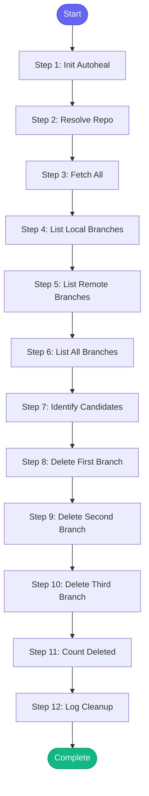

# ⚡ cleanup_branches

> Clean up old feature branches that have been merged or are stale

## Overview

Clean up old feature branches that have been merged or are stale.

The skill will:
1. Fetch latest from remote
2. List all local and remote branches
3. Identify merged branches
4. Delete merged branches (with confirmation)
5. Optionally clean up tracking refs

**Version:** 1.0

## Quick Start

```bash
skill_run("cleanup_branches", '{"issue_key": "AAP-12345"}')
```

## Inputs

| Input | Type | Required | Default | Description |
|-------|------|----------|---------|-------------|
| `repo` | string | No | `""` | Repository path (defaults to cwd) |
| `dry_run` | boolean | No | `True` | Just show what would be deleted (default: true for safety) |
| `include_remote` | boolean | No | `False` | Also delete remote branches (requires push access) |
| `older_than_days` | integer | No | `30` | Consider branches stale if no commits in this many days |
| `protected_branches` | string | No | `main,master,develop,release` | Comma-separated list of branches to never delete |

## Process Flow



## Detailed Steps

### Step 1: Init Autoheal

**Description:** Initialize failure tracking

**Tool:** `compute`

### Step 2: Resolve Repo

**Description:** Determine repository path

**Tool:** `compute`

### Step 3: Fetch All

**Description:** Fetch latest from all remotes

**Tool:** `git_fetch`

### Step 4: List Local Branches

**Description:** List all local branches

**Tool:** `git_branch_list`

### Step 5: List Remote Branches

**Description:** List all remote branches

**Tool:** `git_remote`

### Step 6: List All Branches

**Description:** List all branches including remote

**Tool:** `git_branch_list`

### Step 7: Identify Candidates

**Description:** Identify branches to delete

**Tool:** `compute`

### Step 8: Delete First Branch

**Description:** Delete first candidate branch

**Tool:** `git_branch_delete`

**Condition:** `not inputs.dry_run and branch_candidates.candidate_count > 0`

### Step 9: Delete Second Branch

**Description:** Delete second candidate branch

**Tool:** `git_branch_delete`

**Condition:** `not inputs.dry_run and branch_candidates.candidate_count > 1`

### Step 10: Delete Third Branch

**Description:** Delete third candidate branch

**Tool:** `git_branch_delete`

**Condition:** `not inputs.dry_run and branch_candidates.candidate_count > 2`

### Step 11: Count Deleted

**Description:** Count deleted branches

**Tool:** `compute`

### Step 12: Log Cleanup

**Description:** Log cleanup action

**Tool:** `memory_session_log`

**Condition:** `deletion_results and deletion_results.deleted_count > 0`


## MCP Tools Used (5 total)

- `git_branch_delete`
- `git_branch_list`
- `git_fetch`
- `git_remote`
- `memory_session_log`

## Related Skills

_(To be determined based on skill relationships)_
