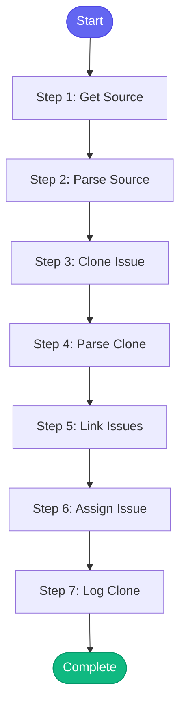

# ⚡ clone_jira_issue

> Clone a Jira issue for similar work

## Overview

Clone a Jira issue for similar work.

This skill:
- Clones an existing issue
- Links to the original
- Assigns to current user

Uses: jira_view_issue, jira_clone_issue, jira_add_link, jira_assign

**Version:** 1.0

## Quick Start

```bash
skill_run("clone_jira_issue", '{"issue_key": "AAP-12345"}')
```

## Inputs

| Input | Type | Required | Default | Description |
|-------|------|----------|---------|-------------|
| `issue_key` | string | ✅ Yes | `-` | Source issue key to clone (e.g., AAP-12345) |
| `new_summary` | string | No | `""` | New summary (optional, defaults to 'Clone of <original>') |
| `link_type` | string | No | `relates to` | Link type to original (relates to, blocks, is blocked by) |
| `assign_to_me` | boolean | No | `True` | Assign cloned issue to current user |

## Process Flow



## Detailed Steps

### Step 1: Get Source

**Description:** Get source issue details

**Tool:** `jira_view_issue`

### Step 2: Parse Source

**Description:** Parse source issue

**Tool:** `compute`

### Step 3: Clone Issue

**Description:** Clone the issue

**Tool:** `jira_clone_issue`

**Condition:** `source_info.exists`

### Step 4: Parse Clone

**Description:** Parse clone result

**Tool:** `compute`

### Step 5: Link Issues

**Description:** Link clone to original

**Tool:** `jira_add_link`

**Condition:** `clone_result.success`

### Step 6: Assign Issue

**Description:** Assign to current user

**Tool:** `jira_assign`

**Condition:** `clone_result.success and inputs.assign_to_me`

### Step 7: Log Clone

**Description:** Log clone action

**Tool:** `memory_session_log`


## MCP Tools Used (5 total)

- `jira_add_link`
- `jira_assign`
- `jira_clone_issue`
- `jira_view_issue`
- `memory_session_log`

## Related Skills

_(To be determined based on skill relationships)_
