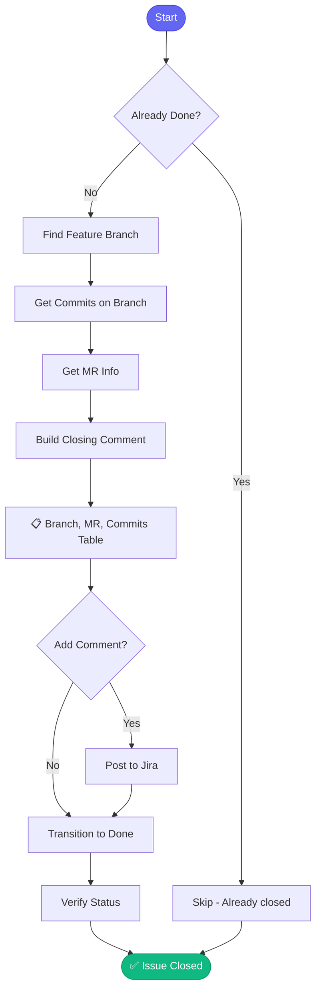

# ✅ close_issue

> Close a Jira issue with a summary of completed work

## Overview

The `close_issue` skill transitions a Jira issue to Done status with a comprehensive closing comment including branch info, MR link, and commit summary.

## Quick Start

```
skill_run("close_issue", '{"issue_key": "AAP-12345"}')
```

## Inputs

| Input | Type | Required | Default | Description |
|-------|------|----------|---------|-------------|
| `issue_key` | string | ✅ Yes | - | Jira issue key |
| `repo` | string | No | `.` | Repository path |
| `add_comment` | boolean | No | `true` | Add closing comment |

## Flow



## Closing Comment Format

```markdown
## Work Completed

| Item | Details |
|------|---------|
| **Branch** | aap-12345-implement-api |
| **MR** | [!456](https://gitlab.../456) |
| **Status** | Merged ✅ |

### Commits
| SHA | Message |
|-----|---------|
| a1b2c3d | AAP-12345 - feat: Initial implementation |
| e4f5g6h | AAP-12345 - fix: Address review feedback |
| i7j8k9l | AAP-12345 - test: Add unit tests |
```

## MCP Tools Used

- `jira_view_issue` - Check current status
- `git_branch_list` - Find feature branch
- `git_log` - Get commits
- `gitlab_mr_list` - Find associated MR
- `jira_add_comment` - Add closing comment
- `jira_set_status` - Transition to Done

## Example Output

```
You: Close issue AAP-12345

Claude: ✅ Closing AAP-12345...
        
        📋 Issue: "Implement new REST API endpoint"
        📁 Branch: aap-12345-implement-api
        🔀 MR: !456 (Merged)
        
        📝 Commits Summary:
        ├── 3 commits
        ├── +245 lines added
        └── -89 lines removed
        
        ✅ Added closing comment
        ✅ Transitioned to Done
        
        Issue AAP-12345 is now closed!
```

## Related Skills

- [start_work](./start_work.md) - Begin working on issue
- [create_mr](./create_mr.md) - Create merge request


