# ⚡ close_issue

> Close a Jira issue by transitioning it to Done

## Overview

Close a Jira issue by transitioning it to Done.
Adds a comment summarizing the work from branch commits.

Resolves Jira statuses from config.json.

**Version:** 1.2

## Quick Start

```bash
skill_run("close_issue", '{"issue_key": "AAP-12345"}')
```

## Inputs

| Input | Type | Required | Default | Description |
|-------|------|----------|---------|-------------|
| `issue_key` | string | ✅ Yes | `-` | Jira issue key (e.g., AAP-12345) |
| `repo` | string | No | `.` | Repository path to look for branch/commits |
| `add_comment` | boolean | No | `True` | Whether to add a closing comment with commit summary |

## Process Flow

```mermaid
flowchart TD
    START([Start])
    STEP1[Step 1: Load Config]
    START --> STEP1
    STEP2[Step 2: Init Autoheal]
    STEP1 --> STEP2
    STEP3[Step 3: Get Issue]
    STEP2 --> STEP3
    STEP4[Step 4: Check Status]
    STEP3 --> STEP4
    STEP5[Step 5: List Branches]
    STEP4 --> STEP5
    STEP6[Step 6: Find Branch]
    STEP5 --> STEP6
    STEP7[Step 7: Get Commit Log]
    STEP6 --> STEP7
    STEP8[Step 8: Parse Commits]
    STEP7 --> STEP8
    STEP9[Step 9: Get Mr]
    STEP8 --> STEP9
    STEP10[Step 10: Parse Mr]
    STEP9 --> STEP10
    STEP11[Step 11: Build Comment]
    STEP10 --> STEP11
    STEP12[Step 12: Add Closing Comment]
    STEP11 --> STEP12
    STEP13[Step 13: Get Available Transitions]
    STEP12 --> STEP13
    STEP14[Step 14: Select Transition]
    STEP13 --> STEP14
    STEP15[Step 15: Do Transition]
    STEP14 --> STEP15
    STEP16[Step 16: Verify Status]
    STEP15 --> STEP16
    STEP17[Step 17: Emit Issue Closed Hook]
    STEP16 --> STEP17
    STEP18[Step 18: Build Memory Context]
    STEP17 --> STEP18
    STEP19[Step 19: Log Session Issue Closed]
    STEP18 --> STEP19
    STEP20[Step 20: Remove From Active Issues]
    STEP19 --> STEP20
    STEP20 --> DONE([Complete])

    style START fill:#6366f1,stroke:#4f46e5,color:#fff
    style DONE fill:#10b981,stroke:#059669,color:#fff
```



## Detailed Steps

### Step 1: Load Config

**Description:** Load Jira status configuration

**Tool:** `compute`

### Step 2: Init Autoheal

**Description:** Initialize failure tracking

**Tool:** `compute`

### Step 3: Get Issue

**Description:** Fetch current issue details

**Tool:** `jira_get_issue`

### Step 4: Check Status

**Tool:** `compute`

### Step 5: List Branches

**Description:** List all git branches

**Tool:** `git_branch_list`

**Condition:** `{{ not status_check.already_done }}`

### Step 6: Find Branch

**Description:** Find branch matching this issue using shared parser

**Tool:** `compute`

**Condition:** `{{ not status_check.already_done }}`

### Step 7: Get Commit Log

**Description:** Get commits from the issue branch

**Tool:** `git_log`

**Condition:** `{{ not status_check.already_done and branch_info.found }}`

### Step 8: Parse Commits

**Description:** Parse commit log

**Tool:** `compute`

**Condition:** `{{ not status_check.already_done and branch_info.found }}`

### Step 9: Get Mr

**Description:** Check for associated Merge Request

**Tool:** `gitlab_list_mrs`

**Condition:** `{{ not status_check.already_done }}`

### Step 10: Parse Mr

**Tool:** `compute`

**Condition:** `{{ not status_check.already_done and mr_list }}`

### Step 11: Build Comment

**Tool:** `compute`

**Condition:** `{{ not status_check.already_done and inputs.add_comment }}`

### Step 12: Add Closing Comment

**Description:** Add closing comment to Jira

**Tool:** `jira_add_comment`

**Condition:** `{{ not status_check.already_done and inputs.add_comment and closing_comment }}`

### Step 13: Get Available Transitions

**Description:** Check what transitions are available from current status

**Tool:** `jira_get_transitions`

**Condition:** `{{ not status_check.already_done }}`

### Step 14: Select Transition

**Description:** Select the transition to Done using shared parser

**Tool:** `compute`

**Condition:** `{{ not status_check.already_done }}`

### Step 15: Do Transition

**Description:** Execute the transition

**Tool:** `jira_transition_issue`

**Condition:** `{{ not status_check.already_done and transition_target.transition_available }}`

### Step 16: Verify Status

**Description:** Verify issue status after transition

**Tool:** `jira_get_issue`

**Condition:** `{{ not status_check.already_done }}`

### Step 17: Emit Issue Closed Hook

**Description:** Notify team channel about closed issue

**Tool:** `compute`

**Condition:** `not status_check.already_done`

### Step 18: Build Memory Context

**Description:** Build timestamp for memory

**Tool:** `compute`

**Condition:** `{{ not status_check.already_done }}`

### Step 19: Log Session Issue Closed

**Description:** Log issue closure to session log

**Tool:** `memory_session_log`

**Condition:** `{{ not status_check.already_done }}`

### Step 20: Remove From Active Issues

**Description:** Remove issue from active_issues in memory

**Tool:** `compute`

**Condition:** `{{ not status_check.already_done }}`


## MCP Tools Used (8 total)

- `git_branch_list`
- `git_log`
- `gitlab_list_mrs`
- `jira_add_comment`
- `jira_get_issue`
- `jira_get_transitions`
- `jira_transition_issue`
- `memory_session_log`

## Related Skills

_(To be determined based on skill relationships)_
