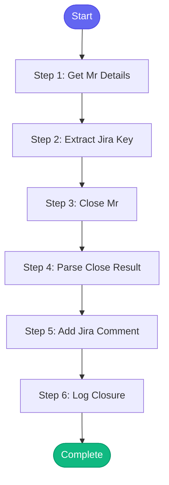

# ⚡ close_mr

> Close a GitLab merge request

## Overview

Close a GitLab merge request.

Use when:
- MR is abandoned
- MR is replaced by another
- Work is no longer needed

Uses: gitlab_mr_view, gitlab_mr_close, jira_transition, jira_add_comment

**Version:** 1.0

## Quick Start

```bash
skill_run("close_mr", '{"issue_key": "AAP-12345"}')
```

## Inputs

| Input | Type | Required | Default | Description |
|-------|------|----------|---------|-------------|
| `mr_id` | integer | ✅ Yes | `-` | GitLab MR ID |
| `project` | string | No | `automation-analytics/automation-analytics-backend` | GitLab project path |
| `reason` | string | No | `Closing - no longer needed` | Reason for closing |
| `update_jira` | boolean | No | `True` | Update linked Jira issue |

## Process Flow



## Detailed Steps

### Step 1: Get Mr Details

**Description:** Get MR details before closing

**Tool:** `gitlab_mr_view`

### Step 2: Extract Jira Key

**Description:** Extract Jira key from MR

**Tool:** `compute`

### Step 3: Close Mr

**Description:** Close the merge request

**Tool:** `gitlab_mr_close`

### Step 4: Parse Close Result

**Description:** Parse close result

**Tool:** `compute`

### Step 5: Add Jira Comment

**Description:** Add comment to Jira issue

**Tool:** `jira_add_comment`

**Condition:** `close_status.success and mr_info.jira_key and inputs.update_jira`

### Step 6: Log Closure

**Description:** Log MR closure

**Tool:** `memory_session_log`


## MCP Tools Used (4 total)

- `gitlab_mr_close`
- `gitlab_mr_view`
- `jira_add_comment`
- `memory_session_log`

## Related Skills

_(To be determined based on skill relationships)_
