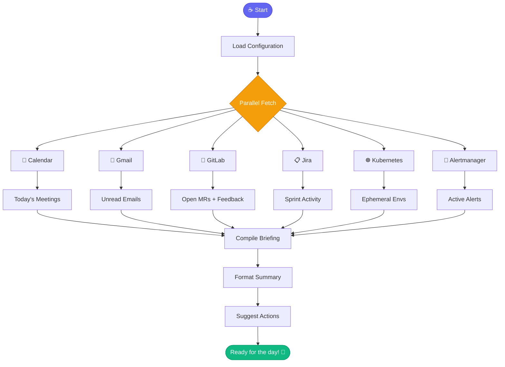

# ☕ coffee

> Morning briefing - everything you need to start your day

## Overview

The `coffee` skill is your morning standup assistant. It gathers information from multiple sources (Calendar, Email, GitLab, Jira, Kubernetes) and presents a comprehensive daily briefing.

## Quick Start

```
skill_run("coffee", '{}')
```

Or use the Cursor command:

```
/coffee
```

## Inputs

| Input | Type | Required | Default | Description |
|-------|------|----------|---------|-------------|
| `full_email_scan` | boolean | No | `false` | Process all unread emails |
| `auto_archive_email` | boolean | No | `false` | Archive processed emails |
| `days_back` | integer | No | `1` | Days to look back for activity |

## Flow



## Sections

| Section | Source | Description |
|---------|--------|-------------|
| 📅 Calendar | Google Calendar | Today's meetings with Meet links |
| 📧 Email | Gmail | Unread emails categorized |
| 🔀 Your PRs | GitLab | Open PRs with pipeline status |
| 👀 Feedback | GitLab | Comments waiting for response |
| 💔 Failed Pipelines | GitLab | PRs needing attention |
| 📋 Sprint | Jira | Last day/week activity |
| 🚀 Merges | GitLab | Recent merged code |
| 🧪 Ephemeral | Bonfire | Active test environments |
| 📝 Yesterday | Git | Your commits for standup |
| 👁️ Reviews | GitLab | PRs assigned to you |
| 🚨 Alerts | Alertmanager | Firing Automation Analytics alerts |

## MCP Tools Used

- `google_calendar_list_events` - Calendar
- `gmail_process_unread_emails` - Email
- `gitlab_mr_list` - PRs and MRs
- `gitlab_mr_comments` - Feedback
- `jira_search` - Sprint activity
- `bonfire_namespace_list` - Ephemeral envs
- `git_log` - Yesterday's commits
- `alertmanager_alerts` - Active alerts

## Example Output

```
## ☕ Good Morning, Dave!

📅 **Today's Calendar** (3 meetings)
├── 10:00 - Sprint Planning (1h)
├── 14:00 - 1:1 with Sarah (30m)
└── 16:00 - PR Review Session (45m)

📧 **Email Summary**
├── 5 unread from people
│   └── 2 from teammates, 1 from manager
└── 12 newsletters (skipped)

🔀 **Your Open PRs** (2)
├── !456: AAP-12345 - feat(api) ✅ Pipeline passed
└── !458: AAP-12348 - fix(db) ⏳ Pipeline running

💬 **Feedback Waiting**
└── !456: jsmith commented "Consider adding validation"

🚨 **Alerts**
└── None firing 🎉

🎯 **Suggested Actions**
1. Respond to feedback on !456
2. Prepare for Sprint Planning
3. Check your email from manager
```

## Related Skills

- [beer](./beer.md) - End of day wrap-up
- [standup_summary](./standup_summary.md) - Generate standup notes
- [check_mr_feedback](./check_mr_feedback.md) - Check for MR comments


