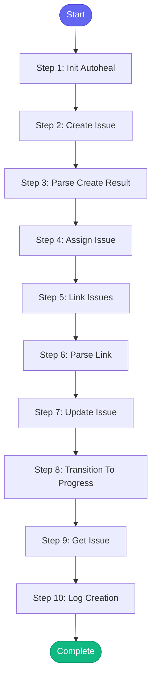

# ⚡ create_jira_issue

> Create a new Jira issue with proper linking and assignment

## Overview

Create a new Jira issue with proper linking and assignment.

Use for:
- Creating bug reports
- Creating feature requests
- Creating sub-tasks
- Linking related issues

The skill will:
1. Create the issue
2. Assign to specified user (or self)
3. Link to related issues
4. Transition to appropriate status

**Version:** 1.0

## Quick Start

```bash
skill_run("create_jira_issue", '{"issue_key": "AAP-12345"}')
```

## Inputs

| Input | Type | Required | Default | Description |
|-------|------|----------|---------|-------------|
| `summary` | string | ✅ Yes | `-` | Issue summary/title |
| `description` | string | No | `""` | Issue description (markdown supported) |
| `issue_type` | string | No | `Task` | Issue type: 'Bug', 'Task', 'Story', 'Sub-task' |
| `project` | string | No | `AAP` | Jira project key |
| `assignee` | string | No | `-` | Assign to user (leave empty for self) |
| `labels` | string | No | `-` | Comma-separated labels |
| `priority` | string | No | `Medium` | Priority: 'Highest', 'High', 'Medium', 'Low', 'Lowest' |
| `link_to` | string | No | `-` | Issue key to link to (e.g., AAP-12345) |
| `link_type` | string | No | `relates to` | Link type: 'relates to', 'blocks', 'is blocked by', 'duplicates' |
| `start_progress` | boolean | No | `False` | Immediately transition to In Progress |
| `slack_format` | boolean | No | `False` | Use Slack link format in report |

## Process Flow



## Detailed Steps

### Step 1: Init Autoheal

**Description:** Initialize failure tracking

**Tool:** `compute`

### Step 2: Create Issue

**Description:** Create the Jira issue

**Tool:** `jira_create_issue`

### Step 3: Parse Create Result

**Description:** Parse issue creation result

**Tool:** `compute`

### Step 4: Assign Issue

**Description:** Assign the issue

**Tool:** `jira_assign`

**Condition:** `create_status.issue_key`

### Step 5: Link Issues

**Description:** Link to related issue

**Tool:** `jira_link_issues`

**Condition:** `create_status.issue_key and inputs.link_to`

### Step 6: Parse Link

**Description:** Parse link result

**Tool:** `compute`

**Condition:** `link_result`

### Step 7: Update Issue

**Description:** Update issue with additional fields

**Tool:** `jira_update_issue`

**Condition:** `create_status.issue_key and inputs.labels`

### Step 8: Transition To Progress

**Description:** Transition to In Progress

**Tool:** `jira_transition`

**Condition:** `create_status.issue_key and inputs.start_progress`

### Step 9: Get Issue

**Description:** Get the created issue details

**Tool:** `jira_view_issue`

**Condition:** `create_status.issue_key`

### Step 10: Log Creation

**Description:** Log issue creation

**Tool:** `memory_session_log`

**Condition:** `create_status.success`


## MCP Tools Used (7 total)

- `jira_assign`
- `jira_create_issue`
- `jira_link_issues`
- `jira_transition`
- `jira_update_issue`
- `jira_view_issue`
- `memory_session_log`

## Related Skills

_(To be determined based on skill relationships)_
