# 📋 create_jira_issue

> Create a Jira issue with Markdown support

## Overview

The `create_jira_issue` skill creates Jira issues with proper formatting, automatically converting Markdown to Jira wiki markup and handling field normalization.

## Quick Start

```
skill_run("create_jira_issue", '{
  "summary": "Implement new feature",
  "issue_type": "story",
  "description": "## Overview\n\nWe need to...",
  "labels": "backend,api"
}')
```

## Inputs

| Input | Type | Required | Default | Description |
|-------|------|----------|---------|-------------|
| `summary` | string | ✅ Yes | - | Issue title |
| `issue_type` | string | ✅ Yes | - | bug, story, task, epic |
| `description` | string | No | - | Detailed description (Markdown OK) |
| `acceptance_criteria` | string | No | - | Acceptance criteria (Markdown OK) |
| `labels` | string | No | - | Comma-separated labels |
| `components` | string | No | - | Comma-separated components |
| `story_points` | integer | No | - | Story points (for stories) |
| `project` | string | No | `AAP` | Jira project key |

## Flow

```mermaid
flowchart TD
    START([Start]) --> NORMALIZE[Normalize Inputs]
    
    NORMALIZE --> TYPE[Normalize Issue Type]
    TYPE --> MD[Convert Markdown to Jira]
    MD --> FIELDS[Normalize Field Names]
    
    FIELDS --> BUILD[Build Issue JSON]
    BUILD --> CREATE[Create via MCP Tool]
    
    CREATE --> SUCCESS{Success?}
    SUCCESS -->|Yes| DONE([✅ Issue Created])
    SUCCESS -->|No| ERROR[Show Error Details]
    
    style START fill:#6366f1,stroke:#4f46e5,color:#fff
    style DONE fill:#10b981,stroke:#059669,color:#fff
```



## Markdown Conversion

The skill converts Markdown to Jira wiki markup:

| Markdown | Jira Wiki |
|----------|-----------|
| `# Heading` | `h1. Heading` |
| `**bold**` | `*bold*` |
| `*italic*` | `_italic_` |
| `` `code` `` | `{{code}}` |
| `[text](url)` | `[text\|url]` |
| `- item` | `* item` |
| `1. item` | `# item` |
| ` ``` ` | `{code}` |

## MCP Tools Used

- `jira_create_issue` - Create the issue

## Example Output

```
You: Create a story for implementing caching

Claude: 📋 Creating Jira issue...
        
        **Input:**
        - Summary: Implement Redis caching
        - Type: Story
        - Description: (converted from Markdown)
        
        ✅ Created: AAP-12360
        
        **Issue Details:**
        - Key: AAP-12360
        - Summary: Implement Redis caching
        - Type: Story
        - Status: New
        - Labels: backend, performance
        
        View: https://issues.redhat.com/browse/AAP-12360
```

## Input Example

```yaml
summary: "Implement Redis caching for API responses"
issue_type: "story"
description: |
  ## Overview
  
  We need to add Redis caching to reduce database load.
  
  ## Technical Details
  
  - Use `redis-py` client
  - Cache TTL: 5 minutes
  - Keys: `api:v1:{endpoint}:{params_hash}`
  
  ## Endpoints to Cache
  
  1. `/api/reports/summary`
  2. `/api/hosts/list`
  3. `/api/metrics/overview`
  
acceptance_criteria: |
  - [ ] Redis connection established
  - [ ] Cache hit rate > 80%
  - [ ] No stale data served
  
labels: "backend,performance,caching"
components: "Automation Analytics"
story_points: 5
```

## Related Skills

- [start_work](./start_work.md) - Start working on the issue
- [jira_hygiene](./jira_hygiene.md) - Validate issue quality


