# ⚡ create_mr

> Create a merge request with full validation:
- Automatically resolves repo and GitLab project from issue key if not provided
- Checks for uncommitted changes
- Validates commit message format (AAP-XXXXX)
- Runs black/flake8 linting
- Checks if branch can merge cleanly
- Optionally runs jira_hygiene first
- Creates MR with proper description
- Links to Jira and updates status

Uses MCP tools: git_status, git_fetch, git_log, git_push, gitlab_mr_list,
                gitlab_mr_create, jira_view_issue, jira_add_comment, jira_set_status

## Overview

Create a merge request with full validation:
- Automatically resolves repo and GitLab project from issue key if not provided
- Checks for uncommitted changes
- Validates commit message format (AAP-XXXXX)
- Runs black/flake8 linting
- Checks if branch can merge cleanly
- Optionally runs jira_hygiene first
- Creates MR with proper description
- Links to Jira and updates status

Uses MCP tools: git_status, git_fetch, git_log, git_push, gitlab_mr_list,
                gitlab_mr_create, jira_view_issue, jira_add_comment, jira_set_status

**Version:** 2.3

## Quick Start

```bash
skill_run("create_mr", '{"issue_key": "AAP-12345"}')
```

## Inputs

| Input | Type | Required | Default | Description |
|-------|------|----------|---------|-------------|
| `issue_key` | string | ✅ Yes | `-` | Jira issue key for linking (e.g., AAP-12345) |
| `repo` | string | No | `""` | Repository path - if not provided, resolved from issue key via config |
| `repo_name` | string | No | `-` | Repository name from config (e.g., 'automation-analytics-backend') |
| `draft` | boolean | No | `True` | Create as draft MR |
| `target_branch` | string | No | `""` | Target branch for MR (defaults to repo's default_branch from config) |
| `run_linting` | boolean | No | `True` | Run black/flake8 before creating MR |
| `check_jira` | boolean | No | `True` | Run jira_hygiene check before creating MR |
| `auto_fix_lint` | boolean | No | `False` | Auto-fix linting issues with black |
| `slack_format` | boolean | No | `False` | Use Slack link format |
| `check_docs` | boolean | No | `True` | Check documentation for staleness (if docs.check_on_mr=true in config) |
| `skip_docs_warning` | boolean | No | `False` | Skip documentation warnings (proceed even if docs need updating) |

## Process Flow

```mermaid
flowchart TD
    START([Start])
    STEP1[Step 1: Resolve Repo]
    START --> STEP1
    STEP2[Step 2: Check Git Status]
    STEP1 --> STEP2
    STEP3[Step 3: Validate Git Status]
    STEP2 --> STEP3
    STEP4[Step 4: Fetch Origin]
    STEP3 --> STEP4
    STEP5[Step 5: Get Commit Log]
    STEP4 --> STEP5
    STEP6[Step 6: Validate Commits]
    STEP5 --> STEP6
    STEP7[Step 7: Test Merge]
    STEP6 --> STEP7
    STEP8[Step 8: Abort Test Merge]
    STEP7 --> STEP8
    STEP9[Step 9: Parse Merge Result]
    STEP8 --> STEP9
    STEP10[Step 10: Read Ci Config]
    STEP9 --> STEP10
    STEP11[Step 11: Parse Ci Config]
    STEP10 --> STEP11
    STEP12[Step 12: Check Existing Mr]
    STEP11 --> STEP12
    STEP13[Step 13: Detect Duplicate Mr]
    STEP12 --> STEP13
    STEP14[Step 14: Check Lint Tools]
    STEP13 --> STEP14
    STEP15[Step 15: Run Black]
    STEP14 --> STEP15
    STEP16[Step 16: Parse Black Result]
    STEP15 --> STEP16
    STEP17[Step 17: Block On Black Errors]
    STEP16 --> STEP17
    STEP18[Step 18: Get Changed Files]
    STEP17 --> STEP18
    STEP19[Step 19: Run Flake8]
    STEP18 --> STEP19
    STEP20[Step 20: Parse Flake8]
    STEP19 --> STEP20
    STEP21[Step 21: Block On Lint Errors]
    STEP20 --> STEP21
    STEP22[Step 22: Check Docs Config]
    STEP21 --> STEP22
    STEP23[Step 23: Run Docs Check]
    STEP22 --> STEP23
    STEP24[Step 24: Parse Docs Result]
    STEP23 --> STEP24
    STEP25[Step 25: Warn About Docs]
    STEP24 --> STEP25
    STEP26[Step 26: Get Issue]
    STEP25 --> STEP26
    STEP27[Step 27: Jira Hygiene Check]
    STEP26 --> STEP27
    STEP28[Step 28: Lint Ci Config]
    STEP27 --> STEP28
    STEP29[Step 29: Parse Ci Lint]
    STEP28 --> STEP29
    STEP30[Step 30: Push Branch]
    STEP29 --> STEP30
    STEP31[Step 31: Detect Commit Type]
    STEP30 --> STEP31
    STEP32[Step 32: Build Description]
    STEP31 --> STEP32
    STEP33[Step 33: Build Mr Title]
    STEP32 --> STEP33
    STEP34[Step 34: Create Mr]
    STEP33 --> STEP34
    STEP35[Step 35: Update Jira]
    STEP34 --> STEP35
    STEP36[Step 36: Update Status]
    STEP35 --> STEP36
    STEP37[Step 37: Notify Team About Mr]
    STEP36 --> STEP37
    STEP38[Step 38: Emit Mr Created Hook]
    STEP37 --> STEP38
    STEP39[Step 39: Build Memory Context]
    STEP38 --> STEP39
    STEP40[Step 40: Log Session Mr Created]
    STEP39 --> STEP40
    STEP41[Step 41: Add Mr To Memory]
    STEP40 --> STEP41
    STEP42[Step 42: Update Active Issue Status]
    STEP41 --> STEP42
    STEP42 --> DONE([Complete])

    style START fill:#6366f1,stroke:#4f46e5,color:#fff
    style DONE fill:#10b981,stroke:#059669,color:#fff
```



## Detailed Steps

### Step 1: Resolve Repo

**Description:** Determine which repo and GitLab project to use

**Tool:** `compute`

### Step 2: Check Git Status

**Description:** Check for uncommitted changes and git state

**Tool:** `git_status`

### Step 3: Validate Git Status

**Description:** Parse git status for issues

**Tool:** `compute`

### Step 4: Fetch Origin

**Description:** Fetch latest from origin

**Tool:** `git_fetch`

### Step 5: Get Commit Log

**Description:** Get commits ahead of target branch

**Tool:** `git_log`

### Step 6: Validate Commits

**Description:** Check commit messages follow config.json commit_format pattern

**Tool:** `compute`

### Step 7: Test Merge

**Description:** Test if branch can merge cleanly

**Tool:** `git_merge`

### Step 8: Abort Test Merge

**Description:** Abort the test merge

**Tool:** `git_merge_abort`

### Step 9: Parse Merge Result

**Description:** Determine if branch is mergeable

**Tool:** `compute`

### Step 10: Read Ci Config

**Description:** Read GitLab CI configuration to understand pipeline

**Tool:** `gitlab_file_read`

### Step 11: Parse Ci Config

**Description:** Parse CI config for key jobs

**Tool:** `compute`

### Step 12: Check Existing Mr

**Description:** Check if MR already exists for this branch

**Tool:** `gitlab_mr_list`

### Step 13: Detect Duplicate Mr

**Description:** Parse MRs to find duplicate using shared parser

**Tool:** `compute`

### Step 14: Check Lint Tools

**Description:** Check if black and flake8 are installed

**Tool:** `compute`

**Condition:** `inputs.run_linting`

### Step 15: Run Black

**Description:** Run black formatter check

**Tool:** `code_format`

**Condition:** `inputs.run_linting and (not lint_tools_check or lint_tools_check.get('available', True))`

### Step 16: Parse Black Result

**Description:** Parse black result

**Tool:** `compute`

**Condition:** `inputs.run_linting`

### Step 17: Block On Black Errors

**Description:** Block MR creation if black formatting needed

**Tool:** `compute`

**Condition:** `inputs.run_linting and black_result and black_result.get('blocking', False)`

### Step 18: Get Changed Files

**Description:** Get list of Python files changed in this branch

**Tool:** `compute`

**Condition:** `inputs.run_linting`

### Step 19: Run Flake8

**Description:** Run flake8 linting on changed files only

**Tool:** `code_lint`

**Condition:** `inputs.run_linting and changed_files and changed_files.get('count', 0) > 0`

### Step 20: Parse Flake8

**Description:** Parse flake8 result and block if issues found

**Tool:** `compute`

**Condition:** `inputs.run_linting`

### Step 21: Block On Lint Errors

**Description:** Block MR creation if there are lint errors

**Tool:** `compute`

**Condition:** `inputs.run_linting and flake8_result and flake8_result.get('blocking', False)`

### Step 22: Check Docs Config

**Description:** Check if docs should be checked for this repo

**Tool:** `compute`

**Condition:** `inputs.check_docs`

### Step 23: Run Docs Check

**Description:** Run documentation check skill

**Tool:** `skill_run`

**Condition:** `inputs.check_docs and docs_config_check and docs_config_check.should_check`

### Step 24: Parse Docs Result

**Description:** Parse documentation check results

**Tool:** `compute`

**Condition:** `inputs.check_docs and docs_config_check and docs_config_check.should_check`

### Step 25: Warn About Docs

**Description:** Warn about documentation issues (non-blocking)

**Tool:** `compute`

**Condition:** `inputs.check_docs and docs_result and docs_result.needs_attention and not inputs.skip_docs_warning`

### Step 26: Get Issue

**Description:** Fetch Jira issue details

**Tool:** `jira_view_issue`

### Step 27: Jira Hygiene Check

**Description:** Check Jira issue quality

**Tool:** `skill_run`

**Condition:** `inputs.check_jira and issue`

### Step 28: Lint Ci Config

**Description:** Validate .gitlab-ci.yml before creating MR

**Tool:** `gitlab_ci_lint`

### Step 29: Parse Ci Lint

**Description:** Parse CI lint result

**Tool:** `compute`

### Step 30: Push Branch

**Description:** Push branch to origin

**Tool:** `git_push`

### Step 31: Detect Commit Type

**Description:** Detect predominant commit type from commits

**Tool:** `compute`

### Step 32: Build Description

**Description:** Build MR description with Jira link

**Tool:** `compute`

### Step 33: Build Mr Title

**Description:** Build MR title following commit format from config.json

**Tool:** `compute`

### Step 34: Create Mr

**Description:** Create GitLab merge request

**Tool:** `gitlab_mr_create`

### Step 35: Update Jira

**Description:** Add MR link to Jira issue

**Tool:** `jira_add_comment`

**Condition:** `mr`

### Step 36: Update Status

**Description:** Move Jira to In Review (if not draft)

**Tool:** `jira_set_status`

**Condition:** `not inputs.draft and mr`

### Step 37: Notify Team About Mr

**Description:** Use notify_mr skill to post to team channel

**Tool:** `skill_run`

**Condition:** `mr and not inputs.draft`

### Step 38: Emit Mr Created Hook

**Description:** Notify team channel about new MR

**Tool:** `compute`

**Condition:** `mr and not inputs.draft`

### Step 39: Build Memory Context

**Description:** Build context for memory update

**Tool:** `compute`

**Condition:** `mr`

### Step 40: Log Session Mr Created

**Description:** Log MR creation to session log

**Tool:** `memory_session_log`

**Condition:** `mr`

### Step 41: Add Mr To Memory

**Description:** Add MR to open_mrs in memory

**Tool:** `memory_append`

**Condition:** `mr`

### Step 42: Update Active Issue Status

**Description:** Update active issue status if MR is not draft

**Tool:** `memory_update`

**Condition:** `mr and not inputs.draft`


## MCP Tools Used (19 total)

- `code_format`
- `code_lint`
- `git_fetch`
- `git_log`
- `git_merge`
- `git_merge_abort`
- `git_push`
- `git_status`
- `gitlab_ci_lint`
- `gitlab_file_read`
- `gitlab_mr_create`
- `gitlab_mr_list`
- `jira_add_comment`
- `jira_set_status`
- `jira_view_issue`
- `memory_append`
- `memory_session_log`
- `memory_update`
- `skill_run`

## Related Skills

_(To be determined based on skill relationships)_
